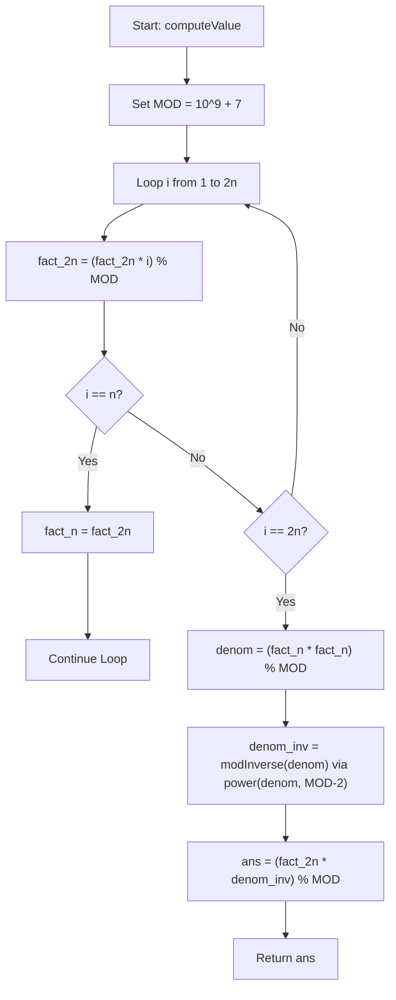

# 💡 Approach — Binary Strings with Equal Sum of Two Halves

| 📄 [Problem](./Problem.md) | 💡 [Approach](./Approach.md) | 🧩 [Solution](./Solution.cpp) | 🚀 [Main](./Main.cpp) |
|:--------------------------:|:-----------------------------:|:------------------------------:|:---------------------:|

## 📊 Metadata

> [!TIP]
> **Core Insight:**
> For a binary string of length $$2n$$ to have an equal sum of bits in the first and second halves:
> 1. Let the sum of the first half (number of 1s) be $$k$$, where $$0 \le k \le n$$.
> 2. The second half must also contain exactly $$k$$ 1s.
> 3. The number of ways to choose $$k$$ positions for 1s in the first half is $$\binom{n}{k}$$.
> 4. The number of ways to choose $$k$$ positions for 1s in the second half is also $$\binom{n}{k}$$.
> 5. Since choices for both halves are independent, the total number of valid strings for a fixed $$k$$ is:
>    $$\binom{n}{k} \times \binom{n}{k} = \binom{n}{k}^2$$
> 6. Summing over all possible values of $$k$$ from $$0$$ to $$n$$, we get:
>    $$\text{Total Sequences} = \sum_{k=0}^{n} \binom{n}{k}^2 = \binom{2n}{n}$$
>    *(This equivalence is given by Vandermonde's Identity, representing the number of ways to choose $$n$$ objects out of a total of $$2n$$ objects).*
>
> Thus, the entire problem simplifies to computing $$\binom{2n}{n} \pmod{10^9+7}$$.

## 🔩 Step-by-Step Breakdown

1. **Step 1: Factorial Precomputation**
   - We need to compute $$\binom{2n}{n} = \frac{(2n)!}{n! \cdot n!} \pmod{10^9+7}$$.
   - Iterate from $$1$$ to $$2n$$ to compute $$(2n)! \pmod{10^9+7}$$.
   - On the way, when the loop index reaches $$n$$, store the value as $$n! \pmod{10^9+7}$$.

2. **Step 2: Modular Exponentiation**
   - Calculate the denominator product: $$\text{denom} = (n! \cdot n!) \pmod{10^9+7}$$.
   - Find the modular multiplicative inverse of $$\text{denom}$$ using Fermat's Little Theorem:
     $$\text{denom}^{-1} \equiv \text{denom}^{MOD - 2} \pmod{MOD}$$
   - We implement this using a binary exponentiation helper function taking $$O(\log MOD)$$ time.

3. **Step 3: Calculate the Result**
   - Compute the final result:
     $$\text{ans} = ((2n)! \cdot \text{denom}^{-1}) \pmod{10^9+7}$$

## 🔄 Mermaid Flowchart

## 📊 Complexity Analysis

| Complexity | Analysis |
|:---:|:---|
| **Time Complexity** | $$O(n)$$ — A single loop runs up to $$2n$$ to calculate factorials. Modular inverse takes $$O(\log MOD)$$ using binary exponentiation, which is negligible compared to $$n$$. Thus, the overall time complexity is $$O(n)$$. |
| **Auxiliary Space** | $$O(1)$$ — We only store a few variables (`fact_2n`, `fact_n`, `denom`, `denom_inv`) to compute the answer. No extra memory is allocated, resulting in constant space. |

> *"Mathematics is the language in which God has written the universe."* — Galileo Galilei

---

<h3>Happy Coding! 🚀</h3>

