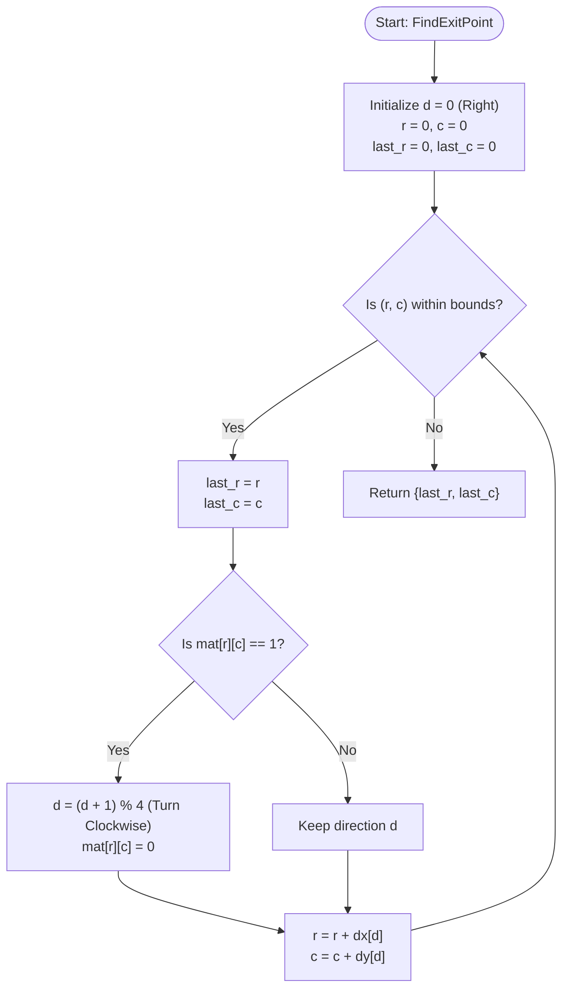

# 💡 Approach — Exit Point in a Matrix

| 📄 [Problem](./Problem.md) | 💡 [Approach](./Approach.md) | 🧩 [Solution](./Solution.cpp) | 🚀 [Main](./Main.cpp) |
|:--------------------------:|:-----------------------------:|:------------------------------:|:---------------------:|

## 📊 Metadata

> [!TIP]
> **Core Insight:**
> - We start traversal from $(0, 0)$ heading **Right**.
> - There are 4 possible movement directions: **Right**, **Down**, **Left**, and **Up**. We can model these using arrays `dx` and `dy` indexed from `0` to `3`.
> - A clockwise turn rotates our direction: $d = (d + 1) \bmod 4$.
> - Encountering a `0` means we keep moving in the same direction.
> - Encountering a `1` means we must turn clockwise, change the cell value to `0`, and then move.
> - Since we need to determine the last coordinates before leaving the matrix, we must cache the current coordinates before every move. Once we step outside the boundaries of the matrix, the cached coordinates represent our exit point.

## 🔩 Step-by-Step Breakdown

1. **Step 1: Initialization**
   - Create coordinate delta arrays `dx` and `dy` for the four directions: Right `(0, 1)`, Down `(1, 0)`, Left `(0, -1)`, and Up `(-1, 0)`.
   - Set the initial position `(r, c) = (0, 0)`, direction index `d = 0` (Right).
   - Initialize variables `last_r` and `last_c` to store the coordinates of the current cell.

2. **Step 2: Simulation Loop**
   - Execute a loop as long as the cell coordinates `(r, c)` are within the matrix boundaries ($$0 \le r < n$$ and $$0 \le c < m$$).
   - At the beginning of each step, cache the current coordinates: `last_r = r`, `last_c = c`.
   - Check the value of the matrix at `mat[r][c]`:
     - If `mat[r][c] == 1`, rotate the direction clockwise (`d = (d + 1) % 4`) and flip the cell to `0` (`mat[r][c] = 0`).
     - Otherwise, continue in direction `d`.
   - Move to the next position: `r = r + dx[d]`, `c = c + dy[d]`.

3. **Step 3: Return Result**
   - Once the boundary condition is violated, the loop ends. The exit point coordinates are saved in `{last_r, last_c}`. Return them.

## 🔄 Mermaid Flowchart

## 📊 Complexity Analysis

| Complexity | Analysis |
|:---:|:---|
| **Time Complexity** | $$O(n \times m)$$ — Since every time we land on a `1`, we convert it to `0` and turn, we can visit any cell at most a constant number of times. There is no possibility of an infinite loop, making the overall runtime linear with respect to the number of cells. |
| **Auxiliary Space** | $$O(1)$$ — We only use a constant amount of memory for direction arrays, loop indices, and cell caching. The modification to the matrix is performed in-place. |

> *"The only way to learn a new programming language is by writing programs in it."* — Dennis Ritchie

---

<h3>Happy Coding! 🚀</h3>

