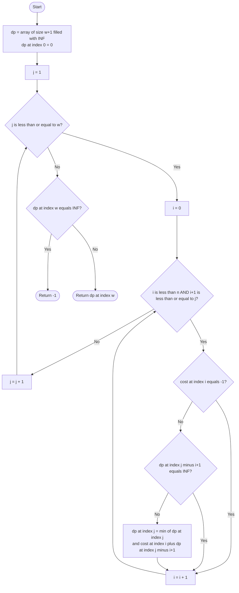

# 💡 Approach — Minimum Cost to Fill Given Weight in a Bag

| 📄 [Problem](./Problem.md) | 💡 [Approach](./Approach.md) | 🧩 [Solution](./Solution.cpp) | 🚀 [Main](./Main.cpp) |
|:--------------------------:|:-----------------------------:|:------------------------------:|:---------------------:|

---

## 📊 Metadata

---

## 🎯 Core Insight

> [!TIP]
> This is a classic **Unbounded Knapsack** problem disguised as a "fill a bag" challenge.
> Each packet type can be used **infinitely many times**. We define `dp[j]` as the **minimum
> cost to buy exactly `j` kg**. For each available packet of weight `i+1` and cost `cost[i]`,
> we update `dp[j]` using `dp[j - (i+1)]` — reusing previously computed sub-problems.
> The "unbounded" nature means we iterate forward through weights (not backward), allowing
> the same packet to be picked multiple times.

---

## 🔩 Step-by-Step Breakdown

**Step 1 — Initialize the DP Table**
- Create a `dp` array of size `w + 1`, initialized to `INT_MAX` (infinity — meaning "impossible").
- Set `dp[0] = 0` as the base case: zero cost to fill zero weight.

**Step 2 — Pre-process Available Packets**
- Iterate over `cost[]`. For any `cost[i] == -1`, mark that packet as unavailable (skip it during DP transitions).
- Only packets with valid costs (≥ 1) are usable.

**Step 3 — Fill the DP Table (Unbounded Knapsack)**
- For each weight `j` from `1` to `w`:
  - For each packet of size `i+1` (where `1 ≤ i+1 ≤ min(j, n)`):
    - If `cost[i] != -1` **and** `dp[j - (i+1)] != INT_MAX`:
      - Update: `dp[j] = min(dp[j], dp[j - (i+1)] + cost[i])`

**Step 4 — Extract the Answer**
- If `dp[w]` remains `INT_MAX`, it's impossible → return `-1`.
- Otherwise, return `dp[w]` as the minimum cost.

---

## 🔄 Mermaid Flowchart

---

## 🧮 Dry Run — Example 1

`cost = [20, 10, 4, 50, 100]`, `w = 5`

| `dp[j]` | j=0 | j=1 | j=2 | j=3 | j=4 | j=5 |
|:-------:|:---:|:---:|:---:|:---:|:---:|:---:|
| Initial | 0   | ∞   | ∞   | ∞   | ∞   | ∞   |
| After 1kg (cost=20) | 0 | 20 | 40 | 60 | 80 | 100 |
| After 2kg (cost=10) | 0 | 20 | 10 | 30 | 20 | 30 |
| After 3kg (cost=4)  | 0 | 20 | 10 | 4  | 14 | 14 |
| After 4kg (cost=50) | 0 | 20 | 10 | 4  | 14 | 14 |
| After 5kg (cost=100)| 0 | 20 | 10 | 4  | 14 | 14 |

**`dp[5] = 14`** ✅

---

## 📊 Complexity Analysis

| Metric          | Value              | Reasoning                                           |
|:---------------:|:------------------:|:---------------------------------------------------:|
| 🕐 Time         | $O(n \times w)$    | Two nested loops: `w` weights × up to `n` packets  |
| 💾 Space        | $O(w)$             | 1D `dp` array of size `w+1` (optimized from 2D)    |

> **Note:** The expected complexity is $O(n \times w)$ for both time and space (2D DP).
> This solution achieves the same time with only $O(w)$ space using the 1D optimization.

---

> *"Dynamic programming is not about filling tables — it's about recognizing that the future can be built from the past."*

---

<h3>Happy Coding! 🚀</h3>

