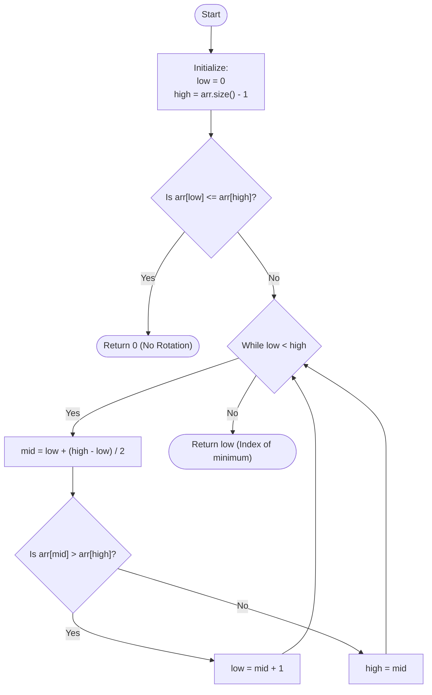

# Approach: Binary Search

  <a href="./Problem.md"><strong>Problem Statement</strong></a> |
  <a href="./Solution.cpp"><strong>Solution.cpp</strong></a> |
  <a href="./Main.cpp"><strong>Main.cpp</strong></a>

 

## 💡 Intuition

The problem asks for the number of right rotations of a sorted array. If a sorted array `[1, 2, 3, 4, 5]` is right-rotated `1` time, it becomes `[5, 1, 2, 3, 4]`.
Notice that the number of rotations is exactly equal to the **index of the minimum element** in the array! (The minimum element `1` is at index `1`).

A simple linear search would take $\mathcal{O}(N)$ time. Since the array is originally sorted, we can use **Binary Search** to find the minimum element in $\mathcal{O}(\log N)$ time.

## 🛠️ Algorithm

1. Initialize `low = 0` and `high = arr.size() - 1`.
2. First, check if the array is already fully sorted and not rotated by checking `if (arr[low] <= arr[high])`. If so, return `0`.
3. Iterate while `low < high`:
   - Calculate `mid = low + (high - low) / 2`.
   - **Condition:** If `arr[mid] > arr[high]`, it means the right half is unsorted and the minimum element must exist in the right half. Set `low = mid + 1`.
   - **Else:** If `arr[mid] <= arr[high]`, it means the right half is sorted, so the minimum element is either at `mid` or somewhere in the left half. Set `high = mid`.
4. When the loop ends, `low` and `high` will point to the index of the minimum element.
5. Return `low`.

## 📊 Visual Representation

## ⏳ Complexity Analysis

- **Time Complexity:** $\mathcal{O}(\log N)$. We halve the search space at each step, utilizing Binary Search.
- **Space Complexity:** $\mathcal{O}(1)$. We only use three variables (`low`, `high`, `mid`), which require constant space.

## 🚶‍♂️ Example Walkthrough

**Input:** `arr = [5, 1, 2, 3, 4]`

| Step | `low` | `high` | `mid` | `arr[mid]` | `arr[high]` | Condition (`arr[mid] > arr[high]`) | Action |
| :---: | :---: | :---: | :---: | :---: | :---: | :---: | :---: |
| Init | 0 | 4 | - | - | - | - | - |
| 1 | 0 | 4 | 2 | 2 | 4 | `2 > 4` (No) | `high = mid = 2` |
| 2 | 0 | 2 | 1 | 1 | 2 | `1 > 2` (No) | `high = mid = 1` |
| 3 | 0 | 1 | 0 | 5 | 1 | `5 > 1` (Yes) | `low = mid + 1 = 1` |

- Loop breaks since `low == high == 1`.
- Return `low` which is `1`.

**Final Output:** `1`
