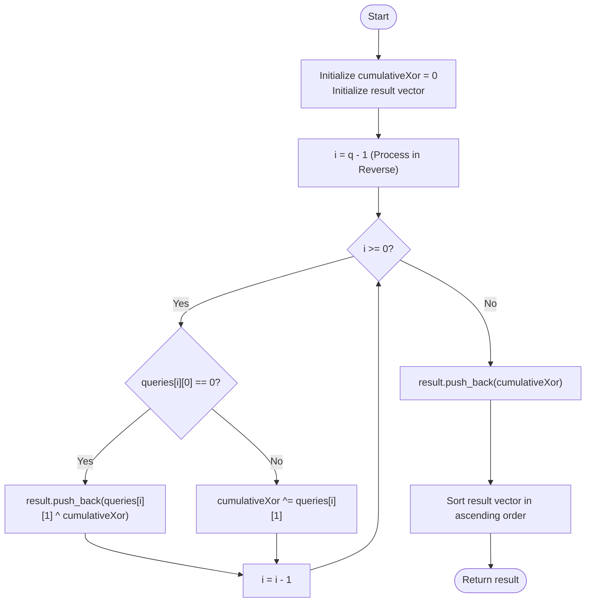

# 💡 Approach — Construct List using XOR Queries

| 📄 [Problem](./Problem.md) | 💡 [Approach](./Approach.md) | 🧩 [Solution](./Solution.cpp) | 🚀 [Main](./Main.cpp) |
|:--------------------------:|:-----------------------------:|:------------------------------:|:---------------------:|

---

## 📊 Metadata

---

---

## 🎯 Core Insight

> [!TIP]
> **Processing Queries in Reverse** is the game-changer here!
> 
> In a forward simulation, each XOR query takes $O(n)$ time because it affects all elements currently in the list, resulting in $O(q^2)$ time overall.
> However, we can observe that a query of type `1 x` (XOR with `x`) affects all elements inserted *before* it. If we traverse the queries **backwards** (from $q - 1$ down to $0$), we can keep a running cumulative XOR value.
> - When we encounter a Type 1 query (`1 x`), we update the running XOR: `cumulativeXor ^= x`.
> - When we encounter a Type 0 query (`0 x`), we can immediately calculate its final value by XORing it with the accumulated XOR value up to that point: `x ^ cumulativeXor`.
> - At the end, the initial element `0` is XORed with the total cumulative XOR.
> 
> Finally, we sort the list of results to satisfy the problem requirement. This reduces the time complexity to $O(q \log q)$!

---

## 🔩 Step-by-Step Breakdown

**Step 1 — Initialize variables**
- Initialize `cumulativeXor = 0` to store the cumulative XOR sum of all Type 1 queries.
- Initialize an empty vector `result` to store the final elements.

**Step 2 — Process queries in reverse**
- Iterate from the last query ($i = q - 1$) down to the first query ($i = 0$):
  - If `queries[i][0] == 0` (Type 0: Insert): Push `queries[i][1] ^ cumulativeXor` into `result`.
  - If `queries[i][0] == 1` (Type 1: XOR): Accumulate the XOR value: `cumulativeXor ^= queries[i][1]`.

**Step 3 — Process initial element**
- The initial element in the array is `0`. It undergoes all Type 1 XOR operations.
- Push `0 ^ cumulativeXor` (which is simply `cumulativeXor`) into `result`.

**Step 4 — Sort and return**
- Sort the `result` vector in ascending order.
- Return the sorted `result`.

---

## 🔄 Mermaid Flowchart

---

## 🧮 Dry Run — Example 1

`queries = [[0, 6], [0, 3], [0, 2], [1, 4], [1, 5]]`

| Query Index `i` | Query Type & Value | Action taken | `cumulativeXor` | `result` State |
|:---:|:---:|:---:|:---:|:---:|
| **Initial** | — | — | `0` | `[]` |
| **4** | `[1, 5]` | XOR update | `0 ^ 5 = 5` | `[]` |
| **3** | `[1, 4]` | XOR update | `5 ^ 4 = 1` | `[]` |
| **2** | `[0, 2]` | Insert `2 ^ 1` | `1` | `[3]` |
| **1** | `[0, 3]` | Insert `3 ^ 1` | `1` | `[3, 2]` |
| **0** | `[0, 6]` | Insert `6 ^ 1` | `1` | `[3, 2, 7]` |
| **Post-Loop** | — | Insert initial `0 ^ 1` | `1` | `[3, 2, 7, 1]` |
| **Sorting** | — | Sort ascending | `1` | **`[1, 2, 3, 7]`** ✅ |

---

## 📊 Complexity Analysis

| Metric | Value | Reasoning |
|:---:|:---:|:---:|
| 🕐 Time | $O(q \log q)$ | We iterate through $q$ queries once in reverse ($O(q)$), then sort the $q + 1$ elements ($O(q \log q)$). |
| 💾 Space | $O(q)$ | We store up to $q + 1$ elements in the `result` vector. |

---

> *"Reverse engineering a problem often turns quadratic complexity into linear elegance."*

---

<h3>Happy Coding! 🚀</h3>

