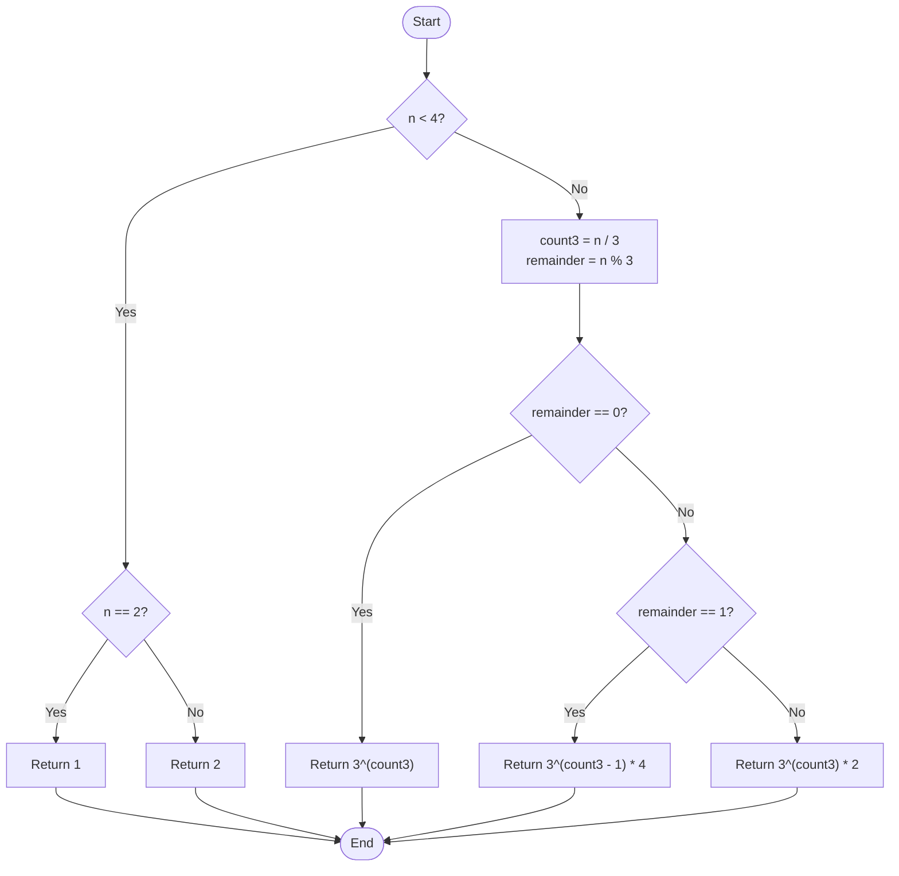

# 💡 Approach — Cut rope to maximise product

| 📄 [Problem](./Problem.md) | 💡 [Approach](./Approach.md) | 🧩 [Solution](./Solution.cpp) | 🚀 [Main](./Main.cpp) |
|:--------------------------:|:-----------------------------:|:------------------------------:|:---------------------:|

---

## 📊 Metadata

---

## 🎯 Core Insight

> [!TIP]
> **Maximize factors of 3** to obtain the mathematically optimal product!
> 
> By Euler's number ($e \approx 2.718$), the maximum product of parts summing to $n$ is achieved when the parts are as close to $e$ as possible. The closest integers are 2 and 3.
> 
> If we compare products:
> - $3 \times 3 = 9$ is strictly greater than $2 \times 2 \times 2 = 8$. Thus, 3s are always preferred over 2s wherever possible.
> - We should never use factors of 1 because $x \times 1 < x$ (unless the rope itself is length 2 or 3, where at least one cut is mandatory, forcing us to use 1).
> - Any factor of 4 can be split into $2 \times 2$, which gives the same product ($4 = 2 \times 2$).
> - Any factor greater than 4 can be broken down into factors of 2 and 3 to yield a strictly larger product (e.g., $5 \rightarrow 2 \times 3 = 6 > 5$).
> 
> Therefore, for any $n > 3$:
> - If $n \equiv 0 \pmod 3$: Break it entirely into 3s. Product = $3^{n/3}$.
> - If $n \equiv 1 \pmod 3$: Since $3 \times 1 < 2 \times 2$, we borrow one 3 to form a 4 (split as $2 \times 2$). Product = $3^{(n-4)/3} \times 4$.
> - If $n \equiv 2 \pmod 3$: Keep the remainder 2. Product = $3^{(n-2)/3} \times 2$.
> 
> We can compute these powers in $O(\log n)$ time using **binary exponentiation**!

---

## 🔩 Step-by-Step Breakdown

**Step 1 — Handle base cases where $n < 4$**
- If $n = 2$, at least one cut is mandatory: return $1 \times 1 = 1$.
- If $n = 3$, at least one cut is mandatory: return $2 \times 1 = 2$.

**Step 2 — Compute quotient and remainder when $n$ is divided by 3**
- Let `count3 = n / 3`.
- Let `remainder = n % 3`.

**Step 3 — Optimize the division of 3s and calculate powers using binary exponentiation**
- If `remainder == 1`:
  - We have a leftover of 1. Combine one 3 with 1 to make $2 \times 2 = 4$.
  - Return $3^{\text{count3} - 1} \times 4$.
- If `remainder == 2`:
  - Keep the leftover of 2.
  - Return $3^{\text{count3}} \times 2$.
- If `remainder == 0`:
  - Perfectly divisible by 3.
  - Return $3^{\text{count3}}$.

---

## 🔄 Mermaid Flowchart

---

## 🧮 Dry Run — Example 2

`n = 5`

| Step | Operation / Condition | Value | Description |
|:---:|:---:|:---:|:---|
| **1** | `n < 4` check | `5 < 4` is `false` | Proceed to normal division logic. |
| **2** | Division | `count3 = 5 / 3 = 1` `remainder = 5 % 3 = 2` | Calculated quotient and remainder. |
| **3** | Remainder match | `remainder == 2` | Branch to `remainder == 2` case. |
| **4** | Exponentiation | `power(3, 1) = 3` | Compute $3^1$ using binary exponentiation. |
| **5** | Multiply | `3 * 2 = 6` | Multiply the powers of 3 by the remainder of 2. |
| **6** | Output | **`6`** ✅ | Maximum product obtained. |

---

## 📊 Complexity Analysis

| Metric | Value | Reasoning |
|:---:|:---:|:---:|
| 🕐 Time | $$O(\log n)$$ | Binary exponentiation takes logarithmic steps relative to the exponent $n/3$. |
| 💾 Space | $$O(1)$$ | We only use a few helper variables, requiring constant auxiliary memory. |

---

> *"Breaking problems down to their prime factors reveals the hidden mathematical harmony of optimization."*

---

<h3>Happy Coding! 🚀</h3>

