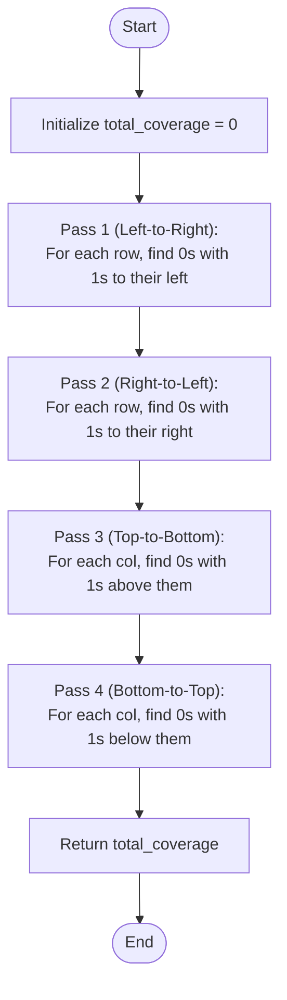

# 💡 Approach — Coverage of all Zeros in a Binary Matrix

| 📄 [Problem](./Problem.md) | 💡 [Approach](./Approach.md) | 🧩 [Solution](./Solution.cpp) | 🚀 [Main](./Main.cpp) |
|:--------------------------:|:-----------------------------:|:------------------------------:|:---------------------:|

---

## 📊 Metadata

---

## 🎯 Core Insight

> [!TIP]
> **Use 4 Linear Passes** to solve the problem in $O(n \times m)$ time complexity with $O(1)$ auxiliary space instead of scanning from each zero node.
> 
> For a zero cell at `mat[i][j]` to have coverage in a particular direction:
> - **Left**: There must be a `1` somewhere to its left in the same row. This is true if we see a `1` during a left-to-right traversal of row `i` before reaching column `j`.
> - **Right**: There must be a `1` somewhere to its right in the same row. This is true if we see a `1` during a right-to-left traversal of row `i` before reaching column `j`.
> - **Up**: There must be a `1` somewhere above it in the same column. This is true if we see a `1` during a top-to-bottom traversal of column `j` before reaching row `i`.
> - **Down**: There must be a `1` somewhere below it in the same column. This is true if we see a `1` during a bottom-to-top traversal of column `j` before reaching row `i`.
>
> By performing 4 passes (Left-to-Right, Right-to-Left, Top-to-Bottom, and Bottom-to-Top) and using a boolean state tracking variable, we can calculate the total coverage efficiently.

---

## 🔩 Step-by-Step Breakdown

**Step 1 — Left-to-Right Pass**
- Loop through each row $i$.
- Initialize a boolean `has_one = false`.
- Iterate columns $j$ from $0$ to $m-1$. If `mat[i][j] == 1`, set `has_one = true`. Otherwise, if `mat[i][j] == 0` and `has_one` is `true`, increment the coverage count.

**Step 2 — Right-to-Left Pass**
- Loop through each row $i$.
- Initialize a boolean `has_one = false`.
- Iterate columns $j$ from $m-1$ down to $0$. If `mat[i][j] == 1`, set `has_one = true`. Otherwise, if `mat[i][j] == 0` and `has_one` is `true`, increment the coverage count.

**Step 3 — Top-to-Bottom Pass**
- Loop through each column $j$.
- Initialize a boolean `has_one = false`.
- Iterate rows $i$ from $0$ to $n-1$. If `mat[i][j] == 1`, set `has_one = true`. Otherwise, if `mat[i][j] == 0` and `has_one` is `true`, increment the coverage count.

**Step 4 — Bottom-to-Top Pass**
- Loop through each column $j$.
- Initialize a boolean `has_one = false`.
- Iterate rows $i$ from $n-1$ down to $0$. If `mat[i][j] == 1`, set `has_one = true`. Otherwise, if `mat[i][j] == 0` and `has_one` is `true`, increment the coverage count.

---

## 🔄 Mermaid Flowchart

---

## 🧮 Dry Run — Example 1

`mat = [[1, 1, 1, 0], [1, 0, 0, 1]]`

| Pass | Direction | Row/Col Index | Step Description | Coverage Increment | Accumulated Total |
| :---: | :---: | :---: | :--- | :---: | :---: |
| **1** | Left-to-Right | Row 0 | `mat[0][3] = 0` has a `1` to its left | +1 | 1 |
| **1** | Left-to-Right | Row 1 | `mat[1][1]` and `mat[1][2]` have `1` to their left | +2 | 3 |
| **2** | Right-to-Left | Row 1 | `mat[1][2]` and `mat[1][1]` have `1` to their right | +2 | 5 |
| **3** | Top-to-Bottom | Col 1 | `mat[1][1] = 0` has `1` at `mat[0][1]` above it | +1 | 6 |
| **3** | Top-to-Bottom | Col 2 | `mat[1][2] = 0` has `1` at `mat[0][2]` above it | +1 | 7 |
| **4** | Bottom-to-Top | Col 3 | `mat[0][3] = 0` has `1` at `mat[1][3]` below it | +1 | **8** ✅ |

---

## 📊 Complexity Analysis

| Metric | Value | Reasoning |
| :---: | :---: | :--- |
| 🕐 Time | $$O(n \times m)$$ | We perform exactly 4 passes over the $n \times m$ matrix. Each cell is visited 4 times. |
| 💾 Space | $$O(1)$$ | We only use a few boolean flags and scalar counters, requiring no additional structures. |

---

> *"Optimizing from multi-directional scanning to state-based linear passes shows that smart traversals can turn complexity into elegance."*

---

<h3>Happy Coding! 🚀</h3>

