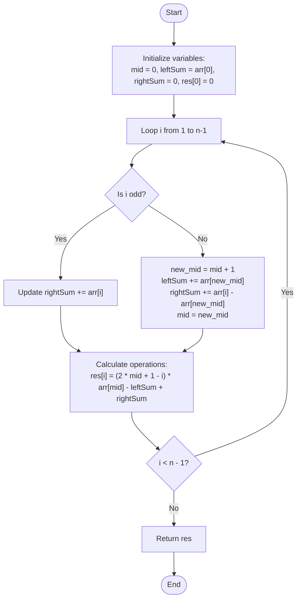

# 💡 Approach — Equalize All Prefix Sums

| 📄 [Problem](./Problem.md) | 💡 [Approach](./Approach.md) | 🧩 [Solution](./Solution.cpp) | 🚀 [Main](./Main.cpp) |
|:--------------------------:|:-----------------------------:|:------------------------------:|:---------------------:|

---

## 📊 Metadata

---

## 🎯 Core Insight

> [!TIP]
> **Use the Median Property and Running Sum Transitions** to solve the problem in $O(n)$ time complexity and $O(1)$ auxiliary space.
>
> 1. **Median Minimization**: To minimize the sum of absolute differences $\sum_{j=0}^{i} |arr[j] - x|$, the target value $x$ must be the median of the subarray `arr[0...i]`. Since the array is sorted, the median is always at index $mid = \lfloor i/2 \rfloor$.
> 2. **Prefix Partitioning**: We can partition the elements into:
>    - Left half ($j \le mid$): Elements are $\le arr[mid]$. Absolute difference sum is $(mid + 1) \cdot arr[mid] - \text{leftSum}$.
>    - Right half ($j > mid$): Elements are $\ge arr[mid]$. Absolute difference sum is $\text{rightSum} - (i - mid) \cdot arr[mid]$.
>    - Total operations:
>      $$\text{operations} = (2 \cdot mid + 1 - i) \cdot arr[mid] - \text{leftSum} + \text{rightSum}$$
> 3. **Dynamic Shifting in $O(1)$**: When $i$ increments:
>    - If the new length $i+1$ is odd ($i$ is even), the median index $mid$ shifts forward by $1$. The element at the new $mid$ transitions from the right half to the left half, and the new element $arr[i]$ is added to the right half.
>    - If the new length $i+1$ is even ($i$ is odd), the median index $mid$ remains the same. The new element $arr[i]$ is simply added to the right half.

---

## 🔩 Step-by-Step Breakdown

**Step 1 — Initialize Variables**
- Set `mid = 0`, `leftSum = arr[0]`, `rightSum = 0`.
- Initialize a result array `res` of size $n$ with `res[0] = 0`.

**Step 2 — Loop and Shift Transitions**
- Iterate $i$ from $1$ to $n-1$:
  - **If $i$ is odd**:
    - The new element `arr[i]` falls into the right half.
    - Update `rightSum += arr[i]`.
  - **If $i$ is even**:
    - The median shifts to `new_mid = mid + 1`.
    - Update `leftSum += arr[new_mid]`.
    - Update `rightSum += arr[i] - arr[new_mid]` (moving `arr[new_mid]` to the left half and adding `arr[i]` to the right).
    - Update `mid = new_mid`.

**Step 3 — Compute Prefix Operations**
- At each step, calculate:
  `res[i] = (2LL * mid + 1 - i) * arr[mid] - leftSum + rightSum`
- Return the `res` array.

---

## 🔄 Mermaid Flowchart

---

## 🧮 Dry Run — Example 1

`arr[] = [1, 6, 9, 12]`

| Step ($i$) | Parity | `new_mid` / `mid` | `leftSum` | `rightSum` | Operations Formula / Calculation | Result |
| :---: | :---: | :---: | :---: | :---: | :--- | :---: |
| **0** | - | 0 | 1 | 0 | `(2*0 + 1 - 0) * 1 - 1 + 0` | 0 |
| **1** | Odd | 0 | 1 | 6 | `(2*0 + 1 - 1) * 1 - 1 + 6` | 5 |
| **2** | Even | 1 | 7 | 9 | `(2*1 + 1 - 2) * 6 - 7 + 9` | 8 |
| **3** | Odd | 1 | 7 | 21 | `(2*1 + 1 - 3) * 6 - 7 + 21` | 14 |

---

## 📊 Complexity Analysis

| Metric | Complexity | Reasoning |
| :---: | :---: | :--- |
| 🕐 Time | $$O(n)$$ | We iterate through the array of size $n$ exactly once. Each transition and operation calculation is performed in $O(1)$ time. |
| 💾 Space | $$O(1)$$ | We only use a few tracking variables (`leftSum`, `rightSum`, `mid`), which requires $O(1)$ auxiliary space. The output array occupies $O(n)$ space. |

---

> *"By observing how mathematical medians partition sorted arrays, we can maintain running left and right bounds in constant time, turning a potentially quadratic problem into a linear masterpiece."*

---

<h3>Happy Coding! 🚀</h3>

