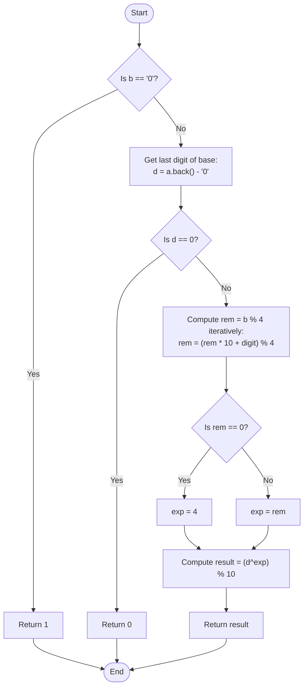

# 💡 Approach — Last Digit of a^b

| 📄 [Problem](./Problem.md) | 💡 [Approach](./Approach.md) | 🧩 [Solution](./Solution.cpp) | 🚀 [Main](./Main.cpp) |
|:--------------------------:|:-----------------------------:|:------------------------------:|:---------------------:|

---

## 📊 Metadata

---

## 🎯 Core Insight

> [!TIP]
> **Use the cyclicity of the last digits of numbers** to solve this problem efficiently in $O(|b|)$ time complexity and $O(1)$ space.
>
> 1. **Last Digit Dependency**: The last digit of $a^b$ depends only on the last digit of the base $a$. Let $d = a \pmod{10}$ (which is the last character of string `a`).
> 2. **Cyclic Nature of Powers**: For any digit $d \in [0, 9]$, the sequence of the last digits of $d^1, d^2, d^3, \dots$ repeats in a cycle of length at most $4$.
>    - E.g., for $d = 3$: $3^1 \to 3$, $3^2 \to 9$, $3^3 \to 7$, $3^4 \to 1$, $3^5 \to 3$ (repeating cycle: `3, 9, 7, 1`).
> 3. **Reducing the Exponent**: Since the cycle length is 4, we can compute the exponent $b \pmod 4$. Because $b$ is a large string, we compute this using modular arithmetic:
>    $$\text{rem} = b \pmod 4$$
>    If $\text{rem} == 0$, we must use exponent $4$ instead of $0$ (since $d^4$ gives the correct last digit of the cycle, while $d^0 = 1$ is incorrect for positive powers of $d$).
> 4. **Base Case for Zero Exponent**: If $b = 0$, $a^0 = 1$ (by definition).

---

## 🔩 Step-by-Step Breakdown

**Step 1 — Handle Base Cases and Exponent Zero**
- If the exponent string `b` is `"0"`, return `1` (since $a^0 = 1$).
- Get the last digit of the base: `d = a.back() - '0'`.
- If `d == 0`, the last digit will always be `0` for any exponent greater than `0`. Return `0`.

**Step 2 — Compute Exponent Modulo 4**
- Iterate through each digit `c` of string `b` to calculate $b \pmod 4$ iteratively:
  $$\text{rem} = (\text{rem} \times 10 + (c - '0')) \pmod 4$$
- Define the effective exponent `exp`:
  $$\text{exp} = (\text{rem} == 0) ? 4 : \text{rem}$$

**Step 3 — Compute Last Digit using Power Cycle**
- Compute $d^{\text{exp}} \pmod{10}$ using a simple loop.
- Return the computed result.

---

## 🔄 Mermaid Flowchart

---

## 🧮 Dry Run — Example 1

`a = "3"`, `b = "10"`

- **Step 1**: `b != "0"`. Last digit of `a` is `d = 3`. Since `d != 0`, we proceed.
- **Step 2**: Modulo arithmetic on `b = "10"`:
  - Char `'1'`: `rem = (0 * 10 + 1) % 4 = 1`
  - Char `'0'`: `rem = (1 * 10 + 0) % 4 = 2`
  - So, `rem = 2`.
  - Since `rem != 0`, `exp = 2`.
- **Step 3**: Compute $3^2 \pmod{10}$:
  - `res = 1`
  - Iteration 1: `res = (1 * 3) % 10 = 3`
  - Iteration 2: `res = (3 * 3) % 10 = 9`
- Return `9`. (Correct: $3^{10} = 59049 \to$ ends in $9$).

---

## 📊 Complexity Analysis

| Metric | Complexity | Reasoning |
| :---: | :---: | :--- |
| 🕐 Time | $$O(|b|)$$ | We iterate through each character of the exponent string $b$ exactly once to compute $b \pmod 4$. |
| 💾 Space | $$O(1)$$ | Only a few integer variables (`d`, `rem`, `exp`, `res`) are used, requiring constant auxiliary space. |

---

> *"Mathematics is the language in which God has written the universe. In the realm of numbers, even the largest exponents bow down to the beauty of cycles."*

---

<h3>Happy Coding! 🚀</h3>

