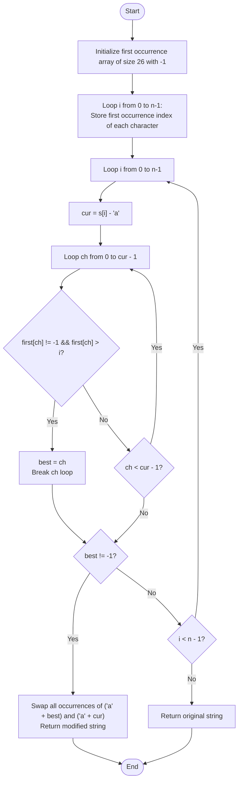

# 💡 Approach — Choose and Swap

| 📄 [Problem](./Problem.md) | 💡 [Approach](./Approach.md) | 🧩 [Solution](./Solution.cpp) | 🚀 [Main](./Main.cpp) |
|:--------------------------:|:-----------------------------:|:------------------------------:|:---------------------:|

---

## 📊 Metadata

---

## 🎯 Core Insight

> [!TIP]
> **Apply a Greedy Approach** to make the string lexicographically as small as possible in $O(n)$ time.
>
> 1. **Left-to-Right Priority**: A string is lexicographically smaller if the difference occurs as early as possible. Thus, we should check characters from left to right and try to replace the first character we can with a smaller one.
> 2. **Swapping Constraints**: When we swap two characters, *all* occurrences of those characters are swapped.
>    - If we swap a character $s[i]$ with a smaller character $c$ that has already appeared before index $i$, we would also swap the occurrence of $c$ at that earlier position with the larger $s[i]$. This would make the prefix larger, which is sub-optimal.
>    - Therefore, a character $s[i]$ can only be swapped with a smaller character $c$ if the **first occurrence** of $c$ is strictly after index $i$ (i.e., $c$ hasn't appeared yet in the prefix).
> 3. **Greedy Choice**: For each character $s[i]$ from left to right, we find the smallest available character $c < s[i]$ whose first occurrence is after index $i$. If multiple such characters exist, we pick the absolute smallest one to get the maximum possible benefit.
> 4. **At Most One Swap**: Once the optimal swap is performed, we return the string immediately since we are allowed at most one swap.

---

## 🔩 Step-by-Step Breakdown

**Step 1 — Track First Occurrences**
- Initialize a lookup table `first` of size 26 with `-1` to store the first occurrence index of each character `'a'` to `'z'`.
- Iterate through the string $s$ from left to right and populate `first[s[i] - 'a'] = i` for the first occurrence of each character.

**Step 2 — Find First Swappable Character**
- Iterate through $s$ from index $0$ to $n-1$:
  - Get the current character's integer value `cur = s[i] - 'a'`.
  - Scan for any character `ch` from `'a'` to the character right before `cur` (`0` to `cur - 1`):
    - If `ch` has appeared in the string (`first[ch] != -1`) and its first occurrence is after the current index (`first[ch] > i`):
      - We have found our optimal replacement! Set `best = ch` and break.

**Step 3 — Perform Swap and Return**
- If a valid `best` character is found:
  - Identify the two characters to be swapped: `a = 'a' + best` and `b = 'a' + cur`.
  - Traverse the string and replace all occurrences of `a` with `b`, and all occurrences of `b` with `a`.
  - Return the modified string.
- If the loop completes without finding any such pair, return the original string $s$.

---

## 🔄 Mermaid Flowchart

---

## 🧮 Dry Run — Example 1

`s = "ccad"`

- **Step 1**: First occurrences of characters:
  - `c`: index `0`
  - `a`: index `2`
  - `d`: index `3`
  - All other characters: `-1`
- **Step 2**: Iterate through string:
  - `i = 0`: `s[0] = 'c'`, `cur = 2`.
    - Check `ch = 0` (`'a'`):
      - `first[0] = 2` (which is $> 0$).
      - Condition met! `best = 0` (`'a'`). Break.
- **Step 3**: `best != -1`. Swap all `'c'` (from `cur`) and `'a'` (from `best`):
  - `"ccad"` $\to$ `"aacd"`
- Return `"aacd"`.

---

## 📊 Complexity Analysis

| Metric | Complexity | Reasoning |
| :---: | :---: | :--- |
| 🕐 Time | $$O(n)$$ | We scan the string of length $n$ to record first occurrences. The search loop runs at most $n$ times, and the inner loop runs at most 26 times (constant). The swap operation takes $O(n)$ time. |
| 💾 Space | $$O(1)$$ | We use a fixed-size vector of size 26 to store the first occurrence indices, which requires $O(1)$ auxiliary space. |

---

> *"Greed is good when it is directed at the first possibility of refinement. By scanning ahead and choosing the smallest available future, we make the optimal choice today."*

---

<h3>Happy Coding! 🚀</h3>

