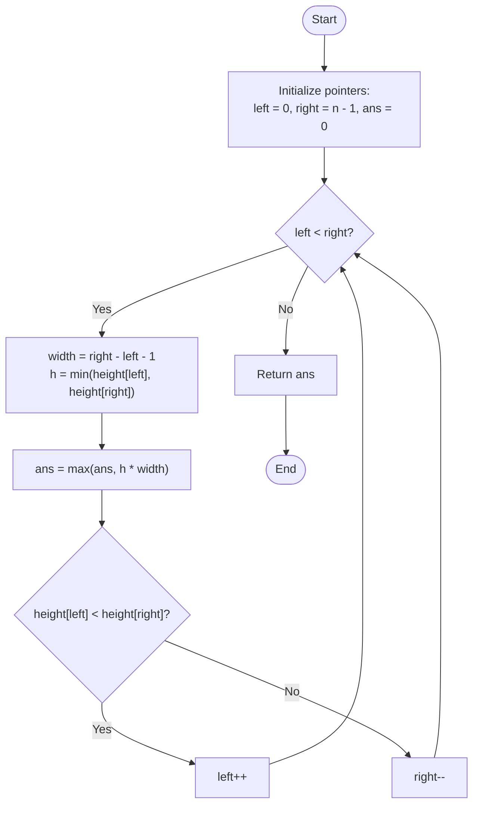

# 💡 Approach — Dam of Candies

| 📄 [Problem](./Problem.md) | 💡 [Approach](./Approach.md) | 🧩 [Solution](./Solution.cpp) | 🚀 [Main](./Main.cpp) |
|:--------------------------:|:-----------------------------:|:------------------------------:|:---------------------:|

---

## 📊 Metadata

---

## 🎯 Core Insight

> [!TIP]
> **Use the Two-Pointer Technique** to find the maximum area in linear $O(n)$ time complexity and $O(1)$ space.
>
> 1. **Mathematical Representation**: The area formed between two bars at indices `left` and `right` is:
>    $$\text{Area} = \min(\text{height}[\text{left}], \text{height}[\text{right}]) \times (\text{right} - \text{left} - 1)$$
> 2. **Brute Force Limitation**: Comparing all pairs takes $O(n^2)$ time, which will result in Time Limit Exceeded (TLE) since $n \le 10^5$.
> 3. **Two-Pointer Strategy**: Start with the widest possible width: `left = 0` and `right = n - 1`.
>    - At each step, calculate the area and update the maximum area found so far.
>    - To find a larger area, we must shift the pointers inwards.
>    - **Which pointer to move?** The area is limited by the shorter bar. Shifting the pointer corresponding to the taller bar inwards will decrease the width and cannot increase the height limit (which is still constrained by the shorter bar or a new even shorter bar).
>    - Therefore, we must greedily move the pointer that points to the **shorter bar** inwards to search for a taller bar that can compensate for the lost width.

---

## 🔩 Step-by-Step Breakdown

**Step 1 — Initialize Pointers**
- Initialize `left` to `0` and `right` to `n - 1`.
- Initialize `ans` to `0` to keep track of the maximum area.

**Step 2 — Compute Area and Shrink Window**
- Loop while `left < right`:
  - Calculate the width (number of bars between them):
    $$\text{width} = \text{right} - \text{left} - 1$$
  - Find the bottleneck height:
    $$h = \min(\text{height}[\text{left}], \text{height}[\text{right}])$$
  - Update `ans = max(ans, h * width)`.
  - Shift the pointers:
    - If `height[left] < height[right]`, increment `left`.
    - Otherwise, decrement `right`.

**Step 3 — Return Maximum Area**
- Once the pointers meet, return the accumulated maximum area `ans`.

---

## 🔄 Mermaid Flowchart

---

## 🧮 Dry Run — Example 1

`height[] = [2, 5, 4, 3, 7]`

- **Initialization**: `left = 0`, `right = 4`, `ans = 0`.

| Step | `left` | `right` | `height[left]` | `height[right]` | `width` | Area Calculation (`h * width`) | `ans` | Pointer Move |
| :---: | :---: | :---: | :---: | :---: | :---: | :--- | :---: | :--- |
| **1** | 0 | 4 | 2 | 7 | 3 | `min(2, 7) * 3 = 6` | 6 | `height[0] < height[4]` $\to$ `left++` (`1`) |
| **2** | 1 | 4 | 5 | 7 | 2 | `min(5, 7) * 2 = 10` | 10 | `height[1] < height[4]` $\to$ `left++` (`2`) |
| **3** | 2 | 4 | 4 | 7 | 1 | `min(4, 7) * 1 = 4` | 10 | `height[2] < height[4]` $\to$ `left++` (`3`) |
| **4** | 3 | 4 | 3 | 7 | 0 | `min(3, 7) * 0 = 0` | 10 | `height[3] < height[4]` $\to$ `left++` (`4`) |
- Loop ends as `left == right`.
- Return `10`.

---

## 📊 Complexity Analysis

| Metric | Complexity | Reasoning |
| :---: | :---: | :--- |
| 🕐 Time | $$O(n)$$ | The two pointers `left` and `right` start at the opposite ends of the array and move towards each other. Each step performs $O(1)$ work and moves at least one pointer, leading to at most $n$ iterations. |
| 💾 Space | $$O(1)$$ | Only constant auxiliary space is required for pointer indices and area variables. |

---

> *"To find the maximum potential, sometimes we must look at the widest scope and prune the weakest boundaries."*

---

<h3>Happy Coding! 🚀</h3>

