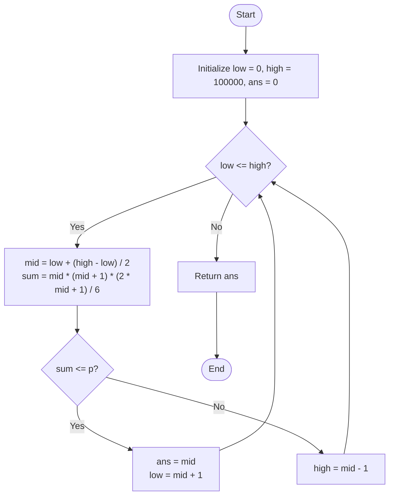

# 💡 Approach — Maximum Number of People Defeated

| 📄 [Problem](./Problem.md) | 💡 [Approach](./Approach.md) | 🧩 [Solution](./Solution.cpp) | 🚀 [Main](./Main.cpp) |
|:--------------------------:|:-----------------------------:|:------------------------------:|:---------------------:|

---

## 📊 Metadata

---

## 🎯 Core Insight

> [!TIP]
> **Use Binary Search and the Sum of Squares Formula** to find the maximum number of people defeated in $O(\log(\text{high}))$ time complexity.
>
> 1. **Mathematical Representation**: The strength of the $i$-th person is $i^2$. To defeat $k$ people, we need a total strength of:
>    $$S_k = \sum_{i=1}^{k} i^2 = \frac{k(k + 1)(2k + 1)}{6}$$
> 2. **Monotonicity**: The sum function $S_k$ is monotonically increasing. If we can defeat $k$ people, we can also defeat any number of people less than $k$. If we cannot defeat $k$ people, we cannot defeat any number of people greater than $k$.
> 3. **Binary Search on Answer**: We can binary search for the maximum $k$. 
>    - The minimum possible number of people defeated is `low = 0`.
>    - Since $p \le 3 \times 10^8$, we can set `high = 100,000` because $S_{100,000} \approx 3.33 \times 10^{14}$, which is far greater than $p$.
>    - For each `mid`, calculate $S_{\text{mid}}$ and check if it is $\le p$. If so, update the potential answer and search the right half; otherwise, search the left half.
> 4. **Overflow Protection**: Intermediate calculations of $S_k$ can exceed standard 32-bit integer limits, so we must calculate the sum using 64-bit integers (`long long` in C++).

---

## 🔩 Step-by-Step Breakdown

**Step 1 — Initialize Binary Search Bounds**
- Initialize `low = 0`, `high = 100000`, and `ans = 0`.

**Step 2 — Perform Binary Search**
- Loop while `low <= high`:
  - Calculate `mid = low + (high - low) / 2`.
  - Calculate the sum of squares of the first `mid` natural numbers using:
    $$\text{sum} = \frac{\text{mid} \times (\text{mid} + 1) \times (2 \times \text{mid} + 1)}{6}$$

**Step 3 — Update Answer and Boundary**
- If `sum <= p`:
  - It's possible to defeat `mid` people. Save the current candidate `ans = mid` and move to the right half to check if we can defeat more: `low = mid + 1`.
- If `sum > p`:
  - It is impossible to defeat `mid` people. Move to the left half: `high = mid - 1`.

**Step 4 — Return Answer**
- Return `ans`, which holds the maximum number of people defeated.

---

## 🔄 Mermaid Flowchart

---

## 🧮 Dry Run — Example 1

`p = 14`

- **Initialization**: `low = 0`, `high = 100000`, `ans = 0`.

| Step | `low` | `high` | `mid` | Sum Calculation ($S_{\text{mid}}$) | Condition (`sum <= 14`) | Action | `ans` |
| :---: | :---: | :---: | :---: | :--- | :---: | :--- | :---: |
| **1** | 0 | 100000 | 50000 | $\approx 8.3 \times 10^{13}$ | No | `high = 49999` | 0 |
| **...** | ... | ... | ... | ... | ... | ... | ... |
| **X** | 0 | 5 | 2 | $\frac{2 \times 3 \times 5}{6} = 5$ | Yes | `low = 3` | 2 |
| **Y** | 3 | 5 | 4 | $\frac{4 \times 5 \times 9}{6} = 30$ | No | `high = 3` | 2 |
| **Z** | 3 | 3 | 3 | $\frac{3 \times 4 \times 7}{6} = 14$ | Yes | `low = 4` | 3 |
- Loop ends as `low (4) > high (3)`.
- Return `3`.

---

## 📊 Complexity Analysis

| Metric | Complexity | Reasoning |
| :---: | :---: | :--- |
| 🕐 Time | $$O(\log(\text{high}))$$ | The search space of size $10^5$ is halved in each step of the binary search, requiring at most $\approx 17$ iterations. |
| 💾 Space | $$O(1)$$ | Only a few integer variables (`low`, `high`, `mid`, `sum`, `ans`) are maintained in memory. |

---

> *"In search of a threshold, binary choice divides the infinite and finds the perfect limit in logarithmic steps."*

---

<h3>Happy Coding! 🚀</h3>

