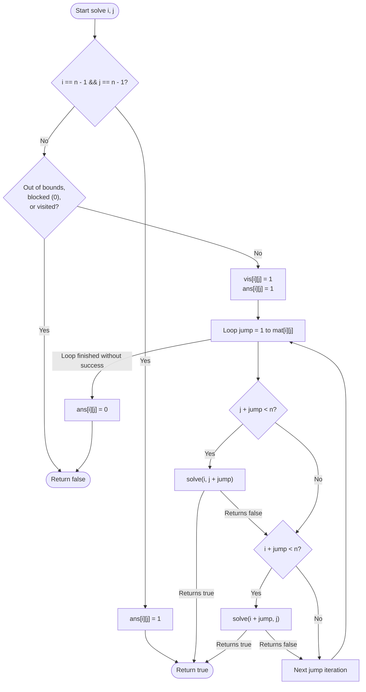

# 💡 Approach — Rat Maze with Multiple Jumps

<div align="center">

| 📄 [Problem](./Problem.md) | 💡 [Approach](./Approach.md) | 🧩 [Solution](./Solution.cpp) | 🚀 [Main](./Main.cpp) |
|:--------------------------:|:-----------------------------:|:------------------------------:|:---------------------:|

</div>

---

## 📊 Metadata

<div align="center">


</div>

---

## 🎯 Core Insight

> [!TIP]
> **Use Backtracking with Visited Matrix Pruning** to systematically explore paths, prioritizing smaller jumps and Rightward moves first.
>
> 1. **Search Space Exploration**: From any cell $(i, j)$, we have up to $2 \times \text{mat}[i][j]$ choices: jumping right by distance $s$ or down by distance $s$ (where $1 \le s \le \text{mat}[i][j]$).
> 2. **Constraint Enforcement**:
>    - To prioritize **shortest jumps first**, loop `jump` from $1$ to $\text{mat}[i][j]$.
>    - To prioritize **Right before Down**, check the horizontal jump first, and then the vertical jump within the loop.
> 3. **Pruning with Visited Array**:
>    - Re-visiting a cell from which no path could be found previously is redundant and causes high time complexity.
>    - Maintain a `vis` array. If a cell $(i, j)$ is visited but backtrack returns false, we keep it marked as visited. This prevents other recursion branches from re-exploring it, effectively pruning the state space to $O(n^2 \times \max(\text{mat}[i][j]))$.

---

## 🔩 Step-by-Step Breakdown

**Step 1 — Base Case Check**
- If the current position $(i, j)$ matches the destination $(n - 1, n - 1)$, mark it in the path matrix: `ans[i][j] = 1`, and return `true`.

**Step 2 — Validity Check**
- If the current index $(i, j)$ is out of bounds, contains $0$ (blocked cell), or has already been visited (`vis[i][j] == 1`), return `false`.

**Step 3 — Mark Visited & Active Path**
- Temporarily mark $(i, j)$ as visited: `vis[i][j] = 1`.
- Assume the current cell is part of the solution: `ans[i][j] = 1`.

**Step 4 — Explore Jumps (Shortest Jumps & Right First)**
- Iterate `jump` from $1$ to $\text{mat}[i][j]$:
  - If a **Right** move is within bounds (`j + jump < n`) and `solve(i, j + jump, ...)` returns `true`, return `true`.
  - If a **Down** move is within bounds (`i + jump < n`) and `solve(i + jump, j, ...)` returns `true`, return `true`.

**Step 5 — Backtrack**
- If none of the jumps lead to the destination, unmark the cell from the active path: `ans[i][j] = 0`, and return `false`. Keep `vis[i][j] = 1` to prevent other paths from re-processing this failed cell.

**Step 6 — Entry Point**
- Check the edge case of $n = 1$.
- Create `ans` and `vis` matrices initialized to $0$.
- Invoke the recursive solver from $(0, 0)$. If successful, return `ans`, else return `{{-1}}`.

---

## 🔄 Mermaid Flowchart



---

## 🧮 Dry Run — Example 1

**Input:**
```text
mat[][] = [[2, 1, 0, 0],
           [3, 0, 0, 1],
           [0, 1, 0, 1],
           [0, 0, 0, 1]]
```

### Execution Log:
1. **At $(0, 0)$:** $\text{mat}[0][0] = 2$.
   - **`jump = 1`**:
     - **Right to $(0, 1)$:** Valid jump.
       - **At $(0, 1)$:** $\text{mat}[0][1] = 1$.
         - **`jump = 1`**:
           - **Right to $(0, 2)$:** $\text{mat}[0][2] = 0$ (Blocked). Returns `false`.
           - **Down to $(1, 1)$:** $\text{mat}[1][1] = 0$ (Blocked). Returns `false`.
         - Backtracks: `ans[0][1] = 0`, returns `false`.
     - **Down to $(1, 0)$:** Valid jump.
       - **At $(1, 0)$:** $\text{mat}[1][0] = 3$.
         - **`jump = 1`**:
           - **Right to $(1, 1)$:** Blocked.
           - **Down to $(2, 0)$:** Blocked.
         - **`jump = 2`**:
           - **Right to $(1, 2)$:** Blocked.
           - **Down to $(3, 0)$:** Blocked.
         - **`jump = 3`**:
           - **Right to $(1, 3)$:** Valid jump.
             - **At $(1, 3)$:** $\text{mat}[1][3] = 1$.
               - **`jump = 1`**:
                 - **Right to $(1, 4)$:** Out of bounds.
                 - **Down to $(2, 3)$:** Valid jump.
                   - **At $(2, 3)$:** $\text{mat}[2][3] = 1$.
                     - **`jump = 1`**:
                       - **Right to $(2, 4)$:** Out of bounds.
                       - **Down to $(3, 3)$:** Destination reached! Returns `true`.
                     - Returns `true`.
                 - Returns `true`.
             - Returns `true`.
         - Returns `true`.
     - Returns `true`.
2. Final Path Matrix `ans` has $1$s at $(0, 0)$, $(1, 0)$, $(1, 3)$, $(2, 3)$, $(3, 3)$.

---

## 📊 Complexity Analysis

| Metric | Complexity | Reasoning |
| :---: | :---: | :--- |
| 🕐 Time | $$O(n^2 \times \max(mat[i][j]))$$ | Each cell is visited at most once due to the `vis` matrix pruning. For each cell, we explore up to $k = \max(mat[i][j])$ jumps. |
| 💾 Space | $$O(n^2)$$ | Requiring $O(n^2)$ space for the `vis` and `ans` matrices, and $O(n^2)$ space for the recursion stack in the worst-case path length. |

---

> *"In the labyrinth of options, the wisest guide is a systematic retreat, leaving no stone unturned and no path unverified."*

---

<div align="center">
<h3>Happy Coding! 🚀</h3>
<a href="../147_Day/Approach.md">
  
</a>
<a href="https://x.com/PankajB42550" target="_blank">
  
</a>
<a href="../149_Day/Approach.md">
  
</a>
</div>
