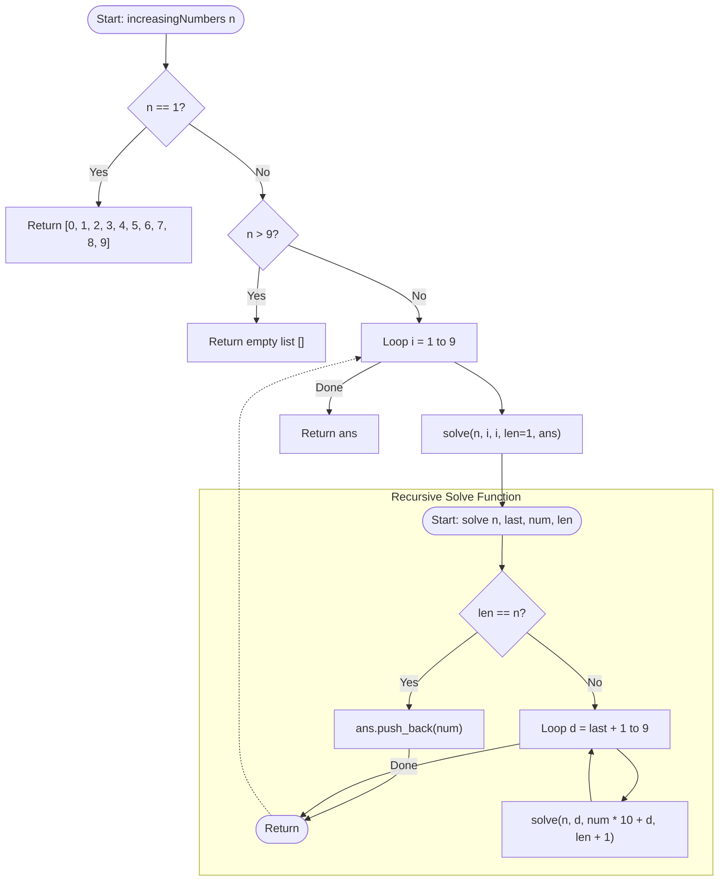

# 💡 Approach — N-Digit Numbers with Increasing Digits

| 📄 [Problem](./Problem.md) | 💡 [Approach](./Approach.md) | 🧩 [Solution](./Solution.cpp) | 🚀 [Main](./Main.cpp) |
|:--------------------------:|:-----------------------------:|:------------------------------:|:---------------------:|

---

## 📊 Metadata

---

## 🎯 Core Insight

> [!TIP]
> **Use Backtracking/Recursion** to build numbers digit by digit, always keeping each new digit strictly greater than the previous digit.
>
> 1. **Digit Constraints**: Because the digits must be strictly increasing, we can only choose digits from $\{1, 2, \dots, 9\}$. A number cannot start with $0$ unless the number of digits $n = 1$, as $012$ is not a valid $3$-digit number.
> 2. **Length Limit**: Since there are only $9$ non-zero digits, a strictly increasing combination can have at most $9$ digits. Thus, if $n > 9$, no valid numbers can be constructed, and we return an empty list immediately.
> 3. **Lexicographical Generation**: By calling the recursion from smaller starting digits to larger ones ($1$ to $9$) and recursively picking next digits in increasing order ($d \in [\text{last} + 1, 9]$), the generated sequences naturally appear in ascending numerical order.

---

## 🔩 Step-by-Step Breakdown

**Step 1 — Edge Cases**
- If $n = 1$, return the list `[0, 1, 2, 3, 4, 5, 6, 7, 8, 9]`.
- If $n > 9$, return an empty vector since we cannot form any strictly increasing sequence of digits of length greater than $9$.

**Step 2 — Initiate Recursion**
- Iterate the first digit $i$ from $1$ to $9$.
- For each starting digit, initiate the recursive solver `solve(n, i, i, 1, ans)`.

**Step 3 — Helper Base Case**
- Inside `solve(int n, int last, int num, int len, vector<int> &ans)`:
- If the current length `len` equals the target length `n`, push `num` to `ans` and return.

**Step 4 — Generate Next Digit**
- Iterate the next digit $d$ from `last + 1` to $9$ to ensure strictly increasing ordering.

**Step 5 — Recursive Call**
- Call `solve(n, d, num * 10 + d, len + 1, ans)` for each chosen next digit $d$.

---

## 🔄 Mermaid Flowchart

---

## 🧮 Dry Run — Example 2 ($n = 2$)

- **First Digit Loop**:
  - **$i = 1$**: call `solve(2, 1, 1, 1, ans)`
    - Next digit $d$ goes from $2$ to $9$:
      - **$d = 2$**: call `solve(2, 2, 12, 2, ans)` $\to$ `len == n`, pushes `12`.
      - **$d = 3$**: call `solve(2, 3, 13, 2, ans)` $\to$ `len == n`, pushes `13`.
      - $\dots$
      - **$d = 9$**: call `solve(2, 9, 19, 2, ans)` $\to$ `len == n`, pushes `19`.
  - **$i = 2$**: call `solve(2, 2, 2, 1, ans)`
    - Next digit $d$ goes from $3$ to $9$:
      - **$d = 3$**: call `solve(2, 3, 23, 2, ans)` $\to$ pushes `23`.
      - $\dots$
      - **$d = 9$**: call `solve(2, 9, 29, 2, ans)` $\to$ pushes `29`.
  - $\dots$
  - **$i = 8$**: call `solve(2, 8, 8, 1, ans)`
    - Next digit $d$ goes from $9$ to $9$:
      - **$d = 9$**: call `solve(2, 9, 89, 2, ans)` $\to$ pushes `89`.
  - **$i = 9$**: call `solve(2, 9, 9, 1, ans)`
    - Next digit loop $d$ from $10$ to $9$ (never executes).
- **Result**: `[12, 13, 14, 15, 16, 17, 18, 19, 23, 24, 25, 26, 27, 28, 29, 34, 35, 36, 37, 38, 39, 45, 46, 47, 48, 49, 56, 57, 58, 59, 67, 68, 69, 78, 79, 89]`.

---

## 📊 Complexity Analysis

| Metric | Complexity | Reasoning |
| :---: | :---: | :--- |
| 🕐 Time | $$O(n \times \binom{9}{n})$$ | We generate exactly $\binom{9}{n}$ combinations. For each combination, we construct a number of length $n$. Since $n \le 9$, the runtime is exceptionally small (at most $\approx 252$ recursive paths). |
| 💾 Space | $$O(n)$$ | Auxiliary space is dominated by the recursion stack, which has a maximum height of $O(n)$ where $n \le 9$. |

---

> *"In order to find the grandest paths, one must take step-by-step leaps, always moving forward, never looking back to smaller options."*

---

<h3>Happy Coding! 🚀</h3>

