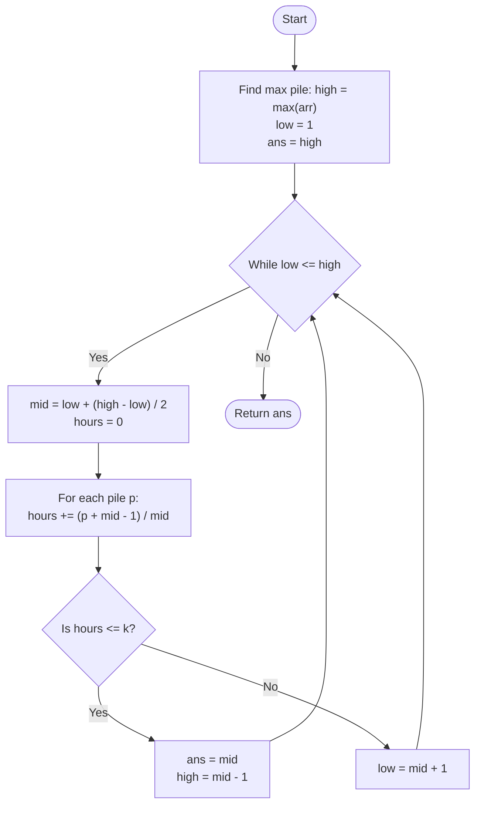

# Approach: Binary Search on Answer

  <a href="./Problem.md"><strong>Problem Statement</strong></a> |
  <a href="./Solution.cpp"><strong>Solution.cpp</strong></a> |
  <a href="./Main.cpp"><strong>Main.cpp</strong></a>

 

## 💡 Intuition

The problem asks for the minimum eating speed (bananas per hour) required to finish all piles within `k` hours.
Notice that the eating speed is bounded:
- The **minimum** possible speed is `1` banana per hour.
- The **maximum** possible speed we'd ever need to consider is the size of the largest pile (`max(piles)`). Eating any faster won't save time because Koko can only eat from one pile per hour anyway.

If we pick an arbitrary speed `s`, we can calculate exactly how many hours it will take Koko to eat all the bananas. 
- If she can finish in $\le k$ hours, `s` is a valid speed. However, we want the *minimum* speed, so we should try to see if a slower speed (smaller `s`) also works.
- If it takes $> k$ hours, she's eating too slowly. We must increase the speed (larger `s`).

Because the validity of the speed is **monotonic** (if speed `s` works, then `s + 1` definitely works; if speed `s` fails, then `s - 1` definitely fails), we can use **Binary Search** over the range of possible speeds to find the optimal minimum speed.

## 🛠️ Algorithm

1. Find the maximum pile size in the array and set it as `high`. Set `low = 1`.
2. Initialize `ans = high`.
3. Perform Binary Search while `low <= high`:
   - Calculate `mid = low + (high - low) / 2` (our current guessed eating speed).
   - Initialize `hours = 0`.
   - Iterate through each pile `p` in the array:
     - Add the hours needed to eat this pile to `hours`. The time taken is $\lceil p / mid \rceil$, which can be calculated using integer math as `(p + mid - 1) / mid`.
   - **Condition Check:**
     - If `hours <= k`, `mid` is a valid speed. Update `ans = mid` and try to find a smaller valid speed by setting `high = mid - 1`.
     - If `hours > k`, `mid` is too slow. Try a faster speed by setting `low = mid + 1`.
4. Return `ans`.

## 📊 Visual Representation

## ⏳ Complexity Analysis

- **Time Complexity:** $\mathcal{O}(N \log(\max(\text{arr})))$. The search space for the binary search is from $1$ to $\max(\text{arr})$. For each step of the binary search, we iterate through the entire array of size $N$ to calculate the required hours.
- **Space Complexity:** $\mathcal{O}(1)$. We only use a few variables (`low`, `high`, `mid`, `hours`, `ans`), requiring constant extra space.

## 🚶‍♂️ Example Walkthrough

**Input:** `arr = [5, 10, 3]`, `k = 4`

1. `low = 1`, `high = max([5, 10, 3]) = 10`. `ans = 10`.
2. **Iteration 1:**
   - `mid = (1 + 10) / 2 = 5`.
   - `hours = ceil(5/5) + ceil(10/5) + ceil(3/5) = 1 + 2 + 1 = 4`.
   - `4 <= 4` (Valid). `ans = 5`, `high = 5 - 1 = 4`.
3. **Iteration 2:**
   - `mid = (1 + 4) / 2 = 2`.
   - `hours = ceil(5/2) + ceil(10/2) + ceil(3/2) = 3 + 5 + 2 = 10`.
   - `10 > 4` (Invalid). `low = 2 + 1 = 3`.
4. **Iteration 3:**
   - `mid = (3 + 4) / 2 = 3`.
   - `hours = ceil(5/3) + ceil(10/3) + ceil(3/3) = 2 + 4 + 1 = 7`.
   - `7 > 4` (Invalid). `low = 3 + 1 = 4`.
5. **Iteration 4:**
   - `mid = (4 + 4) / 2 = 4`.
   - `hours = ceil(5/4) + ceil(10/4) + ceil(3/4) = 2 + 3 + 1 = 6`.
   - `6 > 4` (Invalid). `low = 4 + 1 = 5`.
6. Loop terminates because `low (5) > high (4)`.

**Final Output:** `5`
