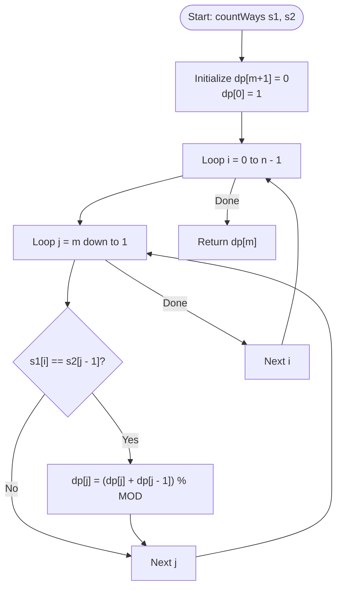

# 💡 Approach — Count Matching Subsequences

<div align="center">

| 📄 [Problem](./Problem.md) | 💡 [Approach](./Approach.md) | 🧩 [Solution](./Solution.cpp) | 🚀 [Main](./Main.cpp) |
|:--------------------------:|:-----------------------------:|:------------------------------:|:---------------------:|

</div>

---

## 📊 Metadata

<div align="center">


</div>

---

## 🎯 Core Insight

> [!TIP]
> **Use Space-Optimized Dynamic Programming** to count how many subsequences of prefix $s1[0 \dots i-1]$ match prefix $s2[0 \dots j-1]$.
>
> 1. **DP Transition**: Let $dp[i][j]$ represent the count of subsequences matching $s2[0 \dots j-1]$ using the prefix $s1[0 \dots i-1]$.
>    - If $s1[i-1] \neq s2[j-1]$, we must exclude $s1[i-1]$, yielding $dp[i][j] = dp[i-1][j]$.
>    - If $s1[i-1] == s2[j-1]$, we have two choices:
>      - Exclude $s1[i-1]$, yielding $dp[i-1][j]$ ways.
>      - Include $s1[i-1]$ to match the character $s2[j-1]$, yielding $dp[i-1][j-1]$ ways.
>      - Thus, $dp[i][j] = (dp[i-1][j] + dp[i-1][j-1]) \pmod{10^9+7}$.
> 2. **Space Optimization**: Since $dp[i][j]$ only relies on values from the previous row $dp[i-1][\dots]$, we can collapse the grid into a 1D vector `dp` of size $m + 1$. Iterating backwards from $m$ down to $1$ ensures we use the values of the previous row without them being overwritten by updates in the current row.

---

## 🔩 Step-by-Step Breakdown

**Step 1 — Initialize DP Array**
- Create a 1D vector `dp` of size $m + 1$ with all elements initialized to $0$.
- Set `dp[0] = 1` since there is exactly 1 way to form an empty string $s2$ (by choosing the empty subsequence).

**Step 2 — Outer Loop over s1**
- Iterate $i$ from $0$ to $n - 1$ to process characters of $s1$ one by one.

**Step 3 — Inner Loop backwards over s2**
- Iterate $j$ backwards from $m$ down to $1$.
- If $s1[i] == s2[j - 1]$, add the ways to match prefix of length $j - 1$ to the ways to match prefix of length $j$:
  $$dp[j] = (dp[j] + dp[j - 1]) \pmod{10^9+7}$$

**Step 4 — Return Result**
- Return `dp[m]`, which stores the number of subsequences of $s1$ equal to $s2$.

---

## 🔄 Mermaid Flowchart



---

## 🧮 Dry Run — Example 1

**Input:**
```text
s1 = "geeksforgeeks", s2 = "gks"
MOD = 1000000007
```

- Initialize `dp` of size $4$: `[1, 0, 0, 0]`

### Dynamic Iterations Log:
- **`i = 0` ($s1[0] = 'g'$):**
  - Matches $s2[0]$ ('g') at $j=1$: `dp[1] = (dp[1] + dp[0]) = 0 + 1 = 1`
  - `dp` state: `[1, 1, 0, 0]`
- **`i = 3` ($s1[3] = 'k'$):**
  - Matches $s2[1]$ ('k') at $j=2$: `dp[2] = (dp[2] + dp[1]) = 0 + 1 = 1`
  - `dp` state: `[1, 1, 1, 0]`
- **`i = 4` ($s1[4] = 's'$):**
  - Matches $s2[2]$ ('s') at $j=3$: `dp[3] = (dp[3] + dp[2]) = 0 + 1 = 1`
  - `dp` state: `[1, 1, 1, 1]`
- **`i = 8` ($s1[8] = 'g'$):**
  - Matches $s2[0]$ ('g') at $j=1$: `dp[1] = (dp[1] + dp[0]) = 1 + 1 = 2`
  - `dp` state: `[1, 2, 1, 1]`
- **`i = 11` ($s1[11] = 'k'$):**
  - Matches $s2[1]$ ('k') at $j=2$: `dp[2] = (dp[2] + dp[1]) = 1 + 2 = 3`
  - `dp` state: `[1, 2, 3, 1]`
- **`i = 12` ($s1[12] = 's'$):**
  - Matches $s2[2]$ ('s') at $j=3$: `dp[3] = (dp[3] + dp[2]) = 1 + 3 = 4`
  - `dp` state: `[1, 2, 3, 4]`

- **Result**: `dp[3] = 4`.

---

## 📊 Complexity Analysis

| Metric | Complexity | Reasoning |
| :---: | :---: | :--- |
| 🕐 Time | $$O(|s1| \times |s2|)$$ | Nested loops run $|s1|$ times externally and $|s2|$ times internally. |
| 💾 Space | $$O(|s2|)$$ | Space-optimized solution stores only a single 1D array of size $|s2| + 1$. |

---

> *"Great outcomes are built upon subsequences of small, consistent choices."*

---

<div align="center">
<h3>Happy Coding! 🚀</h3>
<a href="../149_Day/Approach.md">
  
</a>
<a href="https://x.com/PankajB42550" target="_blank">
  
</a>
<a href="../151_Day/Approach.md">
  
</a>
</div>
