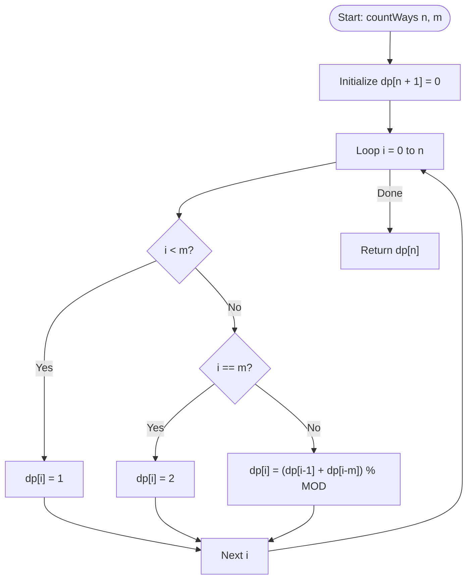

# 💡 Approach — Ways to Tile the Floor

| 📄 [Problem](./Problem.md) | 💡 [Approach](./Approach.md) | 🧩 [Solution](./Solution.cpp) | 🚀 [Main](./Main.cpp) |
|:--------------------------:|:-----------------------------:|:------------------------------:|:---------------------:|

---

## 📊 Metadata

---

## 🎯 Core Insight

> [!TIP]
> **Use Dynamic Programming** to build the tiling counts based on the floor height $i$.
>
> 1. **Tiling Choices**:
>    - Place a tile horizontally (dimensions $1 \times m$). This leaves a remaining floor of height $i - 1$, giving $dp[i - 1]$ ways.
>    - Place a tile vertically (dimensions $m \times 1$). To keep the boundary clean across the width $m$, we must place $m$ vertical tiles side-by-side. This occupies a block of $m \times m$, leaving a remaining floor of height $i - m$, giving $dp[i - m]$ ways.
> 2. **Recurrence Relation**:
>    - For $i > m$: $$dp[i] = (dp[i-1] + dp[i-m]) \pmod{10^9+7}$$
> 3. **Base Cases**:
>    - If $i < m$, vertical placement is impossible because the tile height exceeds the floor height. Thus, we can only place tiles horizontally. There is exactly $1$ way.
>    - If $i == m$, we can either place $m$ tiles horizontally or $m$ tiles vertically. This yields exactly $2$ ways.

---

## 🔩 Step-by-Step Breakdown

**Step 1 — Initialize DP Array**
- Create a 1D vector `dp` of size $n + 1$ filled with $0$.

**Step 2 — Loop floor heights**
- Run a loop $i$ from $0$ to $n$ to compute the tiling ways for each intermediate height.

**Step 3 — Handle $i < m$**
- For heights smaller than the tile width $m$, set `dp[i] = 1`.

**Step 4 — Handle $i == m$**
- For height equal to $m$, set `dp[i] = 2`.

**Step 5 — Transition for $i > m$**
- Apply the transition recurrence:
  $$dp[i] = (dp[i-1] + dp[i-m]) \pmod{10^9+7}$$

**Step 6 — Return Result**
- Return `dp[n]`.

---

## 🔄 Mermaid Flowchart

---

## 🧮 Dry Run — Example 1 ($n = 4, m = 4$)

- DP array size $5$: `[0, 0, 0, 0, 0]`
- **`i = 0`**: $0 < 4 \implies dp[0] = 1$
- **`i = 1`**: $1 < 4 \implies dp[1] = 1$
- **`i = 2`**: $2 < 4 \implies dp[2] = 1$
- **`i = 3`**: $3 < 4 \implies dp[3] = 1$
- **`i = 4`**: $4 == 4 \implies dp[4] = 2$
- **Result**: `dp[4] = 2`.

---

## 📊 Complexity Analysis

| Metric | Complexity | Reasoning |
| :---: | :---: | :--- |
| 🕐 Time | $$O(n)$$ | We compute the tiling configurations by looping from $0$ up to $n$ in a single pass. |
| 💾 Space | $$O(n)$$ | Storing the states of size $n + 1$ in a 1D vector `dp`. |

---

> *"Tiling a massive floor starts with aligning the first single brick correctly."*

---

<h3>Happy Coding! 🚀</h3>

