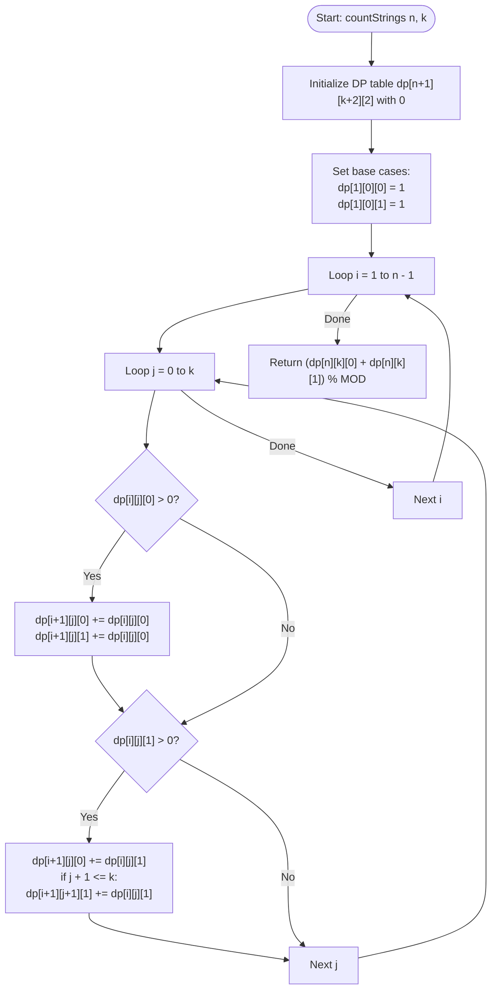

# 💡 Approach — k Times Appearing Adjacent Two 1's

| 📄 [Problem](./Problem.md) | 💡 [Approach](./Approach.md) | 🧩 [Solution](./Solution.cpp) | 🚀 [Main](./Main.cpp) |
|:--------------------------:|:-----------------------------:|:------------------------------:|:---------------------:|

---

## 📊 Metadata

---

## 🎯 Core Insight

> [!TIP]
> **Use 3D Dynamic Programming** to keep track of the string length, the count of adjacent "11" pairs, and the value of the last bit.
>
> 1. **DP State Representation**:
>    - Let `dp[i][j][last_bit]` store the number of binary strings of length `i` with exactly `j` adjacent "11" pairs ending with `last_bit` ($0$ or $1$).
> 2. **Base Cases**:
>    - For a string of length $1$:
>      - `dp[1][0][0] = 1` (string `"0"`)
>      - `dp[1][0][1] = 1` (string `"1"`)
> 3. **State Transitions**:
>    - **Appending `0`**: We can append `0` to any string of length `i` ending in `0` or `1`. The number of adjacent "11" pairs remains unchanged (`j`):
>      - `dp[i + 1][j][0] = (dp[i + 1][j][0] + dp[i][j][0] + dp[i][j][1]) % MOD`
>    - **Appending `1`**: 
>      - If the previous bit was `0` (from `dp[i][j][0]`), appending `1` does not form a new "11" pair. Thus, the count remains `j`:
>        - `dp[i + 1][j][1] = (dp[i + 1][j][1] + dp[i][j][0]) % MOD`
>      - If the previous bit was `1` (from `dp[i][j][1]`), appending `1` forms a new adjacent "11" pair. Thus, the count increases from `j` to `j + 1`:
>        - `dp[i + 1][j + 1][1] = (dp[i + 1][j + 1][1] + dp[i][j][1]) % MOD`

---

## 🔩 Step-by-Step Breakdown

**Step 1 — Initialize DP Table**
- Initialize a 3D vector `dp` of size `(n + 1) x (k + 2) x 2` with value $0$.

**Step 2 — Set Base Cases**
- Assign `dp[1][0][0] = 1` and `dp[1][0][1] = 1`.

**Step 3 — Iterate and Transition**
- Loop through length `i` from $1$ to $n - 1$ and pair count `j` from $0$ to $k$.
- If `dp[i][j][0] > 0`:
  - Update `dp[i + 1][j][0]` and `dp[i + 1][j][1]`.
- If `dp[i][j][1] > 0`:
  - Update `dp[i + 1][j][0]`.
  - If $j + 1 \le k$, update `dp[i + 1][j + 1][1]`.

**Step 4 — Sum and Return Result**
- Sum up the configurations of length `n` having exactly `k` adjacent pairs ending with either `0` or `1`:
  $$\text{Result} = (dp[n][k][0] + dp[n][k][1]) \pmod{10^9+7}$$

---

## 🔄 Mermaid Flowchart

---

## 🧮 Dry Run — Example 1 ($n = 3, k = 2$)

- **Base Cases**:
  - `dp[1][0][0] = 1` (string `"0"`)
  - `dp[1][0][1] = 1` (string `"1"`)
- **`i = 1`** (transitions to length 2):
  - `j = 0`:
    - From `dp[1][0][0] = 1`:
      - Append `0` $\implies$ `dp[2][0][0] += 1` $\implies$ `dp[2][0][0] = 1` (string `"00"`)
      - Append `1` $\implies$ `dp[2][0][1] += 1` $\implies$ `dp[2][0][1] = 1` (string `"01"`)
    - From `dp[1][0][1] = 1`:
      - Append `0` $\implies$ `dp[2][0][0] += 1` $\implies$ `dp[2][0][0] = 2` (strings `"00", "10"`)
      - Append `1` $\implies$ `dp[2][1][1] += 1` $\implies$ `dp[2][1][1] = 1` (string `"11"`)
- **`i = 2`** (transitions to length 3):
  - `j = 0`:
    - From `dp[2][0][0] = 2`:
      - Append `0` $\implies$ `dp[3][0][0] += 2` (strings `"000", "100"`)
      - Append `1` $\implies$ `dp[3][0][1] += 2` (strings `"001", "101"`)
    - From `dp[2][0][1] = 1`:
      - Append `0` $\implies$ `dp[3][0][0] += 1` (strings `"000", "100", "010"`)
      - Append `1` (since $j+1=1 \le 2$) $\implies$ `dp[3][1][1] += 1` (string `"011"`)
  - `j = 1`:
    - From `dp[2][1][1] = 1`:
      - Append `0` $\implies$ `dp[3][1][0] += 1` (string `"110"`)
      - Append `1` (since $j+1=2 \le 2$) $\implies$ `dp[3][2][1] += 1` (string `"111"`)
- **Final Result**:
  - `dp[3][2][0] + dp[3][2][1] = 0 + 1 = 1` (string `"111"`).

---

## 📊 Complexity Analysis

| Metric | Complexity | Reasoning |
| :---: | :---: | :--- |
| 🕐 Time | $$O(n^2)$$ | We compute transitions using two nested loops: length $i$ up to $n$ and adjacent count $j$ up to $k$. With $k \le n$, total states computed is $O(n \times k) \subseteq O(n^2)$. |
| 💾 Space | $$O(n \times k)$$ | We instantiate a 3D table of dimensions $(n+1) \times (k+2) \times 2$ to store subproblem states. |

---

> *"In the binary dance of ones and zeros, every adjacent step holds a pattern waiting to be counted."*

---

<h3>Happy Coding! 🚀</h3>

