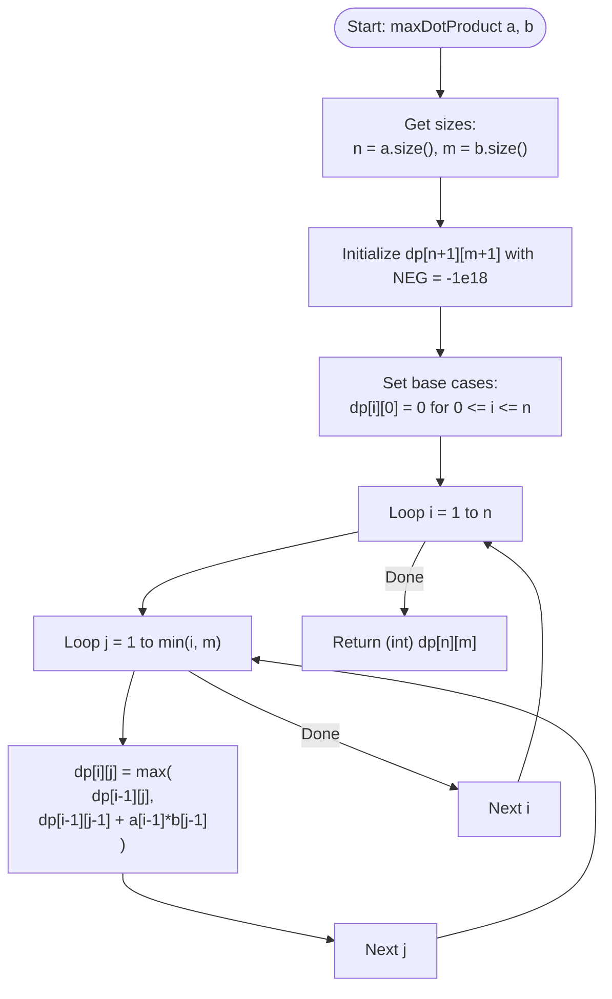

# 💡 Approach — Maximize Dot Product

| 📄 [Problem](./Problem.md) | 💡 [Approach](./Approach.md) | 🧩 [Solution](./Solution.cpp) | 🚀 [Main](./Main.cpp) |
|:--------------------------:|:-----------------------------:|:------------------------------:|:---------------------:|

---

## 📊 Metadata

---

## 🎯 Core Insight

> [!TIP]
> **Use 2D Dynamic Programming** to decide at each step whether to pair the current element of $a$ with the current element of $b$, or to "insert a zero" in $b$ (which multiplies the current element of $a$ by $0$).
>
> 1. **DP State Representation**:
>    - Let `dp[i][j]` store the maximum dot product using a prefix of array $a$ of size $i$ and a prefix of array $b$ of size $j$.
> 2. **Base Cases**:
>    - `dp[i][0] = 0` for all $0 \le i \le n$: If we match $0$ elements of $b$ (i.e. we only insert zeros in $b$), the dot product is $0$.
>    - All other values are initialized to a very small number (`NEG = -1e18`) to represent invalid or unreachable states (e.g. matching more elements of $b$ than available in $a$).
> 3. **State Transitions**:
>    - **Option 1 (Insert 0 in $b$):** The element $a[i-1]$ is paired with $0$. The dot product does not increase, and the problem reduces to matching $i-1$ elements of $a$ with $j$ elements of $b$:
>      - `dp[i - 1][j]`
>    - **Option 2 (Pair $a[i-1]$ with $b[j-1]$):** The element $a[i-1]$ is multiplied by $b[j-1]$. The problem reduces to matching $i-1$ elements of $a$ with $j-1$ elements of $b$:
>      - `dp[i - 1][j - 1] + a[i - 1] * b[j - 1]`
>    - **Transition Formula:**
>      - `dp[i][j] = max(dp[i - 1][j], dp[i - 1][j - 1] + a[i - 1] * b[j - 1])`

---

## 🔩 Step-by-Step Breakdown

**Step 1 — Initialize DP Table**
- Create a 2D table `dp` of size `(n + 1) x (m + 1)` filled with a very small constant `NEG = -1e18`.

**Step 2 — Set Base Cases**
- Assign `dp[i][0] = 0` for all $0 \le i \le n$.

**Step 3 — Iterate and Transition**
- Loop through $i$ from $1$ to $n$.
- Loop through $j$ from $1$ to $\min(i, m)$.
- At each step, compute `dp[i][j]` as the maximum of:
  - `dp[i - 1][j]` (excluding $a[i-1]$ by inserting a zero in $b$)
  - `dp[i - 1][j - 1] + 1LL * a[i - 1] * b[j - 1]` (pairing $a[i-1]$ with $b[j-1]$)

**Step 4 — Return Result**
- The maximum dot product for the entire arrays is stored in `dp[n][m]`. Return it cast to `int`.

---

## 🔄 Mermaid Flowchart

---

## 🧮 Dry Run — Example 1 ($a = [2, 3, 1, 7, 8]$, $b = [3, 6, 7]$)

- **Initial State**:
  - `dp[i][0] = 0` for $i \in [0, 5]$. All other cells initialized to $-\infty$.

- **`i = 1`** ($a[0] = 2$):
  - `j = 1` ($b[0] = 3$):
    - `dp[1][1] = max(dp[0][1], dp[0][0] + 2 * 3) = max(-∞, 0 + 6) = 6`

- **`i = 2`** ($a[1] = 3$):
  - `j = 1` ($b[0] = 3$):
    - `dp[2][1] = max(dp[1][1], dp[1][0] + 3 * 3) = max(6, 0 + 9) = 9`
  - `j = 2` ($b[1] = 6$):
    - `dp[2][2] = max(dp[1][2], dp[1][1] + 3 * 6) = max(-∞, 6 + 18) = 24`

- **`i = 3`** ($a[2] = 1$):
  - `j = 1` ($b[0] = 3$):
    - `dp[3][1] = max(dp[2][1], dp[2][0] + 1 * 3) = max(9, 0 + 3) = 9`
  - `j = 2` ($b[1] = 6$):
    - `dp[3][2] = max(dp[2][2], dp[2][1] + 1 * 6) = max(24, 9 + 6) = 24`
  - `j = 3` ($b[2] = 7$):
    - `dp[3][3] = max(dp[2][3], dp[2][2] + 1 * 7) = max(-∞, 24 + 7) = 31`

- **`i = 4`** ($a[3] = 7$):
  - `j = 1` ($b[0] = 3$):
    - `dp[4][1] = max(dp[3][1], dp[3][0] + 7 * 3) = max(9, 0 + 21) = 21`
  - `j = 2` ($b[1] = 6$):
    - `dp[4][2] = max(dp[3][2], dp[3][1] + 7 * 6) = max(24, 9 + 42) = 51`
  - `j = 3` ($b[2] = 7$):
    - `dp[4][3] = max(dp[3][3], dp[3][2] + 7 * 7) = max(31, 24 + 49) = 73`

- **`i = 5`** ($a[4] = 8$):
  - `j = 1` ($b[0] = 3$):
    - `dp[5][1] = max(dp[4][1], dp[4][0] + 8 * 3) = max(21, 0 + 24) = 24`
  - `j = 2` ($b[1] = 6$):
    - `dp[5][2] = max(dp[4][2], dp[4][1] + 8 * 6) = max(51, 21 + 48) = 69`
  - `j = 3` ($b[2] = 7$):
    - `dp[5][3] = max(dp[4][3], dp[4][2] + 8 * 7) = max(73, 51 + 56) = 107`

- **Final Answer**: `dp[5][3] = 107`.

---

## 📊 Complexity Analysis

| Metric | Complexity | Reasoning |
| :---: | :---: | :--- |
| 🕐 Time | $$O(n \times m)$$ | We compute transitions using two nested loops: array $a$ up to length $n$ and array $b$ up to length $m$. |
| 💾 Space | $$O(n \times m)$$ | A 2D table of dimensions $(n + 1) \times (m + 1)$ is used to store intermediate subproblem states. |

> [!TIP]
> **Space Optimization:** We can optimize the space to $O(m)$ since the state transitions for row `i` only depend on values from row `i - 1`.

---

> *"Alignment is not about forcing matching shapes, but choosing where to place the zeros to maximize the beauty of the product."*

---

<h3>Happy Coding! 🚀</h3>

