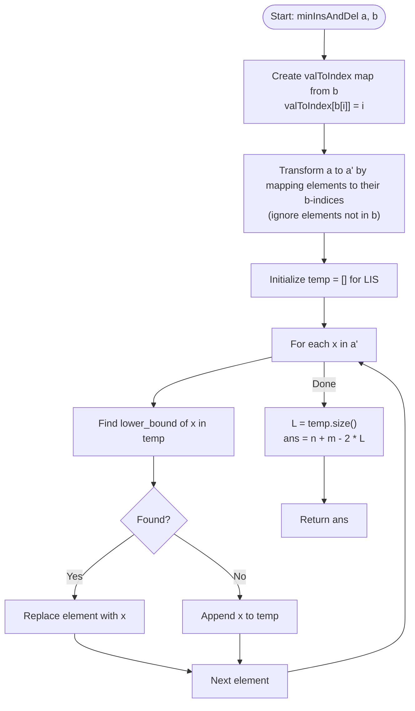

# 💡 Approach — Minimum Insertions to Make Two Arrays Equal

| 📄 [Problem](./Problem.md) | 💡 [Approach](./Approach.md) | 🧩 [Solution](./Solution.cpp) | 🚀 [Main](./Main.cpp) |
|:--------------------------:|:-----------------------------:|:------------------------------:|:---------------------:|

---

## 📊 Metadata

---

## 🎯 Core Insight

> [!TIP]
> **Reduce LCS to LIS using index mapping.**
> Since array $b$ is sorted and consists of distinct elements, we can map each element in $b$ to its unique index.
>
> 1. **Convert LCS to LIS**:
>    - Create a map or lookup table to store the index of each element in $b$.
>    - For each element in $a$, check if it exists in $b$. If it does, replace it with its index in $b$. If not, discard/ignore it.
>    - Let this transformed sequence of indices be $a'$. Since the elements of $b$ are strictly increasing in terms of their indices ($0, 1, 2, \dots, m-1$), the Longest Common Subsequence (LCS) between $a$ and $b$ is exactly the **Longest Increasing Subsequence (LIS)** of $a'$.
> 2. **Calculate Operations**:
>    - Let $L$ be the length of the LIS of $a'$.
>    - The minimum number of deletions in $a$ is $n - L$ (remove elements not in the LCS).
>    - The minimum number of insertions in $a$ is $m - L$ (insert elements from $b$ not in the LCS).
>    - Total operations = $\text{Deletions} + \text{Insertions} = (n - L) + (m - L) = n + m - 2 \cdot L$.
> 3. **Find LIS in $O(n \log n)$**:
>    - Use patience sorting (binary search with `std::lower_bound`) to find the length of the LIS of $a'$.

---

## 🔩 Step-by-Step Breakdown

**Step 1 — Build Element-to-Index Map for b**
- Populate an index mapping structure (`unordered_map<int, int>`) such that `valToIndex[b[i]] = i` for all $0 \le i < m$.

**Step 2 — Filter and Map Array a**
- Create a list/vector $a'$ containing the indices of elements of $a$ in $b$.
- For each element $x \in a$:
  - If $x$ exists in the index mapping, push `valToIndex[x]` into $a'$.

**Step 3 — Compute the LIS of a'**
- Use the binary search approach (`std::lower_bound`) to compute the length of the LIS of $a'$:
  - Initialize an empty vector `temp`.
  - For each element `idx` in $a'$:
    - Find the position of the first element in `temp` that is $\ge$ `idx` using binary search.
    - If no such element exists, append `idx` to `temp`.
    - Otherwise, replace the element at that position with `idx`.
  - The length of LIS is `temp.size()`.

**Step 4 — Calculate and Return the Minimum Operations**
- Let $L$ be `temp.size()`.
- Return $n + m - 2 \cdot L$.

---

## 🔄 Mermaid Flowchart

---

## 🧮 Dry Run — Example 1 ($a = [1, 2, 5, 3, 1]$, $b = [1, 3, 5]$)

- **Step 1: Map $b$'s elements**
  - `valToIndex[1] = 0`
  - `valToIndex[3] = 1`
  - `valToIndex[5] = 2`

- **Step 2: Map and filter $a$ to $a'$**
  - $a[0] = 1 \implies$ in $b$ at index $0$. Push $0$.
  - $a[1] = 2 \implies$ not in $b$. Ignore.
  - $a[2] = 5 \implies$ in $b$ at index $2$. Push $2$.
  - $a[3] = 3 \implies$ in $b$ at index $1$. Push $1$.
  - $a[4] = 1 \implies$ in $b$ at index $0$. Push $0$.
  - Transformed array $a' = [0, 2, 1, 0]$.

- **Step 3: LIS of $a'$**
  - Process $0$: `temp = [0]`
  - Process $2$: `temp = [0, 2]`
  - Process $1$: `lower_bound` of $1$ in `temp` is $2$ (at index 1). Replace $2$ with $1$. `temp = [0, 1]`
  - Process $0$: `lower_bound` of $0$ in `temp` is $0$ (at index 0). Replace $0$ with $0$. `temp = [0, 1]`
  - LIS length $L = 2$.

- **Step 4: Calculate operations**
  - Total operations = $n + m - 2 \cdot L = 5 + 3 - 2 \cdot 2 = 4$.

---

## 📊 Complexity Analysis

| Metric | Complexity | Reasoning |
| :---: | :---: | :--- |
| 🕐 Time | $$O(n \log n)$$ | Building the index map takes $O(m)$ time. Transforming $a$ to $a'$ takes $O(n)$ time. Finding the LIS of $a'$ of size at most $n$ takes $O(n \log n)$ time using binary search. |
| 💾 Space | $$O(n + m)$$ | We store the index map of size $O(m)$, the array $a'$ of size at most $n$, and the LIS vector of size at most $n$. |

---

> *"Transforming a sequence is not about changing its identity, but discovering its relative order in a reference universe."*

---

<h3>Happy Coding! 🚀</h3>

