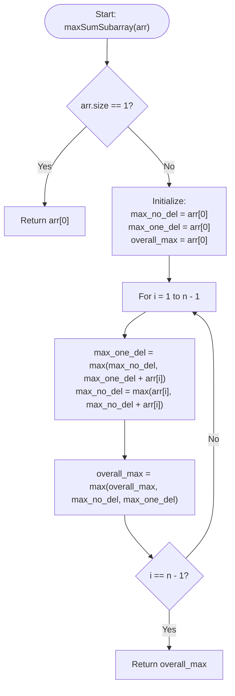

# 💡 Approach — Max Sum Subarray by Removing at Most One Element

| 📄 [Problem](./Problem.md) | 💡 [Approach](./Approach.md) | 🧩 [Solution](./Solution.cpp) | 🚀 [Main](./Main.cpp) |
|:--------------------------:|:-----------------------------:|:------------------------------:|:---------------------:|

---

## 📊 Metadata

---

## 🎯 Core Insight

> [!TIP]
> **Track Subarray Sums with At Most One Deletion using Two States**
>
> We can extend Kadane's algorithm by maintaining two dynamic programming states at each step:
> 1. **`max_no_del`**: The maximum subarray sum ending at the current element with **zero** deletions.
> 2. **`max_one_del`**: The maximum subarray sum ending at the current element with **exactly one** deletion.
>
> For each element $x$ in the array:
> - **Transition for `max_one_del`**: We can either:
>   - Delete the current element $x$: The sum becomes the previous subarray sum with zero deletions (`max_no_del` from the previous step).
>   - Add the current element $x$ to a subarray that already contains a deletion: The sum becomes the previous `max_one_del` plus $x$.
>   - Hence: `max_one_del_new = max(max_no_del_old, max_one_del_old + x)`
> - **Transition for `max_no_del`**: This is standard Kadane's algorithm. We can either start a new subarray at $x$ or extend the previous subarray with no deletions:
>   - Hence: `max_no_del_new = max(x, max_no_del_old + x)`
>
> The overall answer will be the maximum value observed across both states during the single pass.

---

## 🔩 Step-by-Step Breakdown

**Step 1 — Handle Base Cases and Initialize States**
- If the array contains only one element, return `arr[0]`. This is because deleting it would result in an empty subarray, which is not allowed.
- Initialize `max_no_del`, `max_one_del`, and `overall_max` all to `arr[0]`.

**Step 2 — Single Pass DP State Transition**
- Loop through the array from index $1$ to $n-1$:
  - Update `max_one_del` using the previous `max_no_del` and the previous `max_one_del` + `arr[i]`.
  - Update `max_no_del` using `arr[i]` and the previous `max_no_del` + `arr[i]`.
  - Update `overall_max` with the maximum of its current value, `max_no_del`, and `max_one_del`.
- Note: The order of updating `max_one_del` before `max_no_del` ensures that we use the `max_no_del` from the previous index (representing the deletion of the current element `arr[i]`).

**Step 3 — Return Results**
- Return `overall_max` which stores the maximum sum found.

---

## 🔄 Mermaid Flowchart

---

## 🧮 Dry Run — Example 1 ($arr = [1, 2, 3, -4, 5]$)

- **Step 1: Initialization**
  - `max_no_del = 1`, `max_one_del = 1`, `overall_max = 1`.

- **Step 2: State Transitions**
  - **At $i = 1$ ($arr[1] = 2$):**
    - `max_one_del = max(1, 1 + 2) = 3`
    - `max_no_del = max(2, 1 + 2) = 3`
    - `overall_max = max(1, 3, 3) = 3`
  - **At $i = 2$ ($arr[2] = 3$):**
    - `max_one_del = max(3, 3 + 3) = 6`
    - `max_no_del = max(3, 3 + 3) = 6`
    - `overall_max = max(3, 6, 6) = 6`
  - **At $i = 3$ ($arr[3] = -4$):**
    - `max_one_del = max(6, 6 - 4) = 6` (Deletes current element $-4$)
    - `max_no_del = max(-4, 6 - 4) = 2`
    - `overall_max = max(6, 2, 6) = 6`
  - **At $i = 4$ ($arr[4] = 5$):**
    - `max_one_del = max(2, 6 + 5) = 11` (Extends subarray that had deleted $-4$)
    - `max_no_del = max(5, 2 + 5) = 7`
    - `overall_max = max(6, 7, 11) = 11`

- **Step 3: Return**
  - Returns `overall_max = 11`.

---

## 📊 Complexity Analysis

| Metric | Complexity | Reasoning |
| :---: | :---: | :--- |
| 🕐 Time | $$O(n)$$ | We make a single sequential pass through the array. |
| 💾 Space | $$O(1)$$ | We only maintain a few scalar state variables, requiring no auxiliary storage. |

---

> *"In the optimization of code, as in life, sometimes letting go of a single burden leads to the greatest potential."*

---

<h3>Happy Coding! 🚀</h3>

