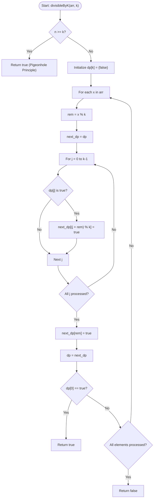

# 💡 Approach — Subset with Sum Divisible by m

| 📄 [Problem](./Problem.md) | 💡 [Approach](./Approach.md) | 🧩 [Solution](./Solution.cpp) | 🚀 [Main](./Main.cpp) |
|:--------------------------:|:-----------------------------:|:------------------------------:|:---------------------:|

---

## 📊 Metadata

---

## 🎯 Core Insight

> [!TIP]
> **Pigeonhole Principle Optimization & Modulo DP**
>
> 1. **Pigeonhole Principle (PHP):**
>    - Let $n$ be the number of elements. If $n \ge k$, the number of prefix sums $S_0, S_1, \dots, S_n$ is $n + 1 \ge k + 1$.
>    - By the Pigeonhole Principle, at least two prefix sums must have the same remainder modulo $k$.
>    - The difference between these two prefix sums represents a contiguous subarray (which is a subset) whose sum is divisible by $k$.
>    - Hence, if $n \ge k$, we can return `true` immediately in $O(1)$ time.
>
> 2. **Modulo DP:**
>    - For cases where $n < k$, we maintain a boolean state array `dp` of size $k$ to track achievable subset sums modulo $k$.
>    - If remainder $j$ was possible using previous elements, then after incorporating element $x$ with $rem = x \pmod k$, the remainder $(j + rem) \pmod k$ also becomes possible.
>    - We also mark the current element's remainder $rem$ as achievable (a single-element subset).
>    - If at any point the remainder $0$ becomes achievable, we exit early and return `true`.

---

## 🔩 Step-by-Step Breakdown

**Step 1 — Apply Pigeonhole Principle Check**
- If the array size $n \ge k$, return `true` immediately.
- This is because among $n$ prefix sums, at least two will share the same remainder modulo $k$, and their difference yields a non-empty subarray sum that is divisible by $k$.

**Step 2 — Initialize DP Table**
- Create a boolean array `dp` of size $k$ initialized to `false`.
- This array tracks achievable subset sums modulo $k$. We do not pre-initialize `dp[0] = true` to avoid counting an empty subset.

**Step 3 — Iterate and Transition States**
- For each element $x$ in the array:
  - Compute `rem = x % k`.
  - Create a copy of the current DP state `next_dp = dp`.
  - For each remainder `j` from $0$ to $k-1$:
    - If `dp[j]` is `true`, set `next_dp[(j + rem) % k] = true`.
  - Mark `next_dp[rem] = true` (representing the single element subset `{x}`).
  - Update `dp = next_dp`.
  - **Early Exit:** If `dp[0]` is `true`, return `true` immediately as we found a non-empty subset whose sum is divisible by $k$.

**Step 4 — Return Failure**
- If we finish iterating through all elements and `dp[0]` is still `false`, return `false`.

---

## 🔄 Mermaid Flowchart

---

## 🧮 Dry Run — Example 1 ($arr = [3, 1, 7, 5], k = 6$)

- **Step 1: Initialization**
  - $n = 4$, $k = 6$. Since $n < k$, we bypass the Pigeonhole Principle check.
  - `dp` of size $6$ is initialized to all `false`.

- **Step 2: State Transitions**
  - **At element $3$ ($rem = 3$):**
    - `next_dp[3] = true`.
    - `dp = [F, F, F, T, F, F]`.
  - **At element $1$ ($rem = 1$):**
    - `dp[3]` is `true` $\implies$ `next_dp[(3+1)%6] = next_dp[4] = true`.
    - `next_dp[1] = true`.
    - `dp = [F, T, F, T, T, F]`.
  - **At element $7$ ($rem = 7 \pmod 6 = 1$):**
    - `dp[1]` is `true` $\implies$ `next_dp[(1+1)%6] = next_dp[2] = true`.
    - `dp[3]` is `true` $\implies$ `next_dp[(3+1)%6] = next_dp[4] = true`.
    - `dp[4]` is `true` $\implies$ `next_dp[(4+1)%6] = next_dp[5] = true`.
    - `next_dp[1] = true`.
    - `dp = [F, T, T, T, T, T]`.
  - **At element $5$ ($rem = 5$):**
    - `dp[1]` is `true` $\implies$ `next_dp[(1+5)%6] = next_dp[0] = true`.
    - Since `next_dp[0]` is `true`, we immediately return `true`.

---

## 📊 Complexity Analysis

| Metric | Complexity | Reasoning |
| :---: | :---: | :--- |
| 🕐 Time | $$O(n \cdot k)$$ | We do at most $k$ iterations of the DP update for each of the $n$ elements. Due to PHP optimization, $n < k$ holds when we run DP, so worst-case time is bounded by $O(k^2)$ which is $10^6$ operations. |
| 💾 Space | $$O(k)$$ | We maintain a few boolean DP arrays of size $k$ to store the state. |

---

> *"Dividing a problem down to its remainders is the first step toward conquering its complexity."*

---

<h3>Happy Coding! 🚀</h3>

