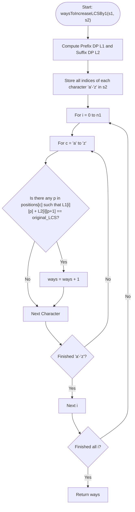

# 💡 Approach — Ways to Increase LCS by One

| 📄 [Problem](./Problem.md) | 💡 [Approach](./Approach.md) | 🧩 [Solution](./Solution.cpp) | 🚀 [Main](./Main.cpp) |
|:--------------------------:|:-----------------------------:|:------------------------------:|:---------------------:|

---

## 📊 Metadata

---

## 🎯 Core Insight

> [!TIP]
> **Prefix-Suffix LCS Dynamic Programming**
>
> 1. **Prefix and Suffix LCS Tables:**
>    - Let $L_1[i][j]$ be the LCS of prefix $s_1[0 \dots i-1]$ and prefix $s_2[0 \dots j-1]$.
>    - Let $L_2[i][j]$ be the LCS of suffix $s_1[i \dots n_1-1]$ and suffix $s_2[j \dots n_2-1]$.
>
> 2. **Evaluation of Insertion:**
>    - If we insert character $c$ at position $i$ in $s_1$ (meaning before $s_1[i]$), and match it with some occurrence of $c$ in $s_2$ at index $p$ (i.e. $s_2[p] == c$):
>      - The prefix match contributes $L_1[i][p]$ to the LCS.
>      - The matched character itself contributes $+1$.
>      - The suffix match contributes $L_2[i][p+1]$ to the LCS.
>      - Thus, the new LCS is $L_1[i][p] + 1 + L_2[i][p+1]$.
>    - An insertion of character $c$ at index $i$ is valid if and only if there exists some $p$ where $s_2[p] == c$ such that:
>      $$L_1[i][p] + L_2[i][p+1] == \text{original\_LCS}$$
>    - Note that we count the number of valid *(insertion position, character)* pairs. Even if two different insertions produce the same resulting string, they represent distinct ways of modifying $s_1$.

---

## 🔩 Step-by-Step Breakdown

**Step 1 — Precompute Prefix DP ($L_1$)**
- Initialize a 2D array `L1[n1 + 1][n2 + 1]` with $0$.
- For each $i$ from $1$ to $n_1$ and $j$ from $1$ to $n_2$:
  - If $s_1[i-1] == s_2[j-1]$, `L1[i][j] = L1[i-1][j-1] + 1`.
  - Otherwise, `L1[i][j] = max(L1[i-1][j], L1[i][j-1])`.

**Step 2 — Precompute Suffix DP ($L_2$)**
- Initialize a 2D array `L2[n1 + 1][n2 + 1]` with $0$.
- For each $i$ from $n_1 - 1$ down to $0$ and $j$ from $n_2 - 1$ down to $0$:
  - If $s_1[i] == s_2[j]$, `L2[i][j] = L2[i+1][j+1] + 1`.
  - Otherwise, `L2[i][j] = max(L2[i+1][j], L2[i][j+1])`.

**Step 3 — Map Character Occurrences**
- Store all 0-based indices for every lowercase English letter in $s_2$ using a hash map or an array of vectors `positions[26]`.

**Step 4 — Evaluate All Valid Insertions**
- Let the base LCS length be `original_LCS = L1[n1][n2]`.
- Loop through each insertion index $i$ from $0$ to $n_1$:
  - For each character $c$ from `'a'` to `'z'`:
    - Check if there is any occurrence index $p$ in `positions[c - 'a']` such that:
      $$L_1[i][p] + L_2[i][p+1] == \text{original\_LCS}$$
    - If a valid match is found, increment the `ways` counter and break (we check only once per insertion point and character choice).

---

## 🔄 Mermaid Flowchart

---

## 🧮 Dry Run — Example 1 ($s_1 = \text{"abab"}$, $s_2 = \text{"abc"}$)

- **Step 1 & 2: DP Calculations**
  - $\text{original\_LCS} = 2$ ("ab").
  - `positions['c' - 'a'] = {2}`.

- **Step 4: Evaluations for $c = \text{'c'}$:**
  - **At $i = 0$:** Check $p = 2$ (since `positions['c'] = {2}`): $L_1[0][2] + L_2[0][3] = 0 + 0 = 0 \neq 2$. (No)
  - **At $i = 1$:** Check $p = 2$: $L_1[1][2] + L_2[1][3] = 1 + 0 = 1 \neq 2$. (No)
  - **At $i = 2$:** Check $p = 2$: $L_1[2][2] + L_2[2][3] = 2 + 0 = 2 == 2$. (Yes, count = 1)
  - **At $i = 3$:** Check $p = 2$: $L_1[3][2] + L_2[3][3] = 2 + 0 = 2 == 2$. (Yes, count = 2)
  - **At $i = 4$:** Check $p = 2$: $L_1[4][2] + L_2[4][3] = 2 + 0 = 2 == 2$. (Yes, count = 3)

- **Result:** $3$ ways.

---

## 📊 Complexity Analysis

| Metric | Complexity | Reasoning |
| :---: | :---: | :--- |
| 🕐 Time | $$O(n1 \cdot n2)$$ | Computing tables $L_1$ and $L_2$ takes $O(n1 \cdot n2)$ time. The matching phase takes $O(n1 \cdot 26 \cdot k) \le O(n1 \cdot n2)$ because the total size of all position lists in $s_2$ is $n_2$. |
| 💾 Space | $$O(n1 \cdot n2)$$ | Auxiliary space is dominated by the storage of the two 2D tables $L_1$ and $L_2$ of size $(n_1 + 1) \times (n_2 + 1)$. |

---

> *"The longest common journey is built character by character, prefix to suffix."*

---

<h3>Happy Coding! 🚀</h3>

