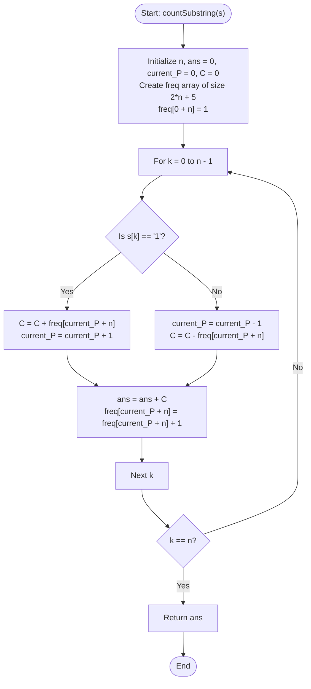

# 💡 Approach — Substrings with more 1's than 0's

| 📄 [Problem](./Problem.md) | 💡 [Approach](./Approach.md) | 🧩 [Solution](./Solution.cpp) | 🚀 [Main](./Main.cpp) |
|:--------------------------:|:-----------------------------:|:------------------------------:|:---------------------:|

---

## 📊 Metadata

---

## 🎯 Core Insight

> [!TIP]
> **Running Balance with Dynamic Prefix Tracking**
>
> 1. **Transform Representation:**
>    - Treat `'1'` as `+1` and `'0'` as `-1`.
>    - A substring $s[i \dots j]$ has more `1`s than `0`s if and only if the sum of its transformed values is strictly positive ($> 0$).
>
> 2. **Prefix Sum Formulation:**
>    - Let $P[k]$ be the prefix sum of the first $k$ characters.
>    - The sum of substring $s[i \dots j]$ is $P[j+1] - P[i]$.
>    - Thus, a substring is valid if $P[j+1] > P[i]$ where $0 \le i \le j < n$.
>
> 3. **Linear State Transition ($O(N)$):**
>    - Let $C[k]$ be the number of indices $i < k$ such that $P[i] < P[k]$.
>    - As we transition from prefix sum $P[k]$ to $P[k+1]$:
>      - **If $s[k] == '1'$**, the prefix sum increases by 1 ($P[k+1] = P[k] + 1$). Any prefix $i$ that had $P[i] < P[k]$ will still satisfy $P[i] < P[k+1]$. In addition, the prefix $k$ itself has $P[k] < P[k+1]$. So, $C[k+1] = C[k] + \text{freq}[P[k]]$.
>      - **If $s[k] == '0'$**, the prefix sum decreases by 1 ($P[k+1] = P[k] - 1$). The prefixes $i$ that satisfy $P[i] < P[k+1]$ are those that had $P[i] < P[k]$ excluding those where $P[i] == P[k+1]$. So, $C[k+1] = C[k] - \text{freq}[P[k+1]]$.
>    - Using an offset array for negative indices allows us to compute all counts in a single pass of $O(N)$ time and $O(N)$ space.

---

## 🔩 Step-by-Step Breakdown

**Step 1 — Initialize Arrays and Offset Variables**
- Set `n = s.length()`, `ans = 0`, `current_P = 0` (running prefix sum), and `C = 0` (count of valid starting points for the current end position).
- Use a frequency array `freq` of size `2 * n + 5` to store the occurrences of each prefix sum.
- Apply an offset of `n` to handle negative prefix sum values safely without out-of-bounds errors.
- Initialize `freq[0 + n] = 1` because the initial prefix sum is $P[0] = 0$.

**Step 2 — Iterate Through the String**
- Loop from `k = 0` to `n - 1`:
  - Determine if `s[k]` is `'1'` or `'0'`.

**Step 3 — Apply Constant Time State Transitions**
- **Case 1: `s[k] == '1'`**
  - Update $C$: `C = C + freq[current_P + n]` (all previously smaller balances remain smaller, plus we gain the ones equal to `current_P`).
  - Update `current_P = current_P + 1`.
  - Add `C` to `ans`.
  - Increment the frequency of the new prefix sum: `freq[current_P + n]++`.
- **Case 2: `s[k] == '0'`**
  - Update `current_P = current_P - 1`.
  - Update $C$: `C = C - freq[current_P + n]` (we lose the prefixes that now equal our new smaller prefix sum).
  - Add `C` to `ans`.
  - Increment the frequency of the new prefix sum: `freq[current_P + n]++`.

**Step 4 — Return the Result**
- Return the final accumulated count `ans`.

---

## 🔄 Mermaid Flowchart

---

## 🧮 Dry Run — Example 1 ($s = \text{"011"}$)

- **Initial State:**
  - `n = 3`, `ans = 0`, `current_P = 0`, `C = 0`.
  - `freq[0 + 3] = freq[3] = 1` (Prefix sum 0 has count 1).
  
- **Iteration 1 ($k = 0$, $s[0] = \text{'0'}$):**
  - `current_P = current_P - 1 = -1`.
  - `C = C - freq[-1 + 3] = 0 - freq[2] = 0 - 0 = 0`.
  - `ans = ans + C = 0 + 0 = 0`.
  - `freq[-1 + 3]++` $\implies$ `freq[2] = 1`.

- **Iteration 2 ($k = 1$, $s[1] = \text{'1'}$):**
  - `C = C + freq[-1 + 3] = 0 + freq[2] = 0 + 1 = 1`.
  - `current_P = current_P + 1 = 0`.
  - `ans = ans + C = 0 + 1 = 1`.
  - `freq[0 + 3]++` $\implies$ `freq[3] = 2`.

- **Iteration 3 ($k = 2$, $s[2] = \text{'1'}$):**
  - `C = C + freq[0 + 3] = 1 + freq[3] = 1 + 2 = 3`.
  - `current_P = current_P + 1 = 1`.
  - `ans = ans + C = 1 + 3 = 4`.
  - `freq[1 + 3]++` $\implies$ `freq[4] = 1`.

- **Final Answer:** `4` substrings.

---

## 📊 Complexity Analysis

| Metric | Complexity | Reasoning |
| :---: | :---: | :--- |
| 🕐 Time | $$O(|s|)$$ | We iterate through the string of length $n$ exactly once. Each transition and frequency update takes $O(1)$ time. |
| 💾 Space | $$O(|s|)$$ | We use an auxiliary frequency array of size $2n + 5$ to map running balances to their frequencies, which consumes $O(n)$ space. |

---

> *"Every bit of information counts, but balancing them reveals the true pattern of the code."*

---

<h3>Happy Coding! 🚀</h3>

