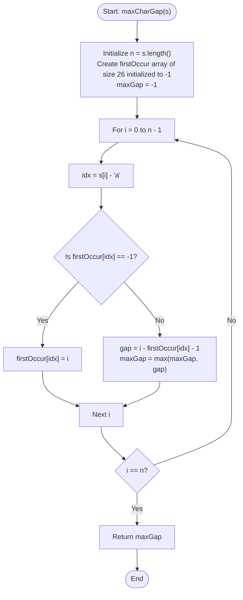

# 💡 Approach — Max Gap Between Two Same

| 📄 [Problem](./Problem.md) | 💡 [Approach](./Approach.md) | 🧩 [Solution](./Solution.cpp) | 🚀 [Main](./Main.cpp) |
|:--------------------------:|:-----------------------------:|:------------------------------:|:---------------------:|

---

## 📊 Metadata

---

## 🎯 Core Insight

> [!TIP]
> **Track the First Occurrence of Characters**
>
> 1. **Calculate the Distance:**
>    - The distance (or number of characters) between two occurrences of character `c` at indices $i$ and $j$ ($i < j$) is given by:
>      $$\text{characters between} = j - i - 1$$
>
> 2. **Single Pass Tracking ($O(N)$):**
>    - To maximize this distance, we need to find the gap between the **first occurrence** and the **last occurrence** of each character.
>    - We can maintain a helper array/hash table of size 26 (since the string has only lowercase English letters) to store the first occurrence index of each character.
>    - For each character at index `i`, if it has been seen before, we calculate the gap `i - firstOccur[idx] - 1` and update the global maximum. If it has not been seen, we record its index as the first occurrence.

---

## 🔩 Step-by-Step Breakdown

**Step 1 — Initialize Arrays and Offset Variables**
- Set `n = s.length()`, `maxGap = -1`.
- Initialize a tracking array `firstOccur` of size `26` with `-1` to store the first occurrence index for each letter from `'a'` to `'z'`.

**Step 2 — Iterate Through the String**
- Loop from `i = 0` to `n - 1`:
  - Fetch character index `idx = s[i] - 'a'`.

**Step 3 — Apply Constant Time State Transitions**
- **Case 1: First Occurrence**
  - If `firstOccur[idx] == -1`, it is the first time we see `s[i]`. Store its index: `firstOccur[idx] = i`.
- **Case 2: Subsequent Occurrences**
  - If `firstOccur[idx] != -1`, calculate the gap: `gap = i - firstOccur[idx] - 1`.
  - Update `maxGap`: `maxGap = max(maxGap, gap)`.

**Step 4 — Return the Result**
- Return `maxGap`.

---

## 🔄 Mermaid Flowchart

---

## 🧮 Dry Run — Example 1 ($s = \text{"socks"}$)

- **Initial State:**
  - `n = 5`, `maxGap = -1`.
  - `firstOccur` initialized with `-1` for all 26 characters.

- **Iteration 1 ($i = 0$, $s[0] = \text{'s'}$):**
  - `idx = 's' - 'a' = 18`.
  - `firstOccur[18] == -1` $\implies$ `firstOccur[18] = 0`.

- **Iteration 2 ($i = 1$, $s[1] = \text{'o'}$):**
  - `idx = 'o' - 'a' = 14`.
  - `firstOccur[14] == -1` $\implies$ `firstOccur[14] = 1`.

- **Iteration 3 ($i = 2$, $s[2] = \text{'c'}$):**
  - `idx = 'c' - 'a' = 2`.
  - `firstOccur[2] == -1` $\implies$ `firstOccur[2] = 2`.

- **Iteration 4 ($i = 3$, $s[3] = \text{'k'}$):**
  - `idx = 'k' - 'a' = 10`.
  - `firstOccur[10] == -1` $\implies$ `firstOccur[10] = 3`.

- **Iteration 5 ($i = 4$, $s[4] = \text{'s'}$):**
  - `idx = 's' - 'a' = 18`.
  - `firstOccur[18] = 0 \neq -1` $\implies$ `gap = 4 - 0 - 1 = 3`.
  - `maxGap = max(-1, 3) = 3`.

- **Final Answer:** `3`.

---

## 📊 Complexity Analysis

| Metric | Complexity | Reasoning |
| :---: | :---: | :--- |
| 🕐 Time | $$O(|s|)$$ | We iterate through the string of length $n$ exactly once. Each lookup, calculation, and update takes $O(1)$ constant time. |
| 💾 Space | $$O(1)$$ | We use an auxiliary tracking array of fixed size $26$, which consumes $O(1)$ constant auxiliary space. |

---

> *"Even the simplest characters can teach us the power of space and distance."*

---

<h3>Happy Coding! 🚀</h3>

