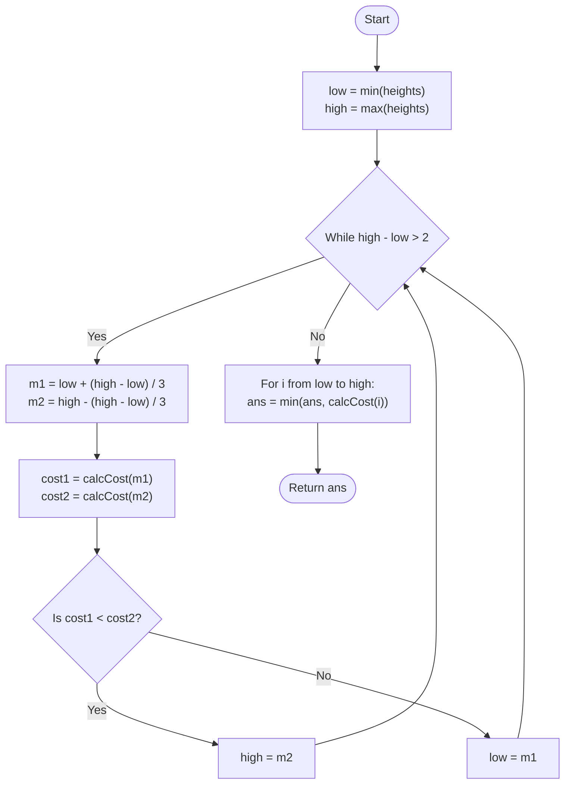

# Approach: Ternary Search

  <a href="./Problem.md"><strong>Problem Statement</strong></a> |
  <a href="./Solution.cpp"><strong>Solution.cpp</strong></a> |
  <a href="./Main.cpp"><strong>Main.cpp</strong></a>

 

## 💡 Intuition

We are given $N$ towers of different heights and a cost associated with modifying each tower. We want to find a single target height that minimizes the total cost of making all towers equal to that height.

If we plot the **total cost** against the **target height**, the resulting curve is a **convex function** (specifically, it's a sum of absolute value functions, which forms a U-shape). 
Because the function is convex, it decreases to a global minimum and then increases. We can use **Ternary Search** to efficiently find the minimum of this function over the range of possible heights.

- The minimum possible target height is `min(heights)`.
- The maximum possible target height is `max(heights)`.
- We can search within this range `[low, high]` using Ternary Search, cutting the search space by a factor of $2/3$ at each step instead of $1/2$ (like binary search), by evaluating two midpoints.

## 🛠️ Algorithm

1. Initialize the search space: `low = min(heights)` and `high = max(heights)`.
2. Define a helper function `calculateCost(targetH)` that iterates through the array and calculates $\sum |heights[i] - targetH| \times cost[i]$.
3. **Ternary Search:** While the search space `high - low > 2`:
   - Calculate two midpoints:
     - $m_1 = low + (high - low) / 3$
     - $m_2 = high - (high - low) / 3$
   - Calculate the total costs at these midpoints: `cost1 = calculateCost(m1)` and `cost2 = calculateCost(m2)`.
   - Since the function is U-shaped:
     - If `cost1 < cost2`, it means the minimum lies to the left of $m_2$. We discard the rightmost third by setting `high = m2`.
     - Otherwise, the minimum lies to the right of $m_1$. We discard the leftmost third by setting `low = m1`.
4. When the loop terminates, the search space is very small (at most 3 elements). We simply iterate from `low` to `high` and evaluate the cost for each, returning the absolute minimum cost found.

## 📊 Visual Representation

## ⏳ Complexity Analysis

- **Time Complexity:** $\mathcal{O}(N \log_3(\max(H) - \min(H)))$. The ternary search reduces the search space of heights $H$ by $2/3$ at each step, taking $\log_3(\max(H) - \min(H))$ iterations. In each iteration, we calculate the cost, which takes $\mathcal{O}(N)$ time.
- **Space Complexity:** $\mathcal{O}(1)$. The algorithm only uses a few auxiliary variables, ensuring constant extra space.

## 🚶‍♂️ Example Walkthrough

**Input:** `heights = [1, 2, 3]`, `cost = [10, 100, 1000]`

1. `low = 1`, `high = 3`.
2. `high - low (3 - 1 = 2)` is not strictly greater than 2. The loop doesn't execute.
3. Final Sweep from `low` (1) to `high` (3):
   - **Target Height 1:**
     Cost = $|1-1|\times 10 + |2-1|\times 100 + |3-1|\times 1000 = 0 + 100 + 2000 = 2100$
   - **Target Height 2:**
     Cost = $|1-2|\times 10 + |2-2|\times 100 + |3-2|\times 1000 = 10 + 0 + 1000 = 1010$
   - **Target Height 3:**
     Cost = $|1-3|\times 10 + |2-3|\times 100 + |3-3|\times 1000 = 20 + 100 + 0 = 120$
4. Minimum cost among all targets is `120`.

**Final Output:** `120`
