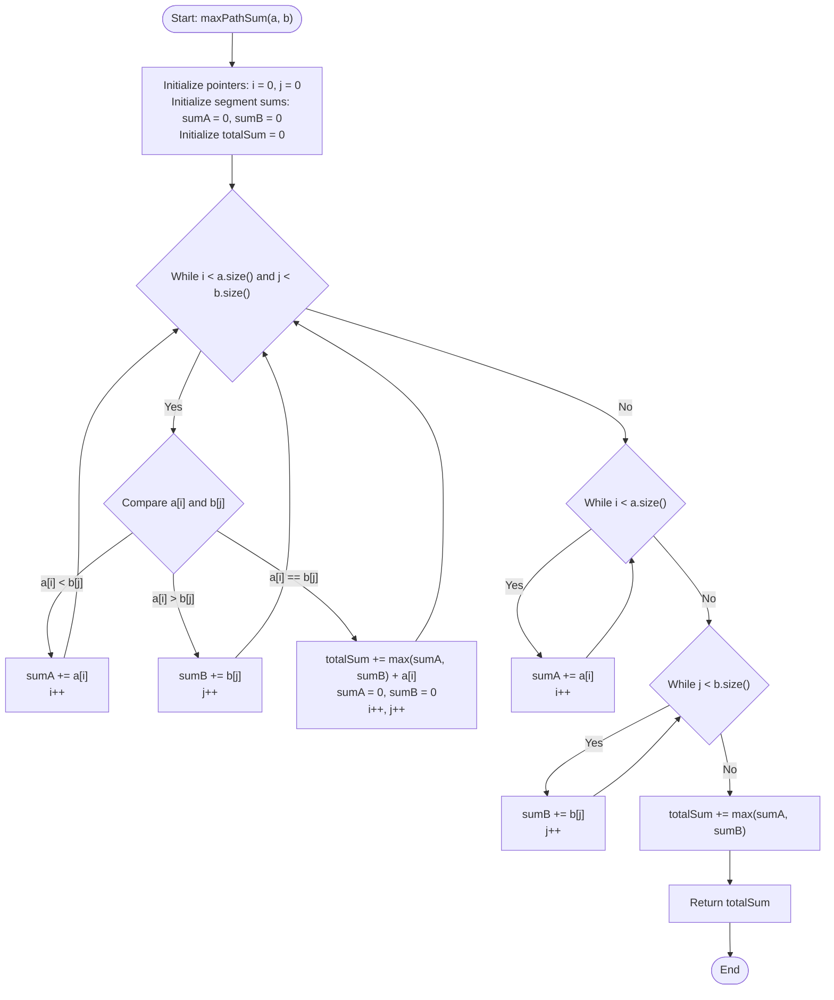

# 💡 Approach — Max Sum Path in Two Arrays

| 📄 [Problem](./Problem.md) | 💡 [Approach](./Approach.md) | 🧩 [Solution](./Solution.cpp) | 🚀 [Main](./Main.cpp) |
|:--------------------------:|:-----------------------------:|:------------------------------:|:---------------------:|

---

## 📊 Metadata

---

## 🎯 Core Insight

> [!TIP]
> **Two-Pointer Interval Maximization**
>
> 1. **Partition by Intersections:**
>    - Since both arrays are sorted and distinct, the common elements serve as synchronization (intersection) points where we can switch between arrays.
>    - These intersection points divide both arrays into a series of corresponding segments.
>
> 2. **Local Decision Making:**
>    - For each segment between two consecutive intersection points, we must choose the path that yields the maximum sum.
>    - Because elements are non-negative and sorted, we can use a two-pointer approach to accumulate segment sums simultaneously.
>
> 3. **Linear Scan ($O(N + M)$):**
>    - Traverse both arrays using pointers `i` and `j`. If $a[i] < b[j]$, we add $a[i]$ to `sumA` and advance `i`. If $b[j] < a[i]$, we add $b[j]$ to `sumB` and advance `j`.
>    - When $a[i] == b[j]$, we choose the maximum of the two segments: $\max(\text{sumA}, \text{sumB})$, add the intersection element itself, and reset the accumulators.

---

## 🔩 Step-by-Step Breakdown

**Step 1 — Initialize Pointers and Sum Accumulators**
- Initialize pointers `i = 0` (for array `a`) and `j = 0` (for array `b`).
- Set `sumA = 0` and `sumB = 0` to accumulate path sums for segments between intersection points.
- Initialize `totalSum = 0` to store the final maximum path sum.

**Step 2 — Traverse Both Arrays Simultaneously**
- Loop while `i < a.size()` and `j < b.size()`:
  - If `a[i] < b[j]`, add `a[i]` to `sumA` and increment `i`.
  - If `b[j] < a[i]`, add `b[j]` to `sumB` and increment `j`.
  - If `a[i] == b[j]`, we have reached a common element (intersection):
    - Add the maximum of the two accumulated segment sums plus the common element itself to `totalSum`:
      $$\text{totalSum} \leftarrow \text{totalSum} + \max(\text{sumA}, \text{sumB}) + a[i]$$
    - Reset `sumA` and `sumB` to `0`.
    - Increment both `i` and `j`.

**Step 3 — Process Remaining Elements**
- If elements remain in `a` (i.e. `i < a.size()`), add them all to `sumA`.
- If elements remain in `b` (i.e. `j < b.size()`), add them all to `sumB`.
- Add the maximum of the remaining sums to `totalSum`:
  $$\text{totalSum} \leftarrow \text{totalSum} + \max(\text{sumA}, \text{sumB})$$

**Step 4 — Return the Final Sum**
- Return `totalSum`.

---

## 🔄 Mermaid Flowchart

---

## 🧮 Dry Run — Example 1

- **Inputs:** `a[] = [2, 3, 7, 10, 12]`, `b[] = [1, 5, 7, 8]`

| Step | `i` | `j` | `a[i]` | `b[j]` | Comparison | Action | `sumA` | `sumB` | `totalSum` |
| :---: | :---: | :---: | :---: | :---: | :--- | :--- | :---: | :---: | :---: |
| **1** | 0 | 0 | 2 | 1 | `a[0] > b[0]` | Add `b[0]` to `sumB`, `j++` | 0 | 1 | 0 |
| **2** | 0 | 1 | 2 | 5 | `a[0] < b[1]` | Add `a[0]` to `sumA`, `i++` | 2 | 1 | 0 |
| **3** | 1 | 1 | 3 | 5 | `a[1] < b[1]` | Add `a[1]` to `sumA`, `i++` | 5 | 1 | 0 |
| **4** | 2 | 1 | 7 | 5 | `a[2] > b[1]` | Add `b[1]` to `sumB`, `j++` | 5 | 6 | 0 |
| **5** | 2 | 2 | 7 | 7 | `a[2] == b[2]` | `totalSum += max(5, 6) + 7 = 13` Reset sums, `i++, j++` | 0 | 0 | 13 |
| **6** | 3 | 3 | 10 | 8 | `a[3] > b[3]` | Add `b[3]` to `sumB`, `j++` | 0 | 8 | 13 |
| **End** | 3 | 4 | - | - | `j == b.size()` | Exit loop | 0 | 8 | 13 |
| **Rem** | - | - | - | - | Process remaining elements | `sumA += 10 + 12 = 22` | 22 | 8 | 13 |
| **Final**| - | - | - | - | Add `max(22, 8)` to `totalSum` | `totalSum += 22 = 35` | - | - | **35** |

---

## 📊 Complexity Analysis

| Metric | Complexity | Reasoning |
| :---: | :---: | :--- |
| 🕐 Time | $$O(n + m)$$ | Both pointers `i` and `j` traverse their respective arrays at most once. Each element is visited exactly once. |
| 💾 Space | $$O(1)$$ | Only a few scalar variables (`i`, `j`, `sumA`, `sumB`, `totalSum`) are used. No extra space is allocated. |

---

> *"When two paths cross, choose the one that brings you the greatest sum of experiences."*

---

<h3>Happy Coding! 🚀</h3>

