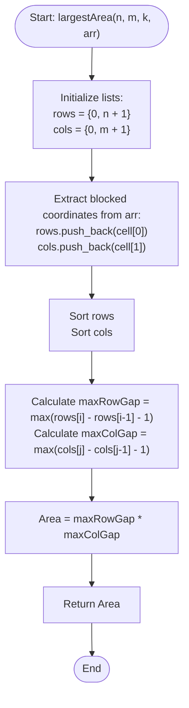

# 💡 Approach — Largest Unblocked Submatrix

| 📄 [Problem](./Problem.md) | 💡 [Approach](./Approach.md) | 🧩 [Solution](./Solution.cpp) | 🚀 [Main](./Main.cpp) |
|:--------------------------:|:-----------------------------:|:------------------------------:|:---------------------:|

---

## 📊 Metadata

---

## 🎯 Core Insight

> [!TIP]
> **Independent Dimension Optimization (1D Reduction)**
>
> 1. **Deconstruct the Grid:**
>    - A cell $(r, c)$ in the grid is unblocked if and only if row $r$ is unblocked AND column $c$ is unblocked.
>    - Thus, any contiguous unblocked submatrix is the Cartesian product of a contiguous range of unblocked rows and a contiguous range of unblocked columns.
>
> 2. **Independent Maximization:**
>    - To maximize the area of the unblocked submatrix, we can independently find the maximum contiguous unblocked segment length in the rows, and the maximum contiguous unblocked segment length in the columns.
>    - Let these maximum lengths be $\text{maxRowGap}$ and $\text{maxColGap}$. The maximum area will then be:
>      $$\text{Area} = \text{maxRowGap} \times \text{maxColGap}$$
>
> 3. **Gap Sorting:**
>    - By collecting the blocked row/column indices and sorting them with virtual boundaries at the start ($0$) and the end ($n + 1$ or $m + 1$), the number of unblocked rows/columns between two consecutive blocked indices $X_i$ and $X_{i-1}$ is $X_i - X_{i-1} - 1$.

---

## 🔩 Step-by-Step Breakdown

**Step 1 — Separate and Boundary Initialization**
- Initialize vectors `rows` and `cols` to store blocked coordinates.
- Add virtual boundaries:
  - For rows: `0` and `n + 1`
  - For columns: `0` and `m + 1`

**Step 2 — Extract Blocked Coordinates**
- Loop through the input array of blocked cells `arr`:
  - For each cell, push its row coordinate `arr[i][0]` into `rows`.
  - Push its column coordinate `arr[i][1]` into `cols`.

**Step 3 — Sort Indices**
- Sort the `rows` vector in ascending order.
- Sort the `cols` vector in ascending order.
- Sorting takes $O(k \log k)$ time and allows us to easily compute consecutive gaps.

**Step 4 — Calculate Maximum Gaps**
- Initialize `maxRowGap = 0` and `maxColGap = 0`.
- Traverse the sorted `rows` vector from index $1$ to size:
  - Update `maxRowGap = max(maxRowGap, rows[i] - rows[i - 1] - 1)`.
- Traverse the sorted `cols` vector from index $1$ to size:
  - Update `maxColGap = max(maxColGap, cols[i] - cols[i - 1] - 1)`.

**Step 5 — Compute Largest Area**
- Return the product `maxRowGap * maxColGap` as the area of the largest unblocked submatrix.

---

## 🔄 Mermaid Flowchart

---

## 🧮 Dry Run — Example 1

- **Inputs:** $n = 5, m = 5, k = 2$, `arr[][] = [[2, 3], [5, 1]]`

### Row Calculations
- Initial `rows` with boundaries: `[0, 6]`
- Add blocked rows: `[2, 5]`
- Sorted `rows`: `[0, 2, 5, 6]`
- Differences:
  - $i=1$: `rows[1] - rows[0] - 1` = $2 - 0 - 1 = 1$
  - $i=2$: `rows[2] - rows[1] - 1` = $5 - 2 - 1 = 2$
  - $i=3$: `rows[3] - rows[2] - 1` = $6 - 5 - 1 = 0$
- `maxRowGap = 2`

### Column Calculations
- Initial `cols` with boundaries: `[0, 6]`
- Add blocked cols: `[3, 1]`
- Sorted `cols`: `[0, 1, 3, 6]`
- Differences:
  - $i=1$: `cols[1] - cols[0] - 1` = $1 - 0 - 1 = 0$
  - $i=2$: `cols[2] - cols[1] - 1` = $3 - 1 - 1 = 1$
  - $i=3$: `cols[3] - cols[2] - 1` = $6 - 3 - 1 = 2$
- `maxColGap = 2`

### Result
- `maxRowGap * maxColGap` = $2 \times 2 = 4$

---

## 📊 Complexity Analysis

| Metric | Complexity | Reasoning |
| :---: | :---: | :--- |
| 🕐 Time | $$O(k \log k)$$ | Sorting vectors of size $k+2$ takes $O(k \log k)$ time. Finding the maximum gap takes a linear scan of $O(k)$ time. |
| 💾 Space | $$O(k)$$ | We allocate extra memory for storing the row and column coordinates. |

---

> *"In the midst of obstacles, find the largest space to grow."*

---

<h3>Happy Coding! 🚀</h3>

