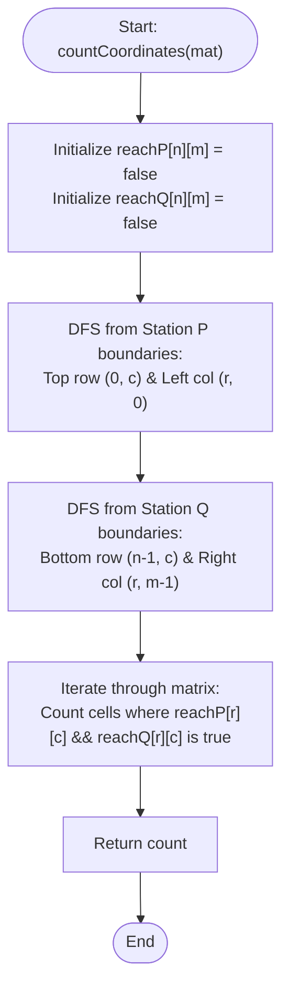

# 💡 Approach — Geeks Island

<div align="center">

| 📄 [Problem](./Problem.md) | 💡 [Approach](./Approach.md) | 🧩 [Solution](./Solution.cpp) | 🚀 [Main](./Main.cpp) |
|:--------------------------:|:-----------------------------:|:------------------------------:|:---------------------:|

</div>

---

## 📊 Metadata

<div align="center">


</div>

---

## 🎯 Core Insight

> [!TIP]
> **Reversing the Flow (Multi-Source Traversal)**
>
> 1. **Understand Flow Rules:**
>    - Signal propagates from tower $A$ to neighbor $B$ only if $\text{mat}[B] \le \text{mat}[A]$.
>    - If we want to find all cells that can reach a station boundary, we can reverse the flow: start from the boundary cells and move inwards.
>    - In this reversed direction, we can only move from cell $A$ to neighbor $B$ if $\text{mat}[B] \ge \text{mat}[A]$ (i.e., non-decreasing signal strength).
>
> 2. **Multi-Source DFS/BFS:**
>    - Station P covers the top row and left column. We start a traversal from all these boundary cells and mark all reachable cells in a `reachP` grid.
>    - Station Q covers the bottom row and right column. We start a traversal from all these boundary cells and mark all reachable cells in a `reachQ` grid.
>
> 3. **Find the Intersection:**
>    - Any cell $(r, c)$ where both `reachP[r][c]` and `reachQ[r][c]` are `true` can propagate signals to both stations.

---

## 🔩 Step-by-Step Breakdown

**Step 1 — Reachability Matrices Initialization**
- Create two 2D boolean matrices `reachP` and `reachQ` of size $n \times m$, initialized to `false`. These will keep track of which cells can reach Station P and Station Q respectively.

**Step 2 — Traversal from Station P Boundaries (Top & Left)**
- Iterate through all columns in the top row ($row = 0$) and all rows in the leftmost column ($col = 0$).
- For each boundary cell, run a Depth First Search (DFS) if it hasn't been visited yet.
- In DFS:
  - Mark the current cell as visited in `reachP`.
  - Recursively visit its 4 orthogonal neighbors if the neighbor is within boundaries, hasn't been visited, and has a signal strength $\ge$ the current cell's strength.

**Step 3 — Traversal from Station Q Boundaries (Bottom & Right)**
- Iterate through all columns in the bottom row ($row = n-1$) and all rows in the rightmost column ($col = m-1$).
- Run a DFS starting from these boundary cells to fill `reachQ` using the same non-decreasing height condition.

**Step 4 — Counting the Intersection**
- Iterate through all cells of the $n \times m$ grid.
- If a cell $(r, c)$ has both `reachP[r][c]` and `reachQ[r][c]` set to `true`, increment our result counter.
- Return the final count.

---

## 🔄 Mermaid Flowchart



---

## 🧮 Dry Run — Example 1

- **Input matrix:**
  ```text
  [
    [1, 2, 2, 3, 5],
    [3, 2, 3, 4, 4],
    [2, 4, 5, 3, 1],
    [6, 7, 1, 4, 5],
    [5, 1, 1, 2, 4]
  ]
  ```

Let's trace cell `(2, 2)` (value = 5):
1. **Station P Reachability:**
   - DFS starts at boundary `(2, 0)` (value = 2).
   - Neighbors of `(2, 0)`: `(1, 0)` (value = 3 $\ge$ 2) $\rightarrow$ visited.
   - Neighbors of `(2, 0)` also includes `(2, 1)` (value = 4 $\ge$ 2) $\rightarrow$ visited.
   - Neighbors of `(2, 1)`: `(2, 2)` (value = 5 $\ge$ 4) $\rightarrow$ visited.
   - Thus, `reachP[2][2]` becomes `true`.

2. **Station Q Reachability:**
   - DFS starts at boundary `(2, 4)` (value = 1).
   - Neighbors of `(2, 4)`: `(2, 3)` (value = 3 $\ge$ 1) $\rightarrow$ visited.
   - Neighbors of `(2, 3)`: `(2, 2)` (value = 5 $\ge$ 3) $\rightarrow$ visited.
   - Thus, `reachQ[2][2]` becomes `true`.

3. **Intersection Check:**
   - Since both `reachP[2][2]` and `reachQ[2][2]` are `true`, the cell `(2, 2)` can reach both stations and is counted.

Following this logic across the grid, we find exactly 7 such cells.

---

## 📊 Complexity Analysis

| Metric | Complexity | Reasoning |
| :---: | :---: | :--- |
| 🕐 Time | $$O(n \times m)$$ | Each cell is visited a constant number of times across the boundary-initiated DFS passes. |
| 💾 Space | $$O(n \times m)$$ | Used by the boolean matrices `reachP` and `reachQ` along with the call stack of the recursive DFS (up to $O(n \times m)$ in the worst case). |

---

> *"A signal is only as strong as the path it takes; clear the path, and connectivity flows naturally."*

---

<div align="center">
<h3>Happy Coding! 🚀</h3>
<a href="../161_Day/Approach.md">
  
</a>
<a href="https://x.com/PankajB42550" target="_blank">
  
</a>
<a href="../163_Day/Approach.md">
  
</a>
</div>
