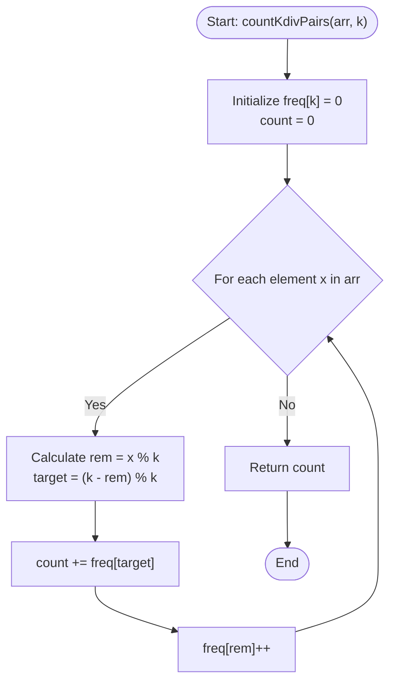

# 💡 Approach — Count Pairs Divisible By K

| 📄 [Problem](./Problem.md) | 💡 [Approach](./Approach.md) | 🧩 [Solution](./Solution.cpp) | 🚀 [Main](./Main.cpp) |
|:--------------------------:|:-----------------------------:|:------------------------------:|:---------------------:|

---

## 📊 Metadata

---

## 🎯 Core Insight

> [!TIP]
> **Using Remainder Frequencies (Modular Arithmetic & Complement Matching)**
>
> 1. **Mathematical Foundation:**
>    - Two numbers $A$ and $B$ form a sum $A + B$ divisible by $K$ if and only if:
>      $$(A + B) \pmod K = 0 \iff (A \pmod K + B \pmod K) \pmod K = 0$$
>    - Let the remainder of $A$ when divided by $K$ be $r_A = A \pmod K$, and for $B$ be $r_B = B \pmod K$.
>    - Thus, $r_A + r_B$ must be a multiple of $K$. Since $0 \le r_A, r_B < K$, their sum must be either $0$ or $K$.
>
> 2. **Remainder Matching Strategy:**
>    - If $r_A = 0$: $r_B$ must also be $0$.
>    - If $r_A \neq 0$: $r_B$ must be $K - r_A$.
>
> 3. **Single-Pass Hashing/Frequency Tracking:**
>    - Maintain a frequency array `freq` of size $K$ to store the count of remainders seen so far.
>    - For each element `x` in the array:
>      - Compute its remainder $rem = x \pmod K$.
>      - Determine its complement remainder needed to form a sum divisible by $K$: $target = (K - rem) \pmod K$.
>      - The number of valid pairs we can form with the current element is exactly the number of elements with the remainder $target$ that we have seen so far (stored in `freq[target]`).
>      - Add `freq[target]` to the total pair count and increment `freq[rem]` by 1.

---

## 🔩 Step-by-Step Breakdown

**Step 1: Remainder Frequency Array Initialization**
- Create a frequency vector `freq` of size $K$, initialized to `0`. This array will store the occurrences of each remainder modulo $K$.
- Initialize a variable `count` to `0` of type `long long` to prevent any potential integer overflow when counting the number of pairs.

**Step 2: Single Pass Processing**
- Iterate through each element `x` in the array `arr`:
  - Calculate `rem = x % k`. (If negative values are possible, use `(x % k + k) % k`).
  - Calculate the complement remainder: `target = (k - rem) % k`.
  - Add `freq[target]` to `count`.
  - Increment the frequency of the current remainder: `freq[rem]++`.

**Step 3: Return Results**
- Cast the `count` to `int` (or return it as `int` depending on GFG's return type signature) and return the value.

---

## 🔄 Mermaid Flowchart

---

## 🧮 Dry Run — Example 1

- **Input:** `arr[] = [2, 2, 1, 7, 5, 3]`, `k = 4`
- **Initial state:** `freq = [0, 0, 0, 0]`, `count = 0`

| Index | Element ($x$) | Remainder ($rem = x \pmod 4$) | Target ($target = (4 - rem) \pmod 4$) | `freq[target]` (Before update) | Updated Count | Updated `freq` |
|:---:|:---:|:---:|:---:|:---:|:---:|:---:|
| 0 | 2 | 2 | 2 | `freq[2] = 0` | 0 | `freq[2] = 1` $\rightarrow$ `[0, 0, 1, 0]` |
| 1 | 2 | 2 | 2 | `freq[2] = 1` | 1 | `freq[2] = 2` $\rightarrow$ `[0, 0, 2, 0]` |
| 2 | 1 | 1 | 3 | `freq[3] = 0` | 1 | `freq[1] = 1` $\rightarrow$ `[0, 1, 2, 0]` |
| 3 | 7 | 3 | 1 | `freq[1] = 1` | 2 | `freq[3] = 1` $\rightarrow$ `[0, 1, 2, 1]` |
| 4 | 5 | 1 | 3 | `freq[3] = 1` | 3 | `freq[1] = 2` $\rightarrow$ `[0, 2, 2, 1]` |
| 5 | 3 | 3 | 1 | `freq[1] = 2` | 5 | `freq[3] = 2` $\rightarrow$ `[0, 2, 2, 2]` |

- **Final Count:** 5 (Pairs are: `(2, 2)` at index `0 & 1`, `(1, 7)` at index `2 & 3`, `(7, 5)` at index `3 & 4`, `(1, 3)` at index `2 & 5`, `(5, 3)` at index `4 & 5`).

---

## 📊 Complexity Analysis

| Metric | Complexity | Reasoning |
| :---: | :---: | :--- |
| 🕐 Time | $$O(n)$$ | We perform a single pass over the array of size $n$, doing constant $O(1)$ time operations per element. |
| 💾 Space | $$O(k)$$ | We maintain a frequency array of size $k$ to store the count of remainders. |

---

> *"Hashing elements to their remainders is like sorting stars by their color: once grouped, finding perfect matches becomes instantaneous."*

---

<h3>Happy Coding! 🚀</h3>

