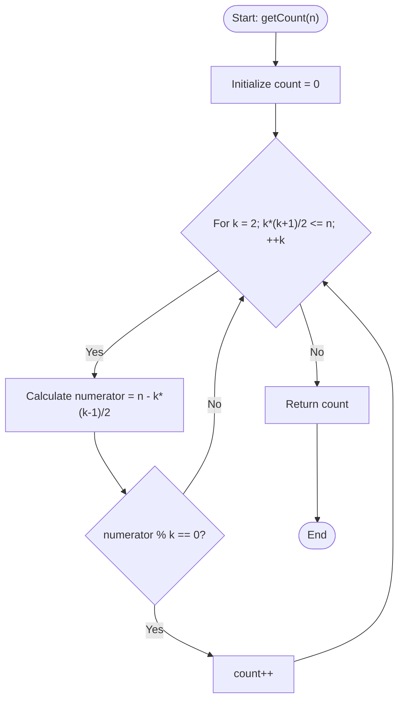

# 💡 Approach — Ways to Express as Sum of Consecutives

| 📄 [Problem](./Problem.md) | 💡 [Approach](./Approach.md) | 🧩 [Solution](./Solution.cpp) | 🚀 [Main](./Main.cpp) |
|:--------------------------:|:-----------------------------:|:------------------------------:|:---------------------:|

---

## 📊 Metadata

---

## 🎯 Core Insight

> [!TIP]
> **Reducing Consecutive Sums to Algebraic Divisibility**
>
> 1. **Mathematical Representation:**
>    - Suppose $n$ is represented as a sum of $k$ consecutive natural numbers starting from $a$:
>      $$n = a + (a+1) + (a+2) + \dots + (a+k-1)$$
>    - Using the arithmetic progression sum formula, this simplifies to:
>      $$n = k \cdot a + \frac{k(k-1)}{2}$$
>
> 2. **Deriving the Divisibility Condition:**
>    - Rearranging the equation to solve for $a$:
>      $$k \cdot a = n - \frac{k(k-1)}{2}$$
>      $$a = \frac{n - \frac{k(k-1)}{2}}{k}$$
>    - Since $a$ must be a natural number ($a \ge 1$), we have two conditions:
>      - **Positivity and Minimum Bound:** $a \ge 1 \implies \frac{n - k(k-1)/2}{k} \ge 1 \implies n - \frac{k(k-1)}{2} \ge k \implies n \ge \frac{k(k+1)}{2}$. This sets the upper limit on $k$, meaning we only need to search up to $k \approx \sqrt{2n}$.
>      - **Divisibility:** The term $\left(n - \frac{k(k-1)}{2}\right)$ must be perfectly divisible by $k$.
> 
> 3. **Search Space:**
>    - We can loop $k$ starting from $2$ (since the sum must have at least 2 numbers) until $\frac{k(k+1)}{2} > n$. For each $k$, we check if the divisibility condition holds.

---

## 🔩 Step-by-Step Breakdown

**Step 1: Initialize Count**
- Create an integer variable `count` and initialize it to `0`. This will store the number of valid consecutive representations.

**Step 2: Iterate over Number of Terms**
- Loop through possible values of the number of terms $k$, starting from $2$ (as we need at least 2 consecutive natural numbers).
- Continue the loop as long as the minimum possible sum of $k$ numbers, $k(k+1)/2$, is less than or equal to $n$.

**Step 3: Check Divisibility Condition**
- For the current $k$, compute the remaining sum if all elements started from $0$ instead of $a$, which is:
  $$\text{numerator} = n - \frac{k(k-1)}{2}$$
- Verify if this remaining sum is divisible by the count of terms $k$. If $\text{numerator} \pmod k == 0$, it implies a valid starting natural number $a$ exists.
- Increment the `count` when the condition is met.

**Step 4: Return Result**
- Return the final `count`.

---

## 🔄 Mermaid Flowchart

---

## 🧮 Dry Run — Example 2 ($n = 15$)

- **Input:** $n = 15$
- **Initial state:** `count = 0`

| $k$ | Loop Condition check ($k(k+1)/2 \le 15$) | Numerator ($15 - k(k-1)/2$) | Divisibility check ($\text{numerator} \pmod k == 0$) | Updated Count |
|:---:|:---|:---|:---|:---:|
| **2** | $3 \le 15$ (True) | $15 - 1 = 14$ | $14 \pmod 2 == 0$ (True) | **1** |
| **3** | $6 \le 15$ (True) | $15 - 3 = 12$ | $12 \pmod 3 == 0$ (True) | **2** |
| **4** | $10 \le 15$ (True) | $15 - 6 = 9$ | $9 \pmod 4 == 1$ (False) | **2** |
| **5** | $15 \le 15$ (True) | $15 - 10 = 5$ | $5 \pmod 5 == 0$ (True) | **3** |
| **6** | $21 \le 15$ (False) | — | — | **3** |

- **Final Count:** 3 (Representations correspond to $15 = 7+8$, $15 = 4+5+6$, and $15 = 1+2+3+4+5$).

---

## 📊 Complexity Analysis

| Metric | Complexity | Reasoning |
| :---: | :---: | :--- |
| 🕐 Time | $$O(\sqrt{n})$$ | The loop runs as long as $k(k+1)/2 \le n$, which implies $k \le \sqrt{2n}$. |
| 💾 Space | $$O(1)$$ | We use a few auxiliary primitive variables (`k`, `numerator`, `count`) that consume constant storage. |

---

> *"Mathematics is the language of nature, and algorithms are the poetry written in it."*

---

<h3>Happy Coding! 🚀</h3>

