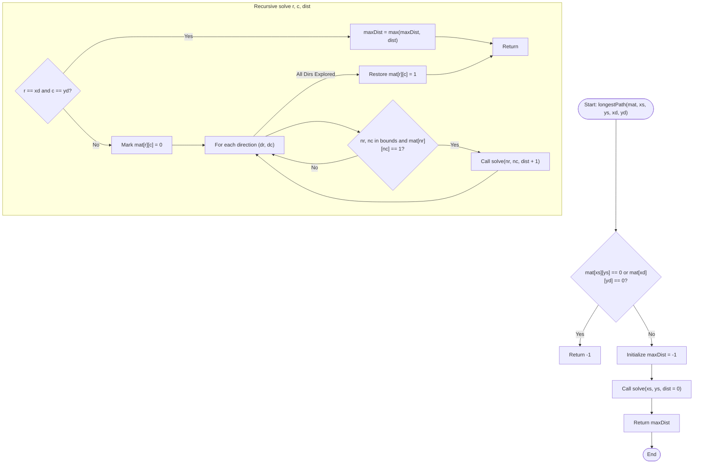

# 💡 Approach — Longest Possible Route in a Matrix with Hurdles

| 📄 [Problem](./Problem.md) | 💡 [Approach](./Approach.md) | 🧩 [Solution](./Solution.cpp) | 🚀 [Main](./Main.cpp) |
|:--------------------------:|:-----------------------------:|:------------------------------:|:---------------------:|

---

## 📊 Metadata

---

## 🎯 Core Insight

> [!TIP]
> **DFS Backtracking for Self-Avoiding Walks**
>
> 1. **NP-Hard Pathfinding:** Finding the *longest* path in a grid without revisiting any cell (a self-avoiding walk) is NP-hard. Unlike the shortest path (which is solvable via BFS), finding the longest path requires exploring all possible paths.
> 2. **Backtracking Algorithm:**
>    - Starting from the source `(xs, ys)`, we recursively explore all four cardinal directions (Up, Down, Left, Right).
>    - To prevent cycles and revisit constraints, we mark the current cell as visited (`mat[r][c] = 0`) before making recursive calls.
>    - Once we exhaust all exploration routes starting from the current cell, we restore its traversable state (`mat[r][c] = 1`). This is the core **backtracking** mechanism.
> 3. **Pruning & Feasibility:**
>    - If the starting cell `mat[xs][ys]` or the ending cell `mat[xd][yd]` is a hurdle (`0`), then no path can ever exist. We immediately return `-1`.
>    - A path only updates the maximum distance when it successfully hits `(xd, yd)`.

---

## 🔩 Step-by-Step Breakdown

**Step 1: Check Feasibility**
- Verify if the starting cell or destination cell is a hurdle (`0`).
- Ensure coordinates are within grid bounds. If invalid, return `-1` immediately.

**Step 2: Initialize Maximum Distance**
- Define a global or reference variable `maxDist` initialized to `-1` to store the maximum path length.

**Step 3: Depth First Search with Backtracking**
- Implement a recursive helper function `solve(r, c, dist)`:
  - **Base Case:** If `(r, c) == (xd, yd)`, update `maxDist = max(maxDist, dist)` and terminate that path.
  - **Mark Visited:** Set `mat[r][c] = 0` to mark the current cell as visited.
  - **Recurse:** Attempt to visit all 4 neighboring cells `(nr, nc)`. If in-bounds and `mat[nr][nc] == 1`, recursively call `solve(nr, nc, dist + 1)`.
  - **Backtrack:** Reset the current cell `mat[r][c] = 1` so it can be visited in alternative paths.

**Step 4: Return Result**
- After completing the traversal, return `maxDist`.

---

## 🔄 Mermaid Flowchart

---

## 🧮 Dry Run — Example 2

- **Matrix:**
  $$mat = \begin{pmatrix} 1 & 0 & 0 & 1 & 0 \\ 0 & 0 & 0 & 1 & 0 \\ 0 & 1 & 1 & 0 & 0 \end{pmatrix}$$
- **Start:** `(0, 3)` (contains `1`), **End:** `(2, 2)` (contains `1`).
- **Execution:**
  1. `solve(0, 3, dist=0)`:
     - Mark `mat[0][3] = 0`.
     - Neighbor `(1, 3)` is `1`. Move to `solve(1, 3, dist=1)`.
  2. `solve(1, 3, dist=1)`:
     - Mark `mat[1][3] = 0`.
     - Checking neighbors of `(1, 3)`:
       - Up `(0, 3)` is `0` (visited).
       - Down `(2, 3)` is `0` (hurdle).
       - Left `(1, 2)` is `0` (hurdle).
       - Right `(1, 4)` is `0` (hurdle).
     - No valid neighbors. Backtrack and unmark `mat[1][3] = 1`.
  3. `solve(0, 3)` backtracks:
     - Unmark `mat[0][3] = 1`.
  4. Search finishes. Since destination `(2, 2)` was never reached, `maxDist` remains `-1`.
  - **Output:** `-1`.

---

## 📊 Complexity Analysis

| Metric | Complexity | Reasoning |
| :---: | :---: | :--- |
| 🕐 Time | $$O(4^{n \times m})$$ | At each cell, we explore up to 4 directions. In the worst case (no hurdles), we visit all cell permutations. |
| 💾 Space | $$O(n \times m)$$ | The maximum depth of the recursion stack is equal to the total number of cells in the grid. |

---

> *"In backtracking, every dead end is not a failure, but a lesson to take a step back and explore new paths."*

---

<h3>Happy Coding! 🚀</h3>

