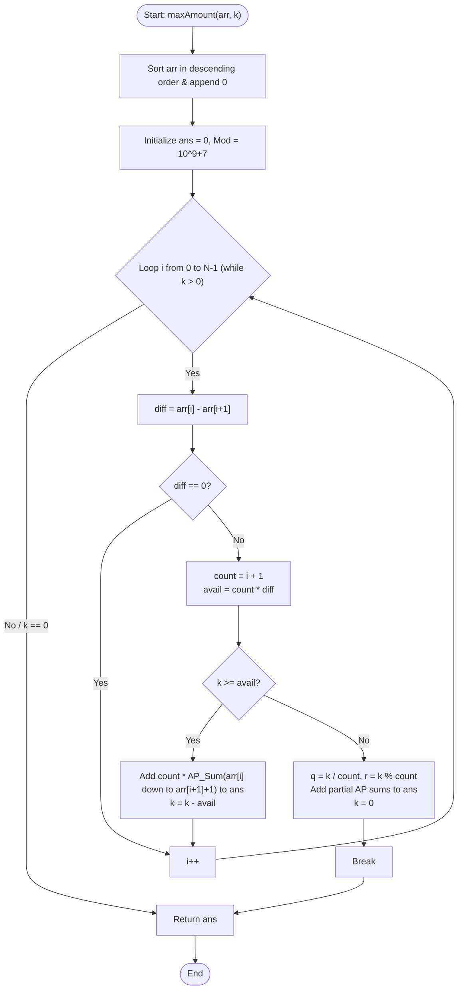

# 💡 Approach — Max Amount by Selling K Tickets

| 📄 [Problem](./Problem.md) | 💡 [Approach](./Approach.md) | 🧩 [Solution](./Solution.cpp) | 🚀 [Main](./Main.cpp) |
|:--------------------------:|:-----------------------------:|:------------------------------:|:---------------------:|

---

## 📊 Metadata

---

## 🎯 Core Insight

> [!TIP]
> **Greedy Batch Processing with Arithmetic Progression (AP)**
>
> 1. **Greedy Choice:** To maximize earnings, we must always sell the ticket with the highest available price.
> 2. **Scaling Bottleneck:** A simple simulation using a Max-Heap takes $O(k \log N)$ time. Since $k$ can be up to $10^6$, this can be slow. We can optimize this by **batching** sellers with the same ticket count.
> 3. **Batching Strategy:** 
>    - Sort the ticket counts in descending order and append a dummy `0` at the end to act as a baseline.
>    - For a group of $i+1$ sellers who all have $arr[i]$ tickets, we can decrease their ticket counts together down to $arr[i+1]$ tickets.
>    - Let $diff = arr[i] - arr[i+1]$. The total tickets we can sell in this step is $avail = (i+1) \times diff$.
>    - If $k \ge avail$, we sell all $avail$ tickets and add the sum of these Arithmetic Progressions to our earnings.
>    - If $k < avail$, we distribute the remaining $k$ tickets as evenly as possible among the $i+1$ sellers.
>    - This reduces the time complexity to $O(N \log N)$ (dominated by sorting) and auxiliary space to $O(1)$.

---

## 🔩 Step-by-Step Breakdown

**Step 1: Sort and Prepare Baseline**
- Sort the array `arr` in descending order.
- Append a dummy `0` to the end of the array to simplify boundary conditions when selling all remaining tickets.

**Step 2: Initialize Profit and Loop variables**
- Initialize `totalAmount = 0` and the modulo constant $10^9+7$.
- Iterate through the sorted array from left to right. Maintain a count of sellers who have at least `arr[i]` tickets (which is $i+1$ at index $i$).

**Step 3: Calculate Available Tickets in the Current Batch**
- Find the difference $diff = arr[i] - arr[i+1]$.
- If $diff = 0$, skip to the next element since no tickets can be sold in this range.
- The total tickets available in this batch is $avail = count \times diff$, where $count = i + 1$.

**Step 4: Greedy Sell & Update**
- **Case A: $k \ge avail$**
  - Sell all $avail$ tickets. The prices sold for each seller range from $arr[i]$ down to $arr[i+1]+1$.
  - The sum of this AP for one seller is:
    $$\text{AP Sum} = \frac{(arr[i] + arr[i+1] + 1) \times diff}{2}$$
  - Add $count \times \text{AP Sum}$ (modulo $10^9+7$) to `totalAmount`.
  - Decrement $k$ by $avail$.
- **Case B: $k < avail$**
  - Distribute the remaining $k$ tickets among the $count$ sellers.
  - Each seller will sell at least $q = k / count$ tickets.
  - The first $r = k \bmod count$ sellers will sell one extra ticket ($q+1$ tickets).
  - For $r$ sellers selling $q+1$ tickets, prices range from $arr[i]$ down to $arr[i] - q$. Sum per seller:
    $$\text{Sum}_1 = \frac{(2 \times arr[i] - q) \times (q+1)}{2}$$
  - For $count - r$ sellers selling $q$ tickets, prices range from $arr[i]$ down to $arr[i] - q + 1$. Sum per seller:
    $$\text{Sum}_2 = \frac{(2 \times arr[i] - q + 1) \times q}{2}$$
  - Add the total sum (modulo $10^9+7$) to `totalAmount`, set $k = 0$, and break.

**Step 5: Return Modulo Result**
- Return `totalAmount` casted to `int`.

---

## 🔄 Mermaid Flowchart

---

## 🧮 Dry Run — Example 1

- **Input:** $arr = [4, 3, 6, 2, 4]$, $k = 3$.
- **Step 1: Sort and Prepare Baseline**
  - Sorted descending: $[6, 4, 4, 3, 2]$.
  - Appending $0$: $[6, 4, 4, 3, 2, 0]$.
- **Step 2: Initialize variables**
  - $totalAmount = 0$, $MOD = 10^9+7$, $N = 5$.
- **Step 3 & 4: Loop Execution**
  - **Iteration 1 ($i = 0$):**
    - $arr[0] = 6$, $arr[1] = 4 \implies diff = 2$.
    - $count = 1$, $avail = 2$.
    - Since $k = 3 \ge 2$:
      - $\text{term} = \frac{(6 + 4 + 1) \times 2}{2} = 11$.
      - $totalAmount = (0 + 1 \times 11) \pmod{10^9+7} = 11$.
      - $k = 3 - 2 = 1$.
  - **Iteration 2 ($i = 1$):**
    - $arr[1] = 4$, $arr[2] = 4 \implies diff = 0$.
    - Skip iteration.
  - **Iteration 3 ($i = 2$):**
    - $arr[2] = 4$, $arr[3] = 3 \implies diff = 1$.
    - $count = 3$, $avail = 3$.
    - Since $k = 1 < 3$:
      - $q = 1 / 3 = 0$, $r = 1 \bmod 3 = 1$.
      - $\text{term}_1 = \frac{(2 \times 4 - 0) \times 1}{2} = 4$.
      - $\text{term}_2 = \frac{(2 \times 4 - 0 + 1) \times 0}{2} = 0$.
      - $totalAmount = (11 + 1 \times 4 + 2 \times 0) \pmod{10^9+7} = 15$.
      - $k = 0$. Break.
- **Return Result:** Return $15$.

---

## 📊 Complexity Analysis

| Metric | Complexity | Reasoning |
| :---: | :---: | :--- |
| 🕐 Time | $$O(N \log N)$$ | Sorting the array `arr` of size $N$ takes $O(N \log N)$ time. The subsequent linear pass runs in $O(N)$ steps. |
| 💾 Space | $$O(1)$$ | The algorithm only requires a few local variables for computation, leading to $O(1)$ auxiliary space. |

---

> *"Efficiency is doing things right; effectiveness is doing the right things."*

---

<h3>Happy Coding! 🚀</h3>

