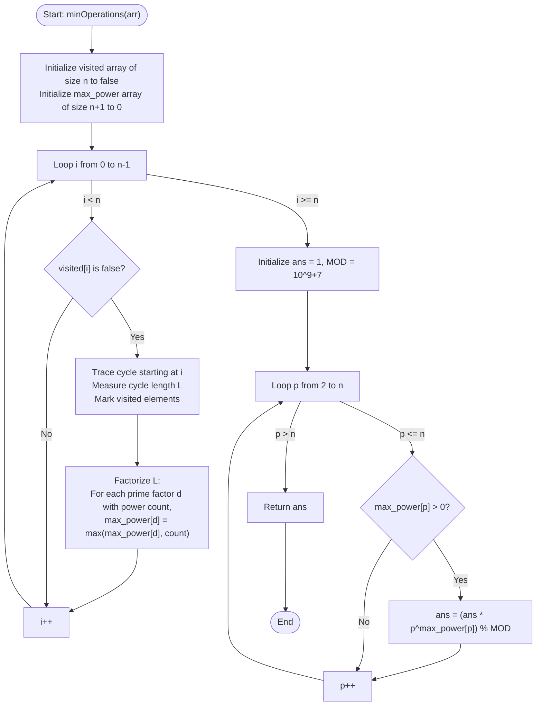

# 💡 Approach — Rearrange the Array

| 📄 [Problem](./Problem.md) | 💡 [Approach](./Approach.md) | 🧩 [Solution](./Solution.cpp) | 🚀 [Main](./Main.cpp) |
|:--------------------------:|:-----------------------------:|:------------------------------:|:---------------------:|

---

## 📊 Metadata

---

## 🎯 Core Insight

> [!TIP]
> **Permutation Decomposition & Prime Power LCM**
>
> 1. **Disjoint Cycles:** Any permutation $arr[]$ can be uniquely decomposed into disjoint cycles. When we apply the rearrangement operation, elements within each cycle rotate. 
> 2. **Cycle Periods:** An element in a cycle of length $L$ returns to its original position after any number of operations that is a multiple of $L$.
> 3. **Global Synchronization:** For all elements to return to their original positions simultaneously, the number of operations must be a multiple of the cycle lengths of all disjoint cycles. The minimum such number of operations is the **Least Common Multiple (LCM)** of all cycle lengths.
> 4. **Modulo LCM:** Since the LCM can be extremely large (far exceeding standard integer limits), we cannot compute it directly and then take modulo. Instead, we:
>    - Decompose each cycle length into its prime factors.
>    - For each prime, maintain the maximum exponent (power) seen in any cycle length.
>    - Compute the final LCM by multiplying these prime powers modulo $10^9+7$.

---

## 🔩 Step-by-Step Breakdown

**Step 1: Find Disjoint Cycle Lengths**
- Maintain a `visited` boolean array of size $n$, initialized to `false`.
- Loop through each index $i$ from $0$ to $n-1$.
- If $i$ is not visited:
  - Start tracing the cycle starting at $i$.
  - Keep moving to $curr = arr[curr] - 1$ (0-indexed) and marking each visited node.
  - Count the number of elements in this cycle to get the cycle length $L$.

**Step 2: Factorize Cycle Lengths**
- For each cycle length $L$:
  - Perform prime factorization on $L$.
  - For each prime factor $d$, count the exponent (how many times it divides $L$).
  - Update `max_power[d] = max(max_power[d], exponent)`.
  - The remaining prime factor (if $L > 1$) is updated to `max_power[L] = max(max_power[L], 1)`.

**Step 3: Calculate the LCM Modulo $10^9+7$**
- Initialize `ans = 1` and `MOD = 10^9+7`.
- Traverse the `max_power` array/map. For each prime $p$ with `max_power[p] > 0`:
  - Compute $p^{\text{max\_power}[p]} \pmod{MOD}$ and multiply it into `ans` modulo $MOD$.
- Return the final `ans`.

---

## 🔄 Mermaid Flowchart

---

## 🧮 Dry Run — Example 2

- **Input:** $arr = [2, 3, 1, 5, 4]$
- **Initialization:**
  - `visited = [false, false, false, false, false]`, `max_power = [0, 0, 0, 0, 0, 0]`.
- **Trace Cycles:**
  - **$i = 0$:** `visited[0]` is false.
    - Trace: $0 \to arr[0]-1 = 1 \to arr[1]-1 = 2 \to arr[2]-1 = 0$.
    - Mark indices `0, 1, 2` as visited.
    - Cycle length $L = 3$.
    - Factorize $3$: `max_power[3] = max(0, 1) = 1`.
  - **$i = 1$:** `visited[1]` is true $\implies$ skip.
  - **$i = 2$:** `visited[2]` is true $\implies$ skip.
  - **$i = 3$:** `visited[3]` is false.
    - Trace: $3 \to arr[3]-1 = 4 \to arr[4]-1 = 3$.
    - Mark indices `3, 4` as visited.
    - Cycle length $L = 2$.
    - Factorize $2$: `max_power[2] = max(0, 1) = 1`.
  - **$i = 4$:** `visited[4]` is true $\implies$ skip.
- **Compute LCM:**
  - `max_power[2] = 1` $\implies$ multiply $2^1$ $\implies$ $ans = 2$.
  - `max_power[3] = 1` $\implies$ multiply $3^1$ $\implies$ $ans = 2 \times 3 = 6$.
- **Result:** $6$.

---

## 📊 Complexity Analysis

| Metric | Complexity | Reasoning |
| :---: | :---: | :--- |
| 🕐 Time | $$O(n \sqrt{n})$$ | We visit each element of the permutation exactly once to identify cycles, which takes $O(n)$ time. For each cycle length $L$, prime factorization takes $O(\sqrt{L})$ time. The sum of square roots of cycle lengths is at most $O(n \sqrt{n})$ in the worst case (e.g. one cycle of size $n$). Calculating the final product takes $O(n \log(\text{power}))$ time. |
| 💾 Space | $$O(n)$$ | The `visited` array and `max_power` array require $O(n)$ auxiliary memory. |

---

> *"The beauty of mathematics is that even the most complex rearrangements follow an elegant, periodic harmony."*

---

<h3>Happy Coding! 🚀</h3>

