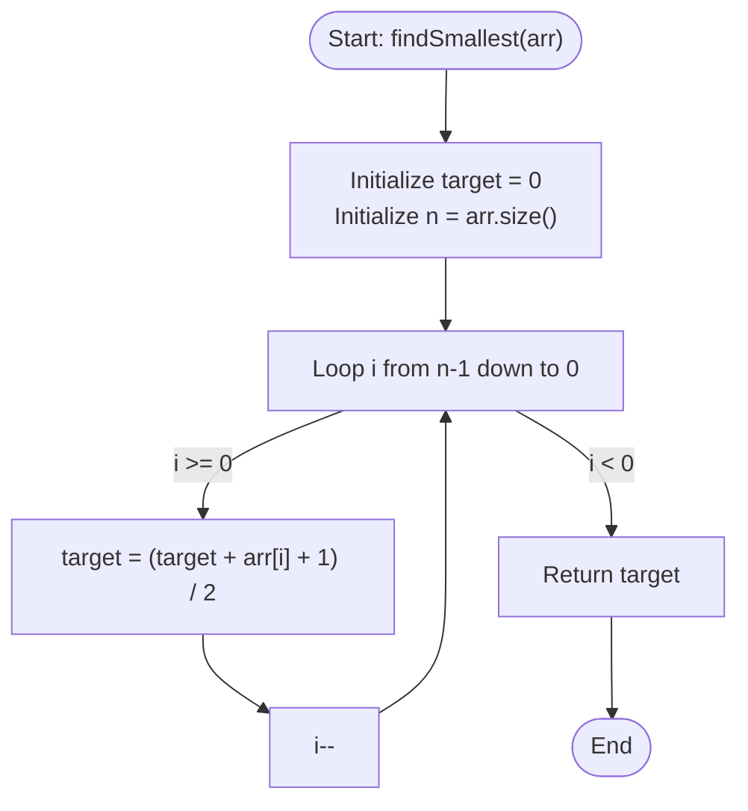

# 💡 Approach — Smallest Non-Zero Number

| 📄 [Problem](./Problem.md) | 💡 [Approach](./Approach.md) | 🧩 [Solution](./Solution.cpp) | 🚀 [Main](./Main.cpp) |
|:--------------------------:|:-----------------------------:|:------------------------------:|:---------------------:|

---

## 📊 Metadata

---

## 🎯 Core Insight

> [!TIP]
> **Greedy Backward Induction**
>
> 1. **Operation Unification:**
>    - If $x > arr[i]$, then the new value is $x + (x - arr[i]) = 2x - arr[i]$.
>    - If $x \le arr[i]$, then the new value is $x - (arr[i] - x) = 2x - arr[i]$.
>    - In both cases, the sequential transformation is identical: $x_{next} = 2x - arr[i]$.
>
> 2. **Reversing the Relation:**
>    - Expressing the current state in terms of the next state:
>      $$x = \frac{x_{next} + arr[i]}{2}$$
>    - Since $x$ must be an integer, the minimum integer starting value at step $i$ that guarantees a next state of at least $x_{next}$ is:
>      $$x = \lceil \frac{x_{next} + arr[i]}{2} \rceil$$
>
> 3. **Inductive Safety:**
>    - We want the final value $x_n \ge 0$ at the end of the array.
>    - If we set the target $x_n = 0$ and propagate backwards, we get the minimum initial value $x_0$.
>    - Since $arr[i] \ge 1$ and $x_{next} \ge 0$ at every step, we have $x \ge \lceil (0+1)/2 \rceil = 1 > 0$. Therefore, $x$ is naturally kept positive at all intermediate stages, preventing it from ever becoming negative.

---

## 🔩 Step-by-Step Breakdown

**Step 1: Initialize Target**
- Define `target = 0` as the minimum required value at the end of processing (index $n$).

**Step 2: Backward Propagation**
- Loop through the array from the last element ($i = n - 1$) down to the first element ($i = 0$).
- At each element $arr[i]$, calculate the minimum required value before processing:
  $$target = \lceil \frac{target + arr[i]}{2} \rceil$$
  Using C++ integer arithmetic:
  $$target = \frac{target + arr[i] + 1}{2}$$

**Step 3: Return Initial Value**
- The final value of `target` after processing $arr[0]$ represents the minimum starting value $x_0$. Return `target`.

---

## 🔄 Mermaid Flowchart

---

## 🧮 Dry Run — Example 1

- **Input:** $arr = [3, 4, 3, 2, 4]$
- **Trace Backwards:**
  - **$i = 4$:** $target = 0 \implies target = \lceil (0 + 4)/2 \rceil = 2$.
  - **$i = 3$:** $target = 2 \implies target = \lceil (2 + 2)/2 \rceil = 2$.
  - **$i = 2$:** $target = 2 \implies target = \lceil (2 + 3)/2 \rceil = 3$.
  - **$i = 1$:** $target = 3 \implies target = \lceil (3 + 4)/2 \rceil = 4$.
  - **$i = 0$:** $target = 4 \implies target = \lceil (4 + 3)/2 \rceil = 4$.
- **Result:** $4$.

---

## 📊 Complexity Analysis

| Metric | Complexity | Reasoning |
| :---: | :---: | :--- |
| 🕐 Time | $$O(n)$$ | We perform exactly one backward traversal of the array of size $n$, executing constant $O(1)$ operations at each step. |
| 💾 Space | $$O(1)$$ | Only a single variable `target` is used, utilizing zero auxiliary space. |

---

> *"Simplicity is the ultimate sophistication. By reversing our perspective, the most complex forwards progression becomes a simple backward induction."*

---

<h3>Happy Coding! 🚀</h3>

