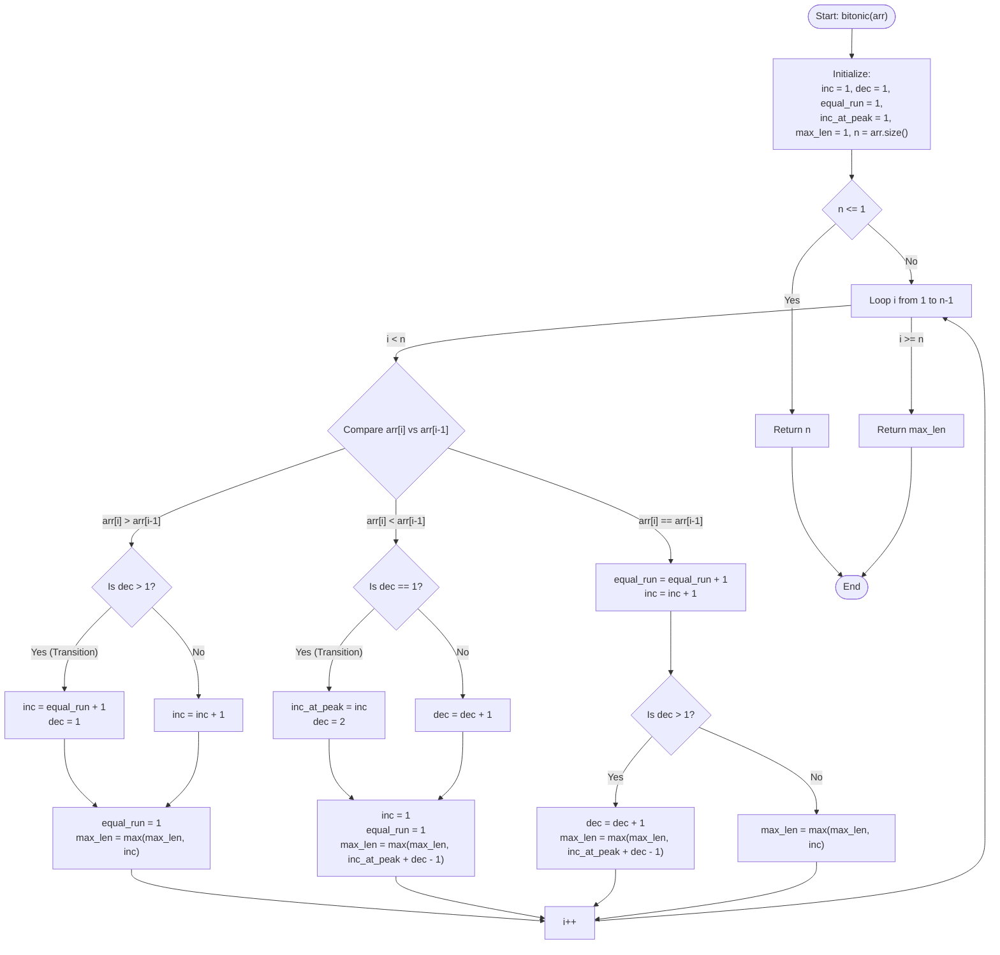

# 💡 Approach — Longest Bitonic Subarray

| 📄 [Problem](./Problem.md) | 💡 [Approach](./Approach.md) | 🧩 [Solution](./Solution.cpp) | 🚀 [Main](./Main.cpp) |
|:--------------------------:|:-----------------------------:|:------------------------------:|:---------------------:|

---

## 📊 Metadata

---

## 🎯 Core Insight

> [!TIP]
> **Dynamic Peak Tracking & Slope State Machine**
>
> A bitonic subarray must first non-decreasingly slope up, and then non-increasingly slope down. Instead of using $O(n)$ space to pre-calculate increasing and decreasing boundaries, we track the slopes using a constant-space state machine during a single pass:
> 
> 1. **Peak Preservation:**
>    - We track the length of the current increasing slope ending at the current index in `inc`.
>    - When a downward slope begins, we save this `inc` length to `inc_at_peak` and start a decreasing run `dec`. The total bitonic length is `inc_at_peak + dec - 1`.
> 
> 2. **Preceding Equality Inheritance:**
>    - Since equal elements (e.g., `[20, 20, 20]`) can continue a decreasing slope but also serve as the start of a subsequent increasing slope, we maintain `equal_run` to track consecutive duplicates.
>    - On transition back to an increasing phase, the new increasing phase inherits the previous flat run, starting with length `equal_run + 1`.

---

## 🔩 Step-by-Step Breakdown

**Step 1: Initialize Variables**
- Set `inc = 1`, `dec = 1` (current increasing and decreasing run lengths).
- Set `equal_run = 1` (consecutive duplicate element run).
- Set `inc_at_peak = 1` (increasing run length at the peak of the current bitonic subarray).
- Set `max_len = 1` (global maximum bitonic subarray length).

**Step 2: Traverse and Identify Trends**
Loop from `i = 1` to `n - 1` comparing `arr[i]` with `arr[i-1]`:
- **Case A: Increasing (`arr[i] > arr[i-1]`)**
  - If we were previously decreasing (`dec > 1`), we transition from a valley back to a mountain. The new increasing run inherits preceding duplicates, so we set `inc = equal_run + 1` and reset `dec = 1`.
  - Otherwise, we simply continue climbing: `inc = inc + 1`.
  - Reset `equal_run = 1` and update `max_len = max(max_len, inc)`.
- **Case B: Decreasing (`arr[i] < arr[i-1]`)**
  - If we were previously increasing (`dec == 1`), we transition past a peak. Record the peak size: `inc_at_peak = inc` and initialize `dec = 2`.
  - Otherwise, we continue descending: `dec = dec + 1`.
  - Reset `inc = 1`, `equal_run = 1`, and update `max_len = max(max_len, inc_at_peak + dec - 1)`.
- **Case C: Flat/Equal (`arr[i] == arr[i-1]`)**
  - Increment the duplicate run: `equal_run = equal_run + 1` and `inc = inc + 1`.
  - If currently decreasing (`dec > 1`), it extends the descent: `dec = dec + 1`. Update `max_len = max(max_len, inc_at_peak + dec - 1)`.
  - Otherwise, it extends the ascent. Update `max_len = max(max_len, inc)`.

**Step 3: Return Maximum Length**
- Return `max_len` as the longest bitonic subarray length.

---

## 🔄 Mermaid Flowchart

---

## 🧮 Dry Run — Example 1

- **Input Array:** `arr = [12, 4, 78, 90, 45, 23]`

| Index `i` | Element | Slope / Trend | `inc` | `dec` | `equal_run` | `inc_at_peak` | `max_len` | Active Bitonic Subarray |
| :---: | :---: | :---: | :---: | :---: | :---: | :---: | :---: | :--- |
| Initial | `12` | - | 1 | 1 | 1 | 1 | 1 | `[12]` |
| 1 | `4` | 📉 Decreasing | 1 | 2 | 1 | 1 | 2 | `[12, 4]` |
| 2 | `78` | 📈 Increasing | 2 | 1 | 1 | 1 | 2 | `[4, 78]` |
| 3 | `90` | 📈 Increasing | 3 | 1 | 1 | 1 | 3 | `[4, 78, 90]` |
| 4 | `45` | 📉 Decreasing | 1 | 2 | 1 | 3 | 4 | `[4, 78, 90, 45]` |
| 5 | `23` | 📉 Decreasing | 1 | 3 | 1 | 3 | **5** | `[4, 78, 90, 45, 23]` |

---

## 📊 Complexity Analysis

| Metric | Complexity | Reasoning |
| :---: | :---: | :--- |
| 🕐 Time | $$O(n)$$ | A single loop runs from index $1$ to $n-1$, checking values and adjusting variables in constant $O(1)$ time. |
| 💾 Space | $$O(1)$$ | The algorithm uses only five integer variables for tracking state, achieving constant auxiliary space. |

---

> *"A peak is not just a destination, but a turning point where descent meets a new ascent. By remembering where we stood at the peak, we map the entire journey."*

---

<h3>Happy Coding! 🚀</h3>

