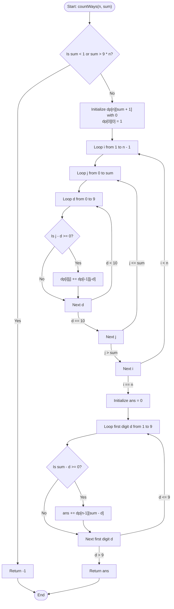

# 💡 Approach — Numbers with Given Digit Sum

| 📄 [Problem](./Problem.md) | 💡 [Approach](./Approach.md) | 🧩 [Solution](./Solution.cpp) | 🚀 [Main](./Main.cpp) |
|:--------------------------:|:-----------------------------:|:------------------------------:|:---------------------:|

---

## 📊 Metadata

---

## 🎯 Core Insight

> [!TIP]
> **Dynamic Programming (Tabulation) with First Digit Separation**
> 
> To construct an $n$-digit positive integer whose digits sum to `sum`, we must handle the first digit (most significant digit) specially because it cannot be $0$ (no leading zeros).
> 
> Let's define $dp[i][j]$ as the number of ways to form a digit sum of $j$ using $i$ digits, where **each digit can be anything from $0$ to $9$** (leading zeros allowed).
> 
> 1. **Base Case:**
>    - $dp[0][0] = 1$: There is exactly 1 way to get a sum of $0$ using $0$ digits (the empty sequence).
>    - All other $dp[0][j] = 0$.
> 
> 2. **State Transition:**
>    - For a length $i$ and target sum $j$, we try choosing all possible digits $d \in [0, 9]$ for the current position:
>      $$dp[i][j] = \sum_{d=0}^{9} dp[i - 1][j - d] \quad \text{(where } j - d \ge 0\text{)}$$
> 
> 3. **Eliminating Leading Zeros:**
>    - For the first position of the $n$-digit number, the digit $d$ must belong to $[1, 9]$ to avoid leading zeros.
>    - The remaining $n-1$ digits can have any values from $0$ to $9$, summing to $sum - d$.
>    - Hence, the total number of valid $n$-digit numbers is:
>      $$\text{Total Ways} = \sum_{d=1}^{9} dp[n - 1][sum - d] \quad \text{(where } sum - d \ge 0\text{)}$$

---

## 🔩 Step-by-Step Breakdown

**Step 1: Check Feasibility**
- If `sum < 1` or `sum > 9 * n`, it is mathematically impossible to form an $n$-digit positive integer that meets the criteria.
- Return `-1` immediately.

**Step 2: Initialize DP Table**
- Create a 2D table `dp` of size `(n + 1) x (sum + 1)` filled with `0`.
- Set the base case: `dp[0][0] = 1`.

**Step 3: Compute DP Transitions**
- Iterate `i` from `1` to `n - 1` (building up states for up to $n-1$ digits where leading zeros are allowed):
  - Iterate `j` from `0` to `sum`:
    - Iterate `d` from `0` to `9`:
      - If `j - d >= 0`, add `dp[i - 1][j - d]` to `dp[i][j]`.

**Step 4: Calculate the Final Answer**
- Initialize `ans = 0`.
- Iterate through the first digit $d$ from `1` to `9`:
  - If `sum - d >= 0`, add `dp[n - 1][sum - d]` to `ans`.
- Return `ans`.

---

## 🔄 Mermaid Flowchart

---

## 🧮 Dry Run — Example 1

- **Input:** `n = 2, sum = 2`

### 1. Base Case Initialization
- `dp[0][0] = 1`, all other entries are `0`.

### 2. DP Table Computation (`i = 1` to `n-1`):
For $i = 1$ (representing $1$ digit, allowing leading zeros):
- `j = 0`: `dp[1][0] = dp[0][0] = 1` (only choice: `0`)
- `j = 1`: `dp[1][1] = dp[0][1] + dp[0][0] = 0 + 1 = 1` (only choice: `1`)
- `j = 2`: `dp[1][2] = dp[0][2] + dp[0][1] + dp[0][0] = 0 + 0 + 1 = 1` (only choice: `2`)

### 3. Final Computation (First digit $d \in [1, 9]$):
- For $d = 1$: $sum - 1 = 1 \ge 0 \implies \text{ans} += dp[1][1] = 1$ (Forms number `11`)
- For $d = 2$: $sum - 2 = 0 \ge 0 \implies \text{ans} += dp[1][0] = 1$ (Forms number `20`)
- For $d \ge 3$: $sum - d < 0 \implies$ Invalid/Out of bounds.

**Final Answer:** `2`.

---

## 📊 Complexity Analysis

| Metric | Complexity | Reasoning |
| :---: | :---: | :--- |
| 🕐 Time | $$O(n \times sum)$$ | The outer loop runs $n-1$ times, the inner loop runs $sum+1$ times, and the innermost loop runs $10$ times. The final loop runs $9$ times. Thus, the time complexity is proportional to $O(n \times sum)$. |
| 💾 Space | $$O(n \times sum)$$ | We allocate a 2D table `dp` of size $(n + 1) \times (sum + 1)$ to store subproblem solutions. |

---

> *"Breaking down a grand design into digits and summing up our choices step by step, we construct every possible path to success."*

---

<h3>Happy Coding! 🚀</h3>

