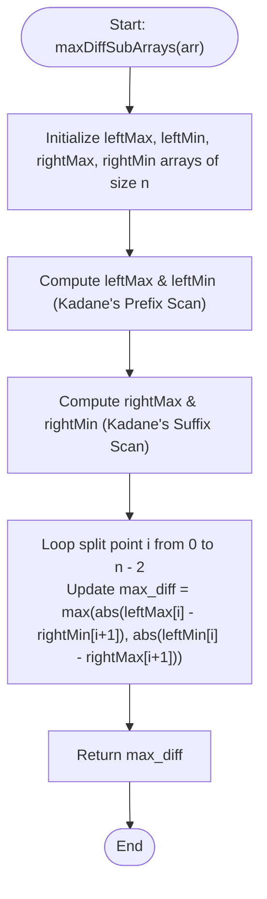

# 💡 Approach — Max Absolute Diff of Two Subarrays

| 📄 [Problem](./Problem.md) | 💡 [Approach](./Approach.md) | 🧩 [Solution](./Solution.cpp) | 🚀 [Main](./Main.cpp) |
|:--------------------------:|:-----------------------------:|:------------------------------:|:---------------------:|

---

## 📊 Metadata

---

## 🎯 Core Insight

> [!TIP]
> **Partitioning and Kadane's Algorithm Suffix/Prefix Scan**
> 
> Since the two subarrays must be **non-overlapping** and **contiguous**, there must exist some split/partition point $i$ ($0 \le i < n - 1$) such that:
> - The first subarray lies entirely in the range `arr[0 ... i]`.
> - The second subarray lies entirely in the range `arr[i + 1 ... n - 1]`.
> 
> To maximize the absolute difference $|Sum(Subarray_1) - Sum(Subarray_2)|$ at any split point $i$, we have two choices:
> 1. Subtract the minimum possible subarray sum in the right part from the maximum possible subarray sum in the left part:
>    $$\text{Diff}_1 = | \text{leftMax}[i] - \text{rightMin}[i + 1] |$$
> 2. Subtract the maximum possible subarray sum in the right part from the minimum possible subarray sum in the left part:
>    $$\text{Diff}_2 = | \text{leftMin}[i] - \text{rightMax}[i + 1] |$$
> 
> We can compute these prefix and suffix minimum/maximum subarray sums in $O(n)$ time using **Kadane's Algorithm** running from both ends.

---

## 🔩 Step-by-Step Breakdown

**Step 1: Initialize Prefix and Suffix Arrays**
- Allocate four arrays of size $n$:
  - `leftMax[i]`: Maximum subarray sum in the prefix range `arr[0 ... i]`.
  - `leftMin[i]`: Minimum subarray sum in the prefix range `arr[0 ... i]`.
  - `rightMax[i]`: Maximum subarray sum in the suffix range `arr[i ... n - 1]`.
  - `rightMin[i]`: Minimum subarray sum in the suffix range `arr[i ... n - 1]`.

**Step 2: Compute Left Max and Min Subarray Sums (Kadane's Prefix Scan)**
- Run Kadane's algorithm from left to right:
  - Track `curr_max` to find the maximum sum of a contiguous subarray ending at $i$. Update `leftMax[i] = max(leftMax[i-1], curr_max)`.
  - Track `curr_min` to find the minimum sum of a contiguous subarray ending at $i$. Update `leftMin[i] = min(leftMin[i-1], curr_min)`.

**Step 3: Compute Right Max and Min Subarray Sums (Kadane's Suffix Scan)**
- Run Kadane's algorithm from right to left (from $n-1$ down to $0$):
  - Track `curr_max` to find the maximum sum of a contiguous subarray starting at $i$. Update `rightMax[i] = max(rightMax[i+1], curr_max)`.
  - Track `curr_min` to find the minimum sum of a contiguous subarray starting at $i$. Update `rightMin[i] = min(rightMin[i+1], curr_min)`.

**Step 4: Calculate the Maximum Absolute Difference**
- Iterate through all partition indices $i$ from $0$ to $n - 2$:
  - Calculate $| \text{leftMax}[i] - \text{rightMin}[i + 1] |$ and $| \text{leftMin}[i] - \text{rightMax}[i + 1] |$.
  - Record the maximum value encountered.

---

## 🔄 Mermaid Flowchart

---

## 🧮 Dry Run — Example 1

### Input
`arr[] = [-2, -3, 4, -1, -2, 1, 5, -3]`, $n = 8$

### 1. Left Max and Left Min Computation
- `leftMax` tracks the maximum subarray sum in `arr[0...i]`.
  - `leftMax = [-2, -2, 4, 4, 4, 4, 7, 7]`
- `leftMin` tracks the minimum subarray sum in `arr[0...i]`.
  - `leftMin = [-2, -5, -5, -5, -5, -5, -5, -5]`

### 2. Right Max and Right Min Computation
- `rightMax` tracks the maximum subarray sum in `arr[i...n-1]`.
  - `rightMax = [7, 7, 7, 6, 6, 6, 5, -3]`
- `rightMin` tracks the minimum subarray sum in `arr[i...n-1]`.
  - `rightMin = [-5, -3, -3, -3, -3, -3, -3, -3]`

### 3. Finding Maximum Absolute Difference
We evaluate partition points $i$ from $0$ to $n-2$:
- **At $i = 0$** (Split: `[-2]` | `[-3, 4, -1, -2, 1, 5, -3]`):
  - $| \text{leftMax}[0] - \text{rightMin}[1] | = | -2 - (-3) | = 1$
  - $| \text{leftMin}[0] - \text{rightMax}[1] | = | -2 - 7 | = 9$
- **At $i = 1$** (Split: `[-2, -3]` | `[4, -1, -2, 1, 5, -3]`):
  - $| \text{leftMax}[1] - \text{rightMin}[2] | = | -2 - (-3) | = 1$
  - $| \text{leftMin}[1] - \text{rightMax}[2] | = | -5 - 7 | = 12$  $\leftarrow \text{Current Max}$
- **At $i = 2$** (Split: `[-2, -3, 4]` | `[-1, -2, 1, 5, -3]`):
  - $| \text{leftMax}[2] - \text{rightMin}[3] | = | 4 - (-3) | = 7$
  - $| \text{leftMin}[2] - \text{rightMax}[3] | = | -5 - 6 | = 11$
- ... and so on.

**Final Maximum Absolute Difference:** `12`.

---

## 📊 Complexity Analysis

| Metric | Complexity | Reasoning |
| :---: | :---: | :--- |
| 🕐 Time | $$O(n)$$ | We make three linear scans over the array of size $n$: one for prefixes, one for suffixes, and one to find the maximum partition difference. |
| 💾 Space | $$O(n)$$ | We allocate four prefix/suffix helper arrays of size $n$. |

---

> *"By dividing a complex sequence at every boundary and looking at both extremes of the split, the absolute maximum potential of our choices is revealed."*

---

<h3>Happy Coding! 🚀</h3>

