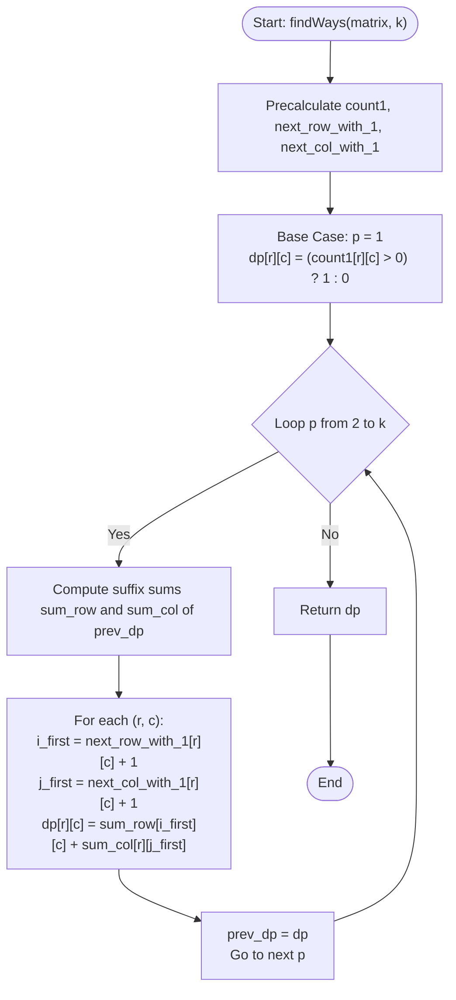

# 💡 Approach — Cut Matrix

| 📄 [Problem](./Problem.md) | 💡 [Approach](./Approach.md) | 🧩 [Solution](./Solution.cpp) | 🚀 [Main](./Main.cpp) |
|:--------------------------:|:-----------------------------:|:------------------------------:|:---------------------:|

---

## 📊 Metadata

---

## 🎯 Core Insight

> [!TIP]
> **Dynamic Programming with Suffix Range-Sum Optimizations**
>
> Let $$dp[r][c][p]$$ be the number of ways to cut the submatrix spanning from row $$r \dots n-1$$ and column $$c \dots m-1$$ into $$p$$ pieces.
>
> Since each piece must contain at least one `1`:
> 1. A horizontal cut at row $$i$$ ($$r < i < n$$) leaves a top piece $$[r \dots i-1][c \dots m-1]$$ and a bottom active piece $$[i \dots n-1][c \dots m-1]$$. This top piece is valid if it contains at least one `1`.
> 2. A vertical cut at col $$j$$ ($$c < j < m$$) leaves a left piece $$[r \dots n-1][c \dots j-1]$$ and a right active piece $$[r \dots n-1][j \dots m-1]$$. This left piece is valid if it contains at least one `1`.
>
> Instead of iterating through all cut indices $$i$$ and $$j$$ in $$O(n + m)$$ for each DP state transition (which leads to a slow $$O(n \cdot m \cdot k \cdot (n + m))$$ solution):
> - Precalculate the first row/column containing a `1` starting from any location $$(r, c)$$:
>   - $$next\_row\_with\_1[r][c]$$: first row index $$\ge r$$ containing a `1` in columns $$\ge c$$.
>   - $$next\_col\_with\_1[r][c]$$: first column index $$\ge c$$ containing a `1` in rows $$\ge r$$.
> - This defines a threshold cut index. Any horizontal cut $$i > next\_row\_with\_1[r][c]$$ or vertical cut $$j > next\_col\_with\_1[r][c]$$ is valid.
> - Maintain suffix sums of the previous DP state ($$p-1$$ pieces) along rows and columns so that we can answer the range sum query of transitions in $$O(1)$$ time.

---

## 🔩 Step-by-Step Breakdown

**Step 1: Compute 1-Density and Indices**
- Compute `count1[r][c]`, representing the number of `1`s in the submatrix `[r...n-1][c...m-1]`.
- Compute `row_has_1[r][c]` indicating whether row `r` has a `1` at or after column `c`.
- Compute `col_has_1[r][c]` indicating whether column `c` has a `1` at or after row `r`.
- Compute `next_row_with_1[r][c]` and `next_col_with_1[r][c]` using suffix propagation.

**Step 2: Base Case (k = 1)**
- For $$p = 1$$, there are no cuts. The remaining submatrix must contain at least one `1`.
- `dp[r][c] = (count1[r][c] > 0) ? 1 : 0`.

**Step 3: DP Transitions (p = 2 to k)**
- For each piece level $$p$$, compute the suffix-sum helper matrices:
  - `sum_row[r][c]` = suffix sum of `prev_dp[i][c]` for $$i \ge r$$.
  - `sum_col[r][c]` = suffix sum of `prev_dp[r][j]` for $$j \ge c$$.
- Compute the new `dp[r][c]` states:
  - If `count1[r][c] == 0`, `dp[r][c] = 0`.
  - Else:
    - Horizontal cuts: sum of `prev_dp[i][c]` for all valid $$i \ge next\_row\_with\_1[r][c] + 1$$, which is given by `sum_row[next_row_with_1[r][c] + 1][c]`.
    - Vertical cuts: sum of `prev_dp[r][j]` for all valid $$j \ge next\_col\_with\_1[r][c] + 1$$, which is given by `sum_col[r][next_col_with_1[r][c] + 1]`.

---

## 🔄 Mermaid Flowchart

---

## 🧮 Dry Run — Example 2

### Input
`matrix = [[0, 0], [1, 1]]`, $$k = 2$$

### 1. Precomputations
- `count1` matrix:
  $$\begin{pmatrix} 2 & 1 \\ 2 & 1 \end{pmatrix}$$
- `next_row_with_1`:
  $$\begin{pmatrix} 1 & 1 \\ 1 & 1 \end{pmatrix}$$
- `next_col_with_1`:
  $$\begin{pmatrix} 0 & 1 \\ 0 & 1 \end{pmatrix}$$

### 2. Base Case ($$p = 1$$)
`prev_dp` is all ones since all submatrices have at least one `1`:
$$\text{prev\_dp} = \begin{pmatrix} 1 & 1 \\ 1 & 1 \end{pmatrix}$$

### 3. Transition ($$p = 2$$)
- Suffix sum matrices of `prev_dp`:
  $$\text{sum\_row} = \begin{pmatrix} 2 & 2 \\ 1 & 1 \end{pmatrix}, \quad \text{sum\_col} = \begin{pmatrix} 2 & 1 \\ 2 & 1 \end{pmatrix}$$
- Compute `dp[0][0]`:
  - `i_first = next_row_with_1[0][0] + 1 = 2` (out of bounds, so no horizontal cut).
  - `j_first = next_col_with_1[0][0] + 1 = 1` (valid vertical cut).
  - `dp[0][0] = sum_col[0][1] = 1`.

**Final Result:** `dp[0][0] = 1`.

---

## 📊 Complexity Analysis

| Metric | Complexity | Reasoning |
| :---: | :---: | :--- |
| 🕐 Time | $$O(n \cdot m \cdot k)$$ | We have $$k$$ iterations. In each iteration, we compute suffix sums and update the states of size $$n \times m$$ in $$O(1)$$ per state. |
| 💾 Space | $$O(n \cdot m)$$ | We only need the DP table of the previous iteration to compute the current one, enabling a rolling buffer. |

---

> *"By dividing a problem into localized choices and caching their range sums, we can make complex decisions in constant time."*

---

<h3>Happy Coding! 🚀</h3>

