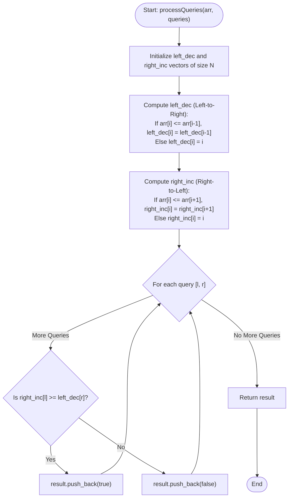

# 💡 Approach — Mountain Subarray Queries

| 📄 [Problem](./Problem.md) | 💡 [Approach](./Approach.md) | 🧩 [Solution](./Solution.cpp) | 🚀 [Main](./Main.cpp) |
|:--------------------------:|:-----------------------------:|:------------------------------:|:---------------------:|

---

## 📊 Metadata

---

## 🎯 Core Insight

> [!TIP]
> **Boundary Precomputation for Constant Time Overlap Queries**
> 
> A subarray `arr[l...r]` is a mountain array if there exists a transition point (peak) `k` ($$l \le k \le r$$) where elements increase up to `k` and decrease afterwards.
> 
> Instead of searching for the peak `k` for each query in $$O(N)$$, we precompute boundaries:
> - `left_dec[i]`: The leftmost index we can reach from `i` by moving backwards (left) through non-increasing elements (i.e., a decreasing run ending at `i` when viewed left-to-right).
> - `right_inc[i]`: The rightmost index we can reach from `i` by moving forwards (right) through non-decreasing elements (i.e., an increasing run starting at `i` when viewed left-to-right).
> 
> **Query Validation:**
> For any query `[l, r]`, the subarray forms a mountain if and only if the increasing segment starting at `l` and the decreasing segment ending at `r` overlap.
> Mathematically, this is satisfied if:
> $$\text{right\_inc}[l] \ge \text{left\_dec}[r]$$

---

## 🔩 Step-by-Step Breakdown

**Step 1: Precompute left_dec**
- Create an array `left_dec` of size $$N$$.
- Initialize `left_dec[0] = 0`.
- For $$i$$ from $$1$$ to $$N-1$$:
  - If `arr[i] <= arr[i - 1]` (elements are decreasing or equal), set `left_dec[i] = left_dec[i - 1]`.
  - Else, set `left_dec[i] = i`.

**Step 2: Precompute right_inc**
- Create an array `right_inc` of size $$N$$.
- Initialize `right_inc[N - 1] = N - 1`.
- For $$i$$ from $$N-2$$ down to $$0$$:
  - If `arr[i] <= arr[i + 1]` (elements are increasing or equal), set `right_inc[i] = right_inc[i + 1]`.
  - Else, set `right_inc[i] = i`.

**Step 3: Answer Queries in $$O(1)$$**
- For each query `[l, r]`:
  - Check if `right_inc[l] >= left_dec[r]`.
  - If true, push `true` to the result, indicating `arr[l...r]` is a mountain.
  - Else, push `false`.

---

## 🔄 Mermaid Flowchart

---

## 🧮 Dry Run — Example 1

### Input
`arr = [2, 3, 2, 4, 4, 6, 3, 2]`, `queries = [[0, 2], [1, 3]]`

### 1. Precomputations
- `left_dec` table:
  - At index 0: `left_dec[0] = 0`
  - At index 1: `arr[1] = 3 > 2` -> `left_dec[1] = 1`
  - At index 2: `arr[2] = 2 <= 3` -> `left_dec[2] = left_dec[1] = 1`
  - At index 3: `arr[3] = 4 > 2` -> `left_dec[3] = 3`
  - At index 4: `arr[4] = 4 <= 4` -> `left_dec[4] = left_dec[3] = 3`
  - At index 5: `arr[5] = 6 > 4` -> `left_dec[5] = 5`
  - At index 6: `arr[6] = 3 <= 6` -> `left_dec[6] = left_dec[5] = 5`
  - At index 7: `arr[7] = 2 <= 3` -> `left_dec[7] = left_dec[6] = 5`
  
  $$\text{left\_dec} = [0, 1, 1, 3, 3, 5, 5, 5]$$

- `right_inc` table:
  - At index 7: `right_inc[7] = 7`
  - At index 6: `arr[6] = 3 > 2` -> `right_inc[6] = 6`
  - At index 5: `arr[5] = 6 > 3` -> `right_inc[5] = 5`
  - At index 4: `arr[4] = 4 <= 6` -> `right_inc[4] = right_inc[5] = 5`
  - At index 3: `arr[3] = 4 <= 4` -> `right_inc[3] = right_inc[4] = 5`
  - At index 2: `arr[2] = 2 <= 4` -> `right_inc[2] = right_inc[3] = 5`
  - At index 1: `arr[1] = 3 > 2` -> `right_inc[1] = 1`
  - At index 0: `arr[0] = 2 <= 3` -> `right_inc[0] = right_inc[1] = 1`
  
  $$\text{right\_inc} = [1, 1, 5, 5, 5, 5, 6, 7]$$

### 2. Query Processing
- **Query 1 `[0, 2]`**:
  - `l = 0`, `r = 2`.
  - `right_inc[0] = 1`.
  - `left_dec[2] = 1`.
  - `right_inc[0] >= left_dec[2]` ($$1 \ge 1$$) is **True** -> Subarray `[2, 3, 2]` is a mountain.
- **Query 2 `[1, 3]`**:
  - `l = 1`, `r = 3`.
  - `right_inc[1] = 1`.
  - `left_dec[3] = 3`.
  - `right_inc[1] >= left_dec[3]` ($$1 \ge 3$$) is **False** -> Subarray `[3, 2, 4]` is not a mountain.

---

## 📊 Complexity Analysis

| Metric | Complexity | Reasoning |
| :---: | :---: | :--- |
| 🕐 Time | $$O(n + q)$$ | $$O(n)$$ to populate `left_dec` and `right_inc` arrays via single linear scans, and $$O(1)$$ time to resolve each of the $$q$$ queries. |
| 💾 Space | $$O(n)$$ | Two precomputed arrays of size $$n$$ are required to store indices. |

---

> *"Like standing on the peak of a mountain, looking back at the climb and forward to the descent, precomputed visibility reveals the entire horizon in a single glance."*

---

<h3>Happy Coding! 🚀</h3>

