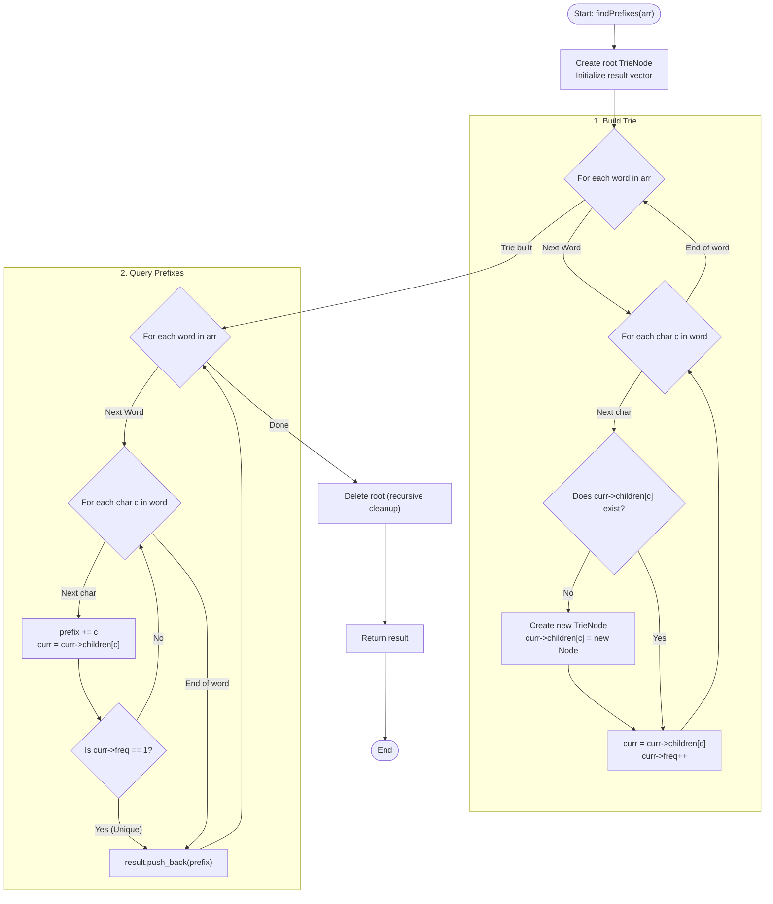

# 💡 Approach — Shortest Unique Prefix for Every Word

| 📄 [Problem](./Problem.md) | 💡 [Approach](./Approach.md) | 🧩 [Solution](./Solution.cpp) | 🚀 [Main](./Main.cpp) |
|:--------------------------:|:-----------------------------:|:------------------------------:|:---------------------:|

---

## 📊 Metadata

---

## 🎯 Core Insight

> [!TIP]
> **Frequency Tracking in a Trie (Prefix Tree)**
> 
> A prefix of a word is unique among all words in a set if and only if it is not shared by any other word in the set.
> 
> By inserting all words into a Trie, each node (representing a character of a prefix) can maintain a **frequency count** of how many words pass through it:
> 1. When inserting a word, we increment the frequency of every node we visit/create.
> 2. To find the shortest unique prefix for a word, we traverse the Trie from the root using the characters of that word.
> 3. The first node we encounter that has a `frequency == 1` signifies that only the current word passes through this path. Thus, the path from the root to this node constitutes the shortest unique prefix.
> 
> Because the problem guarantees that *no word is a prefix of another*, every word is guaranteed to find some prefix with `frequency == 1` before or at its terminal character.

---

## 🔩 Step-by-Step Breakdown

### 1. Build the Trie
- Define a `TrieNode` structure with:
  - `children`: An array of size 256 pointers (to support all standard ASCII characters).
  - `freq`: An integer tracking how many words share this prefix.
- Initialize `root = new TrieNode()`.
- For each word in the input array:
  - Start at the `root`.
  - For each character `c` of the word:
    - If `curr->children[c]` does not exist, create a new `TrieNode`.
    - Move to `curr->children[c]`.
    - Increment `curr->freq`.

### 2. Search Shortest Unique Prefixes
- For each word in the input array:
  - Start at the `root`.
  - Initialize an empty string `prefix`.
  - For each character `c` of the word:
    - Append `c` to `prefix`.
    - Move to `curr->children[c]`.
    - If `curr->freq == 1`, stop traversing and return `prefix`.
  - Store this `prefix` in the result list.

### 3. Cleanup Memory
- Recursively deallocate the Trie nodes to avoid memory leaks.

---

## 🔄 Mermaid Flowchart

---

## 🧮 Dry Run — Example 1

### Input
`arr[] = ["zebra", "dog", "duck", "dove"]`

### 1. Trie Insertion Phase
- **"zebra"**:
  - `z` (freq 1) $\rightarrow$ `e` (freq 1) $\rightarrow$ `b` (freq 1) $\rightarrow$ `r` (freq 1) $\rightarrow$ `a` (freq 1)
- **"dog"**:
  - `d` (freq 1) $\rightarrow$ `o` (freq 1) $\rightarrow$ `g` (freq 1)
- **"duck"**:
  - `d` (freq 2) $\rightarrow$ `u` (freq 1) $\rightarrow$ `c` (freq 1) $\rightarrow$ `k` (freq 1)
- **"dove"**:
  - `d` (freq 3) $\rightarrow$ `o` (freq 2) $\rightarrow$ `v` (freq 1) $\rightarrow$ `e` (freq 1)

### 2. Prefix Resolution Phase
- **"zebra"**:
  - `z` (freq 1) $\rightarrow$ **Stop**. Prefix = `"z"`
- **"dog"**:
  - `d` (freq 3) $\rightarrow$ `o` (freq 2) $\rightarrow$ `g` (freq 1) $\rightarrow$ **Stop**. Prefix = `"dog"`
- **"duck"**:
  - `d` (freq 3) $\rightarrow$ `u` (freq 1) $\rightarrow$ **Stop**. Prefix = `"du"`
- **"dove"**:
  - `d` (freq 3) $\rightarrow$ `o` (freq 2) $\rightarrow$ `v` (freq 1) $\rightarrow$ **Stop**. Prefix = `"dov"`

**Result:** `{"z", "dog", "du", "dov"}`

---

## 📊 Complexity Analysis

| Metric | Complexity | Reasoning |
| :---: | :---: | :--- |
| 🕐 Time | $O(N \times L)$ | We insert each word of length at most $L$ into the Trie in $O(L)$ time, and then resolve prefixes in $O(L)$ per word. Max total operations $\approx 2 \times N \times L$. |
| 💾 Space | $O(N \times L)$ | In the worst case, every character of every word forms a unique node in the Trie. The total number of nodes is bounded by $N \times L$. |

---

<h3>Happy Coding! 🚀</h3>

