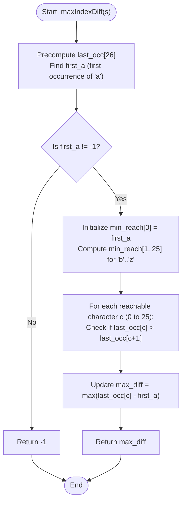

# 💡 Approach — Maximum Reachable Index Difference

| 📄 [Problem](./Problem.md) | 💡 [Approach](./Approach.md) | 🧩 [Solution](./Solution.cpp) | 🚀 [Main](./Main.cpp) |
|:--------------------------:|:-----------------------------:|:------------------------------:|:---------------------:|

---

## 📊 Metadata

---

## 🎯 Core Insight

> [!TIP]
> **Greedy Alphabet Reachability & Terminal Condition Analysis**
> 
> 1. **Optimal Starting Index**:
>    - To maximize the difference `ending_index - starting_index`, we must make `starting_index` as small as possible.
>    - Any jump sequence valid from a later `'a'` (at index $i_2 > i_1$) is also valid from the very first occurrence of `'a'` (at index $i_1$). Thus, starting at the first `'a'` (`first_a`) is always optimal.
> 
> 2. **Minimum Reachable Index (`min_reach`)**:
>    - A character $c$ can be reached if and only if its preceding alphabet letter $c-1$ was reachable.
>    - To make subsequent characters as easy to reach as possible, we track `min_reach[c]`: the **first occurrence** of character $c$ at an index $> \text{min\_reach}[c-1]$.
> 
> 3. **Terminal Condition ("No further jump is possible")**:
>    - An index $E$ with character $c$ is **terminal** if and only if there is **no index $> E$ containing character $c+1$**.
>    - Let `last_occ[c+1]` be the rightmost occurrence of character $c+1$ in the entire string. An index $E$ with character $c$ has no $c+1$ to its right if and only if $E > \text{last\_occ}[c+1]$ (or $c+1$ does not exist in `s`).
> 
> 4. **Optimal Ending Index per Character**:
>    - For any reachable character $c$, its rightmost occurrence `last_occ[c]` is always reachable.
>    - If `last_occ[c] > last_occ[c+1]`, `last_occ[c]` is a valid terminal index yielding an index difference of `last_occ[c] - first_a`.
>    - We take the maximum difference across all valid terminal characters.

---

## 🔩 Step-by-Step Breakdown

### 1. Precompute Rightmost Occurrences & Find First `'a'`
- Iterate through `s` once to populate `last_occ[26]` storing the last index of each character `'a'` through `'z'`.
- Find `first_a`, the index of the first occurrence of `'a'` in `s`.
- If no `'a'` exists in `s`, immediately return `-1`.

### 2. Compute Minimum Reachable Indices (`min_reach`)
- Initialize `min_reach[0] = first_a` (for `'a'`).
- For each character $c$ from $1$ to $25$ (`'b'` to `'z'`):
  - If `min_reach[c-1] == -1`, character $c-1$ was not reachable, so character $c$ cannot be reached. Break.
  - Scan `s` starting from `min_reach[c-1] + 1` to find the first index $i$ where `s[i] - 'a' == c`.
  - Set `min_reach[c] = i`.

### 3. Evaluate Valid Terminal States
- Check character `'a'` ($c = 0$): If `last_occ[1] < first_a` (or `'b'` does not exist), `first_a` itself is terminal with difference $0$.
- For characters $c$ from $1$ to $25$:
  - If `min_reach[c] != -1`:
    - `last_occ[c]` is terminal if $c == 25$ or `last_occ[c+1] < last_occ[c]` (or $c+1$ does not exist).
    - If terminal, update `max_diff = max(max_diff, last_occ[c] - first_a)`.

### 4. Return Result
- Return `max_diff`.

---

## 🔄 Mermaid Flowchart

---

## 🧮 Dry Run — Example 1

### Input
`s = "aaabcb"`

### Step 1: Precomputation & `first_a`
- `last_occ`: `'a'`: 2, `'b'`: 5, `'c'`: 4
- `first_a`: 0

### Step 2: Reachability Computation
- `min_reach['a']` = 0
- `min_reach['b']` = 3 (first `'b'` after index 0)
- `min_reach['c']` = 4 (first `'c'` after index 3)
- `min_reach['d']` = -1 (no `'d'` after index 4)

### Step 3: Terminal Evaluation
- Character `'a'` ($c=0$): `last_occ['b'] = 5 > 0` $\rightarrow$ Not terminal.
- Character `'b'` ($c=1$): `min_reach['b'] = 3 != -1`. `last_occ['c'] = 4 < last_occ['b'] = 5` $\rightarrow$ **Terminal!** Diff = $5 - 0 = 5$.
- Character `'c'` ($c=2$): `min_reach['c'] = 4 != -1`. `last_occ['d'] = -1 < last_occ['c'] = 4` $\rightarrow$ **Terminal!** Diff = $4 - 0 = 4$.

**Result:** $\max(5, 4) = 5$.

---

## 📊 Complexity Analysis

| Metric | Complexity | Reasoning |
| :---: | :---: | :--- |
| 🕐 Time | $O(N)$ | Finding `last_occ` takes $O(N)$. Computing `min_reach` scans each section of the string at most 25 times ($O(26N) = O(N)$). Evaluating candidates takes $O(26) = O(1)$. Overall time complexity is linear. |
| 💾 Space | $O(1)$ | Uses fixed-size arrays of size 26 (`last_occ` and `min_reach`). Auxiliary space is $O(1)$. |

---

<h3>Happy Coding! 🚀</h3>

