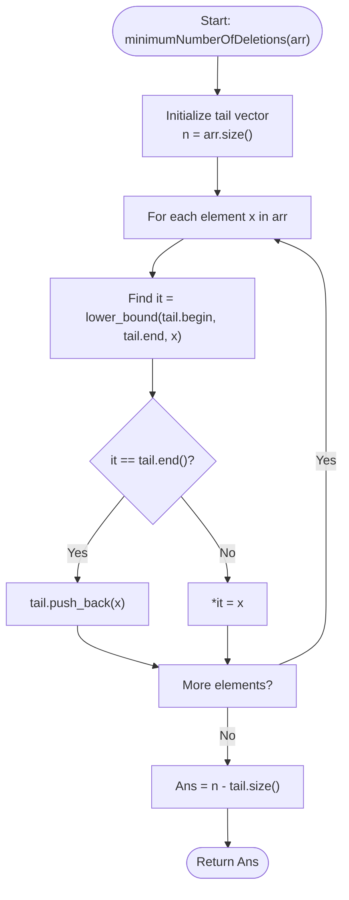

# 💡 Approach — Minimum Deletions to Make Sorted

| 📄 [Problem](./Problem.md) | 💡 [Approach](./Approach.md) | 🧩 [Solution](./Solution.cpp) | 🚀 [Main](./Main.cpp) |
|:--------------------------:|:-----------------------------:|:------------------------------:|:---------------------:|

---

## 📊 Metadata

---

## 🎯 Core Insight

> [!TIP]
> **Equivalence to Longest Increasing Subsequence (LIS)**
> 
> 1. **Core Objective**: We want to delete the minimum number of elements from the array `arr[]` such that the remaining elements form a strictly increasing sequence.
> 2. **LIS Connection**: The length of the longest strictly increasing sequence we can keep is exactly the **Longest Increasing Subsequence (LIS)** of `arr[]`.
> 3. **Calculation**: If the length of the LIS is $L$, then the minimum number of deletions required is:
>    $$\text{Deletions} = n - L$$
> 4. **Optimized LIS Algorithm**:
>    - The naive DP approach takes $O(n^2)$ time, which will TLE for $n = 10^5$.
>    - We can use the **DP + Binary Search** (Patience Sorting) algorithm to find the length of the LIS in $O(n \log n)$ time.

---

## 🔩 Step-by-Step Breakdown

### 1. Maintain an Active Tails Array
- We maintain an array/vector `tail` where `tail[i]` stores the smallest tail of all increasing subsequences of length $i + 1$ found so far.
- This `tail` array will naturally remain sorted at all times.

### 2. Process Elements and Binary Search
For each element `x` in `arr[]`:
- Use binary search (`std::lower_bound` in C++) to find the first element in `tail` that is greater than or equal to `x` (say at index `idx`).
- If `x` is greater than all elements in `tail`, append `x` to `tail` (this extends the LIS length).
- Otherwise, update `tail[idx] = x` (this optimizes the LIS of length `idx + 1` by making its tail smaller).

### 3. Compute Deletions
- The size of `tail` at the end of the iteration is the length of the LIS ($L$).
- Return $n - L$.

---

## 🔄 Mermaid Flowchart

---

## 🧮 Dry Run — Example 1

### Input
`arr[] = [5, 6, 1, 7, 4]`

| Element ($x$) | Binary Search (Lower Bound) | `tail` state | Explanation |
| :---: | :---: | :---: | :--- |
| **5** | Not found | `[5]` | Append $5$ |
| **6** | Not found | `[5, 6]` | Append $6$ |
| **1** | Found $5$ (idx 0) | `[1, 6]` | Replace $5$ with $1$ |
| **7** | Not found | `[1, 6, 7]` | Append $7$ |
| **4** | Found $6$ (idx 1) | `[1, 4, 7]` | Replace $6$ with $4$ |

- **LIS Length**: `tail.size()` = $3$
- **Deletions**: $5 - 3 = 2$

---

## ⏱️ Complexity Analysis

- **Time Complexity**: $O(n \log n)$ because for each of the $n$ elements, we perform a binary search (`std::lower_bound`) which takes $O(\log n)$ time.
- **Auxiliary Space**: $O(n)$ to store the `tail` vector of size at most $n$.

---

<h3>Happy Coding! 🚀</h3>

