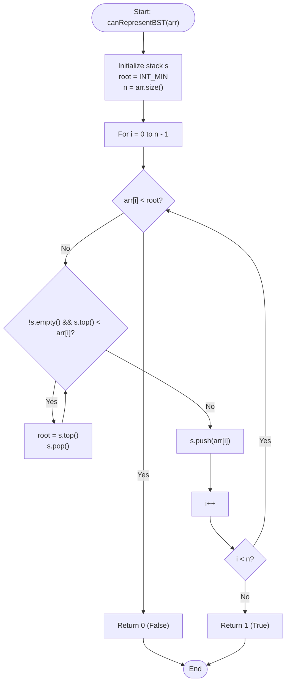

# 💡 Approach — Check Preorder of BST

| 📄 [Problem](./Problem.md) | 💡 [Approach](./Approach.md) | 🧩 [Solution](./Solution.cpp) | 🚀 [Main](./Main.cpp) |
|:--------------------------:|:-----------------------------:|:------------------------------:|:---------------------:|

---

## 📊 Metadata

---

## 🎯 Core Insight

> [!TIP]
> **Upper and Lower Bounds in Preorder Traversal of a BST**
> 
> 1. **BST Property**: For any node $V$:
>    - All nodes in its **left subtree** must have values $< V$.
>    - All nodes in its **right subtree** must have values $> V$.
> 
> 2. **Preorder Traversal Pattern**: Preorder visits nodes in the order **Root $\to$ Left $\to$ Right**.
>    - When we descend into left subtrees, values typically decrease or change.
>    - As soon as we find a value greater than the current node, it means we have transitioned into a **right subtree**.
>    - Once we transition into the right subtree of a node $V$, we can **never** see any value smaller than $V$ again. Thus, $V$ becomes the new lower bound (or `root`) for all subsequent elements.
> 
> 3. **Monotonic Stack Approach**:
>    - We can use a stack to keep track of ancestral nodes.
>    - The stack will store nodes representing the path we are currently exploring (which behaves like a decreasing sequence because we continue to go left).
>    - If we encounter a node `arr[i]` that is greater than `stack.top()`, we are moving to a right subtree. We pop all elements from the stack that are smaller than `arr[i]`. The last popped element represents the root of the subtree we are exiting. We update our `root` (lower bound) limit to this popped value.
>    - If we ever encounter an element smaller than the current `root` limit, the preorder traversal is **invalid**, and we return `0` (false).

---

## 🔩 Step-by-Step Breakdown

### 1. Initialization
- Create an empty stack `s`.
- Initialize `root = INT_MIN` to represent our lower bound constraint.

### 2. Traverse the Array
For each element `arr[i]` in the array:
- **Constraint Check**: If `arr[i] < root`, return `0` (false).
- **Find Ancestor / Update Lower Bound**: While the stack is not empty and `s.top() < arr[i]`:
  - Update `root = s.top()`.
  - Pop the element from the stack.
- **Push to Stack**: Push `arr[i]` onto the stack.

### 3. Return Success
- If the loop finishes without violating the constraint, return `1` (true).

---

## 🔄 Mermaid Flowchart

---

## 🧮 Dry Run — Example 1

### Input
`arr[] = [2, 4, 3]`

| Step | Element (`arr[i]`) | Constraint (`root`) | Stack State (top at right) | Action & Explanation |
| :---: | :---: | :---: | :---: | :--- |
| **0** | — | `INT_MIN` | `[]` | Initial state |
| **1** | **2** | `INT_MIN` | `[2]` | $2 > \text{INT\_MIN}$. Push $2$. |
| **2** | **4** | `INT_MIN` | `[4]` | $4 > 2$ (stack top). Pop $2$, set `root = 2`. Push $4$. |
| **3** | **3** | `2` | `[4, 3]` | $3 > 2$. Since $3 < 4$, stack loop doesn't execute. Push $3$. |

**Result**: Loop finishes successfully. Returns `1` (True).

---

## ⏱️ Complexity Analysis

- **Time Complexity**: $O(N)$ because every element is pushed onto and popped from the stack at most once.
- **Auxiliary Space**: $O(N)$ to store the stack of size at most $N$.

---

<h3>Happy Coding! 🚀</h3>

