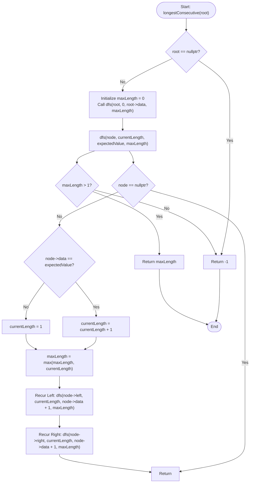

# 💡 Approach — Longest Consecutive Path in Binary tree

| 📄 [Problem](./Problem.md) | 💡 [Approach](./Approach.md) | 🧩 [Solution](./Solution.cpp) | 🚀 [Main](./Main.cpp) |

---

## 🎯 Core Insight

> [!TIP]
> **Depth-First Search (DFS) for Consecutive Paths**
> 
> 1. **Path Movement Constraint**: The consecutive path must only move from **parent to child** and follow **increasing consecutive values** (value of child = value of parent + 1).
> 2. **Recursive Traversal**:
>    - We traverse the tree using a Depth-First Search (DFS).
>    - At each node, we check if the current node's value matches the `expectedValue` (which is `parentValue + 1`).
>    - If it matches: we increment the `currentLength` of the consecutive path.
>    - If it does not match: we reset `currentLength` to `1` because a new path starts from this node.
> 3. **Global Maximum**:
>    - We keep track of the maximum sequence length `maxLength` found across all paths traversed.
> 4. **No Sequence Case**:
>    - If the longest consecutive sequence has length $\le 1$, it means no consecutive path of at least 2 nodes exists. According to problem specifications, we return `-1`.

---

## 🔩 Step-by-Step Breakdown

### 1. DFS Helper Function
We define a recursive helper function `dfs(Node* root, int currentLength, int expectedValue, int& maxLength)`:
- **Base Case**: If `root == nullptr`, return immediately.
- **Extend or Reset Path**:
  - If `root->data == expectedValue`: `currentLength++`.
  - Else: `currentLength = 1` (starting a new path).
- **Update Maximum**: Update `maxLength = max(maxLength, currentLength)`.
- **Recursive Subproblems**:
  - Traverse left child: `dfs(root->left, currentLength, root->data + 1, maxLength)`.
  - Traverse right child: `dfs(root->right, currentLength, root->data + 1, maxLength)`.

### 2. Main Entry Point
In `longestConsecutive(Node* root)`:
- If `root == nullptr`, return `-1`.
- Initialize `maxLength = 0`.
- Call `dfs(root, 0, root->data, maxLength)`.
- Return `maxLength > 1 ? maxLength : -1`.

---

## 🔄 Mermaid Flowchart

---

## 🧮 Dry Run

### Dry Run 1: Example 1 (`root = [1, 2, 3]`)

* **Initial state**: `maxLength = 0`
* **DFS Call Stack Progression**:

| Call Depth | Node | `currentLength` (In) | `expectedValue` | Action & Condition | `currentLength` (Out) | `maxLength` |
| :---: | :---: | :---: | :---: | :--- | :---: | :---: |
| **1** | `1` | `0` | `1` | `1 == 1`. Increment path. Recur left/right. | `1` | `1` |
| **2 (Left)** | `2` | `1` | `2` | `2 == 2`. Increment path. Recur left/right. | `2` | `2` |
| **3 (Left-Left)** | `nullptr` | `2` | `3` | Base Case: return. | — | `2` |
| **3 (Left-Right)** | `nullptr` | `2` | `3` | Base Case: return. | — | `2` |
| **2 (Right)** | `3` | `1` | `2` | `3 != 2`. Reset path. Recur left/right. | `1` | `2` |
| **3 (Right-Left)** | `nullptr` | `1` | `4` | Base Case: return. | — | `2` |
| **3 (Right-Right)** | `nullptr` | `1` | `4` | Base Case: return. | — | `2` |

* **Final Result**: `maxLength = 2`. Since `maxLength > 1`, return **`2`**.

---

### Dry Run 2: Example 2 (`root = [10, 20, 30, 40, N, 60, 90]`)

* **Initial state**: `maxLength = 0`
* **DFS Call Stack Progression**:

| Call Depth | Node | `currentLength` (In) | `expectedValue` | Action & Condition | `currentLength` (Out) | `maxLength` |
| :---: | :---: | :---: | :---: | :--- | :---: | :---: |
| **1** | `10` | `0` | `10` | `10 == 10`. Increment path. Recur left/right. | `1` | `1` |
| **2 (Left)** | `20` | `1` | `11` | `20 != 11`. Reset path. Recur left/right. | `1` | `1` |
| **3 (Left-Left)** | `40` | `1` | `21` | `40 != 21`. Reset path. Recur left/right. | `1` | `1` |
| **4 (Left-Left-Left)** | `nullptr` | `1` | `41` | Base Case: return. | — | `1` |
| **4 (Left-Left-Right)** | `nullptr` | `1` | `41` | Base Case: return. | — | `1` |
| **3 (Left-Right)** | `nullptr` | `1` | `21` | Base Case: return. | — | `1` |
| **2 (Right)** | `30` | `1` | `11` | `30 != 11`. Reset path. Recur left/right. | `1` | `1` |
| **3 (Right-Left)** | `60` | `1` | `31` | `60 != 31`. Reset path. Recur left/right. | `1` | `1` |
| **3 (Right-Right)** | `90` | `1` | `31` | `90 != 31`. Reset path. Recur left/right. | `1` | `1` |

* **Final Result**: `maxLength = 1`. Since `maxLength > 1` is false, return **`-1`**.

---

## ⏱️ Complexity Analysis

- **Time Complexity**: $O(N)$ because we visit each node in the binary tree exactly once during the DFS traversal.
- **Auxiliary Space**: $O(H)$ where $H$ is the height of the binary tree. This space is used by the recursion call stack, which is $O(N)$ in the worst case (skewed tree) and $O(\log N)$ in the best case (balanced tree).

---

<h3>Happy Coding! 🚀</h3>

