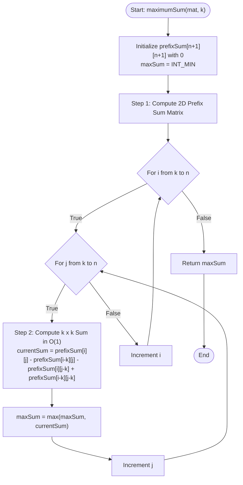

# 💡 Approach — Max Sum Square Sub-Matrix of Size k

<div align="center">

| 📄 [Problem](./Problem.md) | 💡 [Approach](./Approach.md) | 🧩 [Solution](./Solution.cpp) | 🚀 [Main](./Main.cpp) |
|:--------------------------:|:-----------------------------:|:------------------------------:|:---------------------:|

</div>

---

## 📊 Metadata


---

## 🎯 Core Insight

> [!TIP]
> **2D Prefix Sum Array (Inclusion-Exclusion Principle)**
> 
> By pre-calculating the cumulative sum of elements from the top-left corner `(0, 0)` to any index `(i, j)`, we can compute the sum of any subgrid of size $k \times k$ in constant $O(1)$ time. 
> 
> For a 1-indexed prefix sum grid:
> $$\text{sum} = \text{prefixSum}[i][j] - \text{prefixSum}[i - k][j] - \text{prefixSum}[i][j - k] + \text{prefixSum}[i - k][j - k]$$

---

## 🔩 Step-by-Step Breakdown

### Step 1: Precompute the 2D Prefix Sum Matrix
Initialize a $(n + 1) \times (n + 1)$ prefix sum matrix with all zeros to simplify boundary conditions. For each element `mat[i-1][j-1]` in the grid, compute:
$$\text{prefixSum}[i][j] = \text{mat}[i - 1][j - 1] + \text{prefixSum}[i - 1][j] + \text{prefixSum}[i][j - 1] - \text{prefixSum}[i - 1][j - 1]$$

### Step 2: Iterate and Find the Maximum Subgrid Sum
Loop through all coordinates $(i, j)$ that represent bottom-right corners of possible $k \times k$ subgrids (i.e., $k \le i, j \le n$). For each, compute the subgrid sum in $O(1)$ using the Inclusion-Exclusion principle and update the running maximum sum.

---

## 🔄 Mermaid Flowchart



---

## 🧮 Dry Run

### Dry Run: Example 1 ($n=4, k=3$, `mat[][]` = `[[1, 2, -1, 4], [-8, -3, 4, 2], [3, 8, 10, -8], [-4, -1, 1, 7]]`)

#### 1. Prefix Sum Matrix Builder
The prefix sum matrix of size $5 \times 5$ is calculated as:
```
[
 [0,  0,  0,  0,  0],
 [0,  1,  3,  2,  6],
 [0, -7, -8, -5,  1],
 [0, -4,  3, 16, 14],
 [0, -8, -2, 12, 17]
]
```

#### 2. Querying $3 \times 3$ Sub-grids ($i \ge 3, j \ge 3$)

| Top-Left Corner | Bottom-Right Corner (1-based) | Formula Calculation | Subgrid Sum | `maxSum` |
| :---: | :---: | :---: | :---: | :---: |
| $(0,0)$ to $(2,2)$ | $(3,3)$ | `prefixSum[3][3] - prefixSum[0][3] - prefixSum[3][0] + prefixSum[0][0]`<br>$= 16 - 0 - 0 + 0 = 16$ | **16** | **16** |
| $(0,1)$ to $(2,3)$ | $(3,4)$ | `prefixSum[3][4] - prefixSum[0][4] - prefixSum[3][1] + prefixSum[0][1]`<br>$= 14 - 0 - (-4) + 0 = 18$ | **18** | **18** |
| $(1,0)$ to $(3,2)$ | $(4,3)$ | `prefixSum[4][3] - prefixSum[1][3] - prefixSum[4][0] + prefixSum[1][0]`<br>$= 12 - 2 - 0 + 0 = 10$ | **10** | **18** |
| $(1,1)$ to $(3,3)$ | $(4,4)$ | `prefixSum[4][4] - prefixSum[1][4] - prefixSum[4][1] + prefixSum[1][1]`<br>$= 17 - 6 - (-8) + 1 = 17 - 6 + 8 + 1 = 20$ | **20** | **20** |

*   **Final Result**: `20`

---

## 📊 Complexity Analysis

| Complexity | Analysis |
| :--- | :--- |
| **Time Complexity** | $O(n^2)$ since we iterate through the grid of size $n \times n$ exactly twice: once to calculate prefix sums, and once to calculate the maximum sum. |
| **Auxiliary Space** | $O(n^2)$ to store the $(n+1) \times (n+1)$ prefix sum grid, preventing mutation of the input parameter. |

---

> *"Code is like humor. When you have to explain it, it’s bad."* — Cory House

---

<div align="center">
<h3>Happy Coding! 🚀</h3>
<a href="../178_Day/Approach.md">
  
</a>
<a href="https://x.com/PankajB42550" target="_blank">
  
</a>
<a href="../180_Day/Approach.md">
  
</a>
</div>
