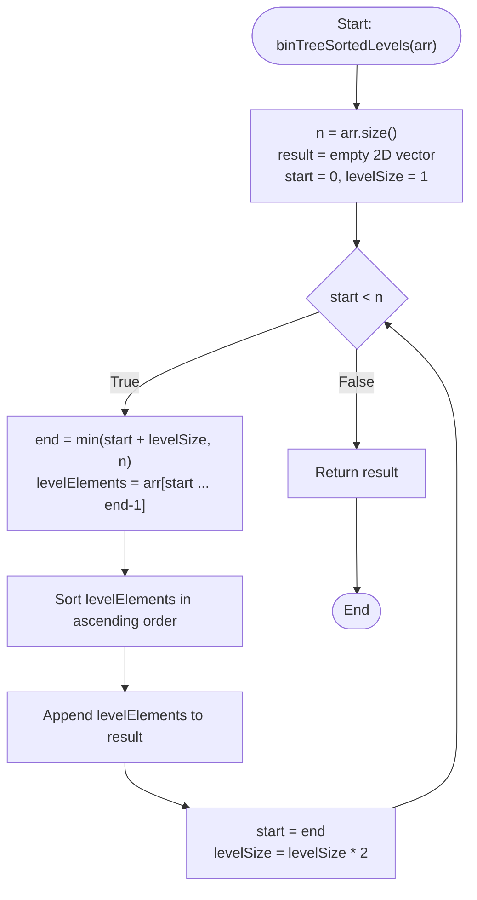

# 💡 Approach — Complete Binary Tree Traversal with Array Input

| 📄 [Problem](./Problem.md) | 💡 [Approach](./Approach.md) | 🧩 [Solution](./Solution.cpp) | 🚀 [Main](./Main.cpp) |
|:--------------------------:|:-----------------------------:|:------------------------------:|:---------------------:|

---

## 📊 Metadata

---

## 🎯 Core Insight

> [!TIP]
> **Complete Binary Tree Level Boundaries**
> 
> A complete binary tree represented as a 1D array in level-order traversal has fixed mathematical boundaries for its levels:
> - Level 0 contains at most $2^0 = 1$ element (index 0).
> - Level 1 contains at most $2^1 = 2$ elements (indices 1 to 2).
> - Level $L$ contains at most $2^L$ elements, starting immediately after the end of level $L-1$.
> 
> Therefore, we can partition the array into sequential segments of size $1, 2, 4, 8, \dots$, sort each segment independently, and construct the required 2D array representation.

---

## 🔩 Step-by-Step Breakdown

### Step 1: Initialize Traversal State
- Track the start index of the current level: `start = 0`.
- Track the maximum capacity of the current level: `levelSize = 1`.
- Initialize a 2D vector `result` to store the sorted levels.

### Step 2: Extract and Sort Level Elements
While `start < n` (where $n$ is the size of the array):
- Determine the end boundary of the current level: `end = min(start + levelSize, n)`.
- Extract the sub-array `arr[start ... end - 1]`.
- Sort the extracted elements in ascending order.
- Append this sorted list to `result`.

### Step 3: Transition to the Next Level
- Advance `start` to `end`.
- Double the capacity of the next level: `levelSize *= 2`.

---

## 🔄 Mermaid Flowchart

---

## 🧮 Dry Run

### Dry Run: Example 2 (`arr[]` = `[7, 16, 1, 4, 13]`, $n = 5$)

- **Initialization**: `result = []`, `start = 0`, `levelSize = 1`

#### Iteration 1:
- `start = 0 < 5` (True)
- `end = min(0 + 1, 5) = 1`
- `levelElements` = `arr[0 ... 0]` = `[7]`
- Sorted `levelElements` = `[7]`
- Append to `result` $\rightarrow$ `[[7]]`
- Update: `start = 1`, `levelSize = 1 * 2 = 2`

#### Iteration 2:
- `start = 1 < 5` (True)
- `end = min(1 + 2, 5) = 3`
- `levelElements` = `arr[1 ... 2]` = `[16, 1]`
- Sorted `levelElements` = `[1, 16]`
- Append to `result` $\rightarrow$ `[[7], [1, 16]]`
- Update: `start = 3`, `levelSize = 2 * 2 = 4`

#### Iteration 3:
- `start = 3 < 5` (True)
- `end = min(3 + 4, 5) = 5`
- `levelElements` = `arr[3 ... 4]` = `[4, 13]`
- Sorted `levelElements` = `[4, 13]`
- Append to `result` $\rightarrow$ `[[7], [1, 16], [4, 13]]`
- Update: `start = 5`, `levelSize = 4 * 2 = 8`

#### Termination:
- `start = 5 < 5` (False)
- Return `[[7], [1, 16], [4, 13]]`

---

## 📊 Complexity Analysis

| Complexity | Analysis |
| :--- | :--- |
| **Time Complexity** | $O(n \log n)$ since we partition the array into levels and sort each level of size $k$ in $O(k \log k)$ time. The sum of all levels' sizes is $n$, so the total time complexity is bounded by $O(n \log n)$. |
| **Auxiliary Space** | $O(n)$ to store intermediate level elements during extraction and sorting, preventing modification of the input tree representation. |

---

> *"Simplicity is the soul of efficiency."* — Austin Freeman

---

<h3>Happy Coding! 🚀</h3>

