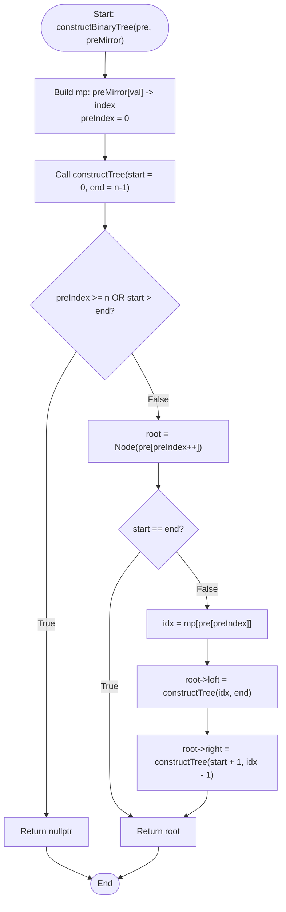

# 💡 Approach — Construct a Full Binary Tree from Preorder and Mirror Preorder

| 📄 [Problem](./Problem.md) | 💡 [Approach](./Approach.md) | 🧩 [Solution](./Solution.cpp) | 🚀 [Main](./Main.cpp) |
|:--------------------------:|:-----------------------------:|:------------------------------:|:---------------------:|

---

## 📊 Metadata

---

## 🎯 Core Insight

> [!TIP]
> **Exploiting Preorder Traversal Properties of Mirror Trees**
> 
> In a binary tree, preorder traversal visits nodes in the order: **Root → Left Subtree → Right Subtree**.
> In its mirror tree, the preorder traversal visits nodes in the order: **Root → Right Subtree → Left Subtree**.
> 
> If we know that the tree is a **full binary tree** (every node has either $0$ or $2$ children):
> 1. The first element in the current preorder segment is the root of the subtree.
> 2. If the subtree has more than one node, the next element in the preorder sequence (`pre[preIndex]`) must be the root of the left subtree of the original tree.
> 3. In the mirror tree, this left subtree corresponds to the left subtree of the mirror, which is traversed **last** (after the right subtree).
> 4. By locating the left child's value in the mirror preorder array, say at index `idx`, we can divide the mirror preorder array:
>    - Elements at `[idx ... end]` correspond to the mirror preorder traversal of the left subtree.
>    - Elements at `[start + 1 ... idx - 1]` correspond to the mirror preorder traversal of the right subtree.
> 
> To achieve $O(n)$ time complexity, we can use a hash map to store the indices of elements in the `preMirror[]` array, allowing $O(1)$ split-point lookups.

---

## 🔩 Step-by-Step Breakdown

### Step 1: Precalculate Index Map
- Store the indices of all elements in `preMirror` in a hash map `mp` to enable $O(1)$ search.
- Initialize `preIndex = 0` to track our progress through the `pre[]` array.

### Step 2: Recursive Tree Construction
For a range `[start ... end]` in the mirror preorder segment:
- If `preIndex >= pre.size()` or `start > end`, return `nullptr`.
- Create a new node `root` with the value `pre[preIndex++]`.
- If `start == end`, the node is a leaf node, so return `root` immediately.
- The next element `pre[preIndex]` is the root of the left subtree. Look up its index in `preMirror`: `idx = mp[pre[preIndex]]`.
- Recursively build the left child by passing the mirror preorder segment corresponding to the left subtree: `[idx ... end]`.
- Recursively build the right child by passing the mirror preorder segment corresponding to the right subtree: `[start + 1 ... idx - 1]`.
- Return the `root` node.

---

## 🔄 Mermaid Flowchart

---

## 🧮 Dry Run

### Dry Run: Example 2 (`pre[]` = `[1, 2, 4, 5, 3, 6, 7]`, `preMirror[]` = `[1, 3, 7, 6, 2, 5, 4]`)

- **Map initialization (`mp`)**:
  `{1: 0, 3: 1, 7: 2, 6: 3, 2: 4, 5: 5, 4: 6}`
- **Global traversal tracker**: `preIndex = 0`

| Call Number | Function Parameters (`start`, `end`) | Node Created (`preIndex` advanced) | Action / Split Decision | Child Calls Spawned |
| :---: | :---: | :---: | :--- | :--- |
| **#1** | `(0, 6)` | `1` (`preIndex` $\rightarrow 1$) | `start < end` $\rightarrow$ Left root value = `pre[1] = 2`. `idx = mp[2] = 4`. Split: left `(4, 6)`, right `(1, 3)`. | Left: Call **#2**, Right: Call **#5** |
| **#2** | `(4, 6)` | `2` (`preIndex` $\rightarrow 2$) | `start < end` $\rightarrow$ Left root value = `pre[2] = 4`. `idx = mp[4] = 6`. Split: left `(6, 6)`, right `(5, 5)`. | Left: Call **#3**, Right: Call **#4** |
| **#3** | `(6, 6)` | `4` (`preIndex` $\rightarrow 3$) | `start == end` $\rightarrow$ Leaf node. Returns `Node(4)`. | None (Leaf) |
| **#4** | `(5, 5)` | `5` (`preIndex` $\rightarrow 4$) | `start == end` $\rightarrow$ Leaf node. Returns `Node(5)`. | None (Leaf) |
| **#5** | `(1, 3)` | `3` (`preIndex` $\rightarrow 5$) | `start < end` $\rightarrow$ Left root value = `pre[5] = 6`. `idx = mp[6] = 3`. Split: left `(3, 3)`, right `(2, 2)`. | Left: Call **#6**, Right: Call **#7** |
| **#6** | `(3, 3)` | `6` (`preIndex` $\rightarrow 6$) | `start == end` $\rightarrow$ Leaf node. Returns `Node(6)`. | None (Leaf) |
| **#7** | `(2, 2)` | `7` (`preIndex` $\rightarrow 7$) | `start == end` $\rightarrow$ Leaf node. Returns `Node(7)`. | None (Leaf) |

---

## 📊 Complexity Analysis

| Complexity | Analysis |
| :--- | :--- |
| **Time Complexity** | $O(n)$ because each node is visited exactly once, and using a hash map allows us to find the subtree split points in $O(1)$ time. |
| **Auxiliary Space** | $O(n)$ to store the hash map mapping node values to their mirror preorder indices, along with $O(h)$ space for the recursion stack where $h$ is the height of the tree. |

---

> *"Structure is the foundation of logic, and recursion is its execution."* — Senior C++ Engineer

---

<h3>Happy Coding! 🚀</h3>

