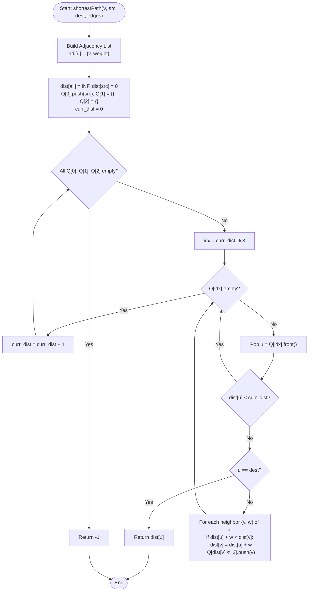

# 💡 Approach — Shortest Path in 1-2 Graph

| 📄 [Problem](./Problem.md) | 💡 [Approach](./Approach.md) | 🧩 [Solution](./Solution.cpp) | 🚀 [Main](./Main.cpp) |
|:--------------------------:|:-----------------------------:|:------------------------------:|:---------------------:|

---

## 📊 Metadata

---

## 🎯 Core Insight

> [!TIP]
> **Exploiting Small Edge Weights (Dial's Algorithm)**
> 
> A standard Dijkstra's algorithm using a priority queue solves the shortest path problem in $O(E \log V)$ time. However, here edge weights are strictly restricted to $1$ or $2$.
> 
> Since the maximum edge weight $W = 2$ is extremely small:
> 1. At any point during Dijkstra's search, the maximum difference between the distance of the node currently being processed and any node waiting in the queue is at most $W = 2$.
> 2. This implies we only need $W + 1 = 3$ buckets (or queues) to store nodes at distances: `curr_dist`, `curr_dist + 1`, and `curr_dist + 2`.
> 3. We can represent these buckets using a circular queue structure of size 3: `Q[0]`, `Q[1]`, and `Q[2]`. Nodes at distance $d$ are pushed into `Q[d % 3]`.
> 4. We increment the distance `curr_dist` sequentially and empty the corresponding queue `Q[curr_dist % 3]`. This guarantees that we process nodes in strictly non-decreasing order of their shortest path distances.
> 
> This eliminates the $O(\log V)$ factor of priority queues, yielding an optimal $O(V + E)$ time complexity and $O(V)$ auxiliary space.

---

## 🔩 Step-by-Step Breakdown

### Step 1: Graph Representation
- Build an adjacency list where each node has a list of pairs `(neighbor, weight)`.

### Step 2: Initialize Distance and Buckets
- Create a distance array `dist` initialized with a large value (`INF = 1e9`) for all vertices, setting `dist[src] = 0`.
- Create an array of three queues `Q[3]`.
- Push the source node `src` into `Q[0]` (since $0 \pmod 3 = 0$).

### Step 3: Sequential Distance Iteration
- Set a variable `curr_dist = 0` to keep track of the current path length.
- Loop until all three queues are empty:
  - Identify the active queue index: `idx = curr_dist % 3`.
  - While `Q[idx]` is not empty:
    - Pop the front vertex `u`.
    - If `dist[u] < curr_dist`, it means `u` has already been processed via a shorter path. Discard it.
    - If `u` is the destination `dest`, return `dist[u]` immediately.
    - For each neighbor `v` of `u` with weight `w`:
      - If `dist[u] + w < dist[v]`, update `dist[v] = dist[u] + w` and push `v` to `Q[dist[v] % 3]`.
  - Increment `curr_dist` by 1.

### Step 4: Unreachable Check
- If the loop terminates without reaching `dest`, it means the destination is unreachable. Return `-1`.

---

## 🔄 Mermaid Flowchart

---

## 🧮 Dry Run

### Dry Run: Example 1
- **Input:** $V = 4$, `edges` = `[[0, 1, 1], [0, 2, 2], [2, 3, 1], [1, 2, 1], [1, 3, 2]]`, `src = 0`, `dest = 3`
- **Initial Setup:** `dist = [0, INF, INF, INF]`, `Q[0] = {0}`, `Q[1] = {}`, `Q[2] = {}`, `curr_dist = 0`.

| Distance (`curr_dist`) | Active Queue (`idx`) | Node Pop (`u`) | Neighbor / Edge | Action / Update | Queues State |
| :---: | :---: | :---: | :---: | :---: | :--- |
| **0** | `0` | `0` | `(1, weight 1)` | `dist[1] = 0 + 1 = 1`   Push `1` to `Q[1]` | `Q[0] = {}`, `Q[1] = {1}`, `Q[2] = {}` |
| | | | `(2, weight 2)` | `dist[2] = 0 + 2 = 2`   Push `2` to `Q[2]` | `Q[0] = {}`, `Q[1] = {1}`, `Q[2] = {2}` |
| **1** | `1` | `1` | `(0, weight 1)` | `dist[0] = 0 < 1 + 1` (No change) | |
| | | | `(2, weight 1)` | `dist[1] + 1 = 2` (Not less than `dist[2] = 2`) | |
| | | | `(3, weight 2)` | `dist[3] = 1 + 2 = 3`   Push `3` to `Q[0]` | `Q[0] = {3}`, `Q[1] = {}`, `Q[2] = {2}` |
| **2** | `2` | `2` | `(0, weight 2)` | `dist[0] = 0 < 2 + 2` (No change) | |
| | | | `(1, weight 1)` | `dist[1] = 1 < 2 + 1` (No change) | |
| | | | `(3, weight 1)` | `dist[2] + 1 = 3` (Not less than `dist[3] = 3`) | `Q[0] = {3}`, `Q[1] = {}`, `Q[2] = {}` |
| **3** | `0` | `3` | — | **`u == dest` reached!** | Return `dist[3] = 3`. |

---

## 📊 Complexity Analysis

| Complexity | Analysis |
| :--- | :--- |
| **Time Complexity** | $O(V + E)$ because each vertex is added to and processed from the queues at most twice, and every undirected edge is traversed and relaxed at most twice. Since queue push and pop operations are $O(1)$, the total runtime is linear. |
| **Auxiliary Space** | $O(V)$ to store the distance array and the three queues. (The adjacency list storage takes $O(V + E)$ space). |

---

> *"Restricting weights transforms a logarithmic search into a linear flow."* — Senior C++ Engineer

---

<h3>Happy Coding! 🚀</h3>

