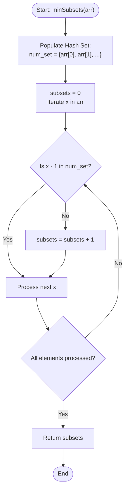

# 💡 Approach — Split Array into Minimum Subsets

| 📄 [Problem](./Problem.md) | 💡 [Approach](./Approach.md) | 🧩 [Solution](./Solution.cpp) | 🚀 [Main](./Main.cpp) |
|:--------------------------:|:-----------------------------:|:------------------------------:|:---------------------:|

---

## 📊 Metadata

---

## 🎯 Core Insight

> [!TIP]
> **Identifying Sequence Boundaries via Hash Lookup**
>
> We want to split an array of **distinct** positive integers into the minimum number of subsets, where each subset consists of consecutive numbers.
>
> 1. Since all numbers are unique, any subset of consecutive numbers must be of the form $\{x, x+1, x+2, \dots, x+k\}$.
> 2. Every such subset has exactly **one** boundary element at the start: the minimum element $x$ of that subset.
> 3. For any number $y$ in the array:
>    - If $y - 1$ is **not** present in the array, then $y$ must be the starting element of a consecutive subset.
>    - If $y - 1$ **is** present in the array, then $y$ belongs to an existing consecutive sequence that started at some smaller value, so it cannot start a new subset.
> 4. Thus, the minimum number of subsets is exactly equal to the number of elements $x$ in the array for which $x - 1$ is absent.
>
> By utilizing a hash set (`std::unordered_set` in C++), we can perform all lookups in $O(1)$ average time, resulting in an optimal linear time complexity of $O(n)$.

---

## 🔩 Step-by-Step Breakdown

### Step 1: Populate the Hash Set
- Insert all array elements into an `unordered_set<int> num_set`. This allows us to check for the existence of $x - 1$ in $O(1)$ time.

### Step 2: Iterate through the Array
- Keep a counter `subsets` initialized to `0`.
- For each element `x` in the input array `arr`:
  - Search for `x - 1` in `num_set`.

### Step 3: Identify the Start of a Subsequence
- If `x - 1` is not found, increment `subsets` by `1`. This means `x` is the starting number of a new consecutive subsequence.
- If `x - 1` is found, do nothing, as `x` will automatically be covered in the subset starting at or before `x - 1`.

### Step 4: Return the Count
- Return the final count of `subsets`.

---

## 🔄 Mermaid Flowchart

---

## 🧮 Dry Run

### Dry Run: Example 1
- **Input:** `arr = [100, 56, 5, 6, 102, 58, 101, 57, 7, 103, 59]`
- **Set Content:** `num_set = {5, 6, 7, 56, 57, 58, 59, 100, 101, 102, 103}`
- **Initial Setup:** `subsets = 0`.

| Iteration | Element `x` | Predecessor `x - 1` | `x - 1` in Set? | Action / Update | Subsets Count |
| :---: | :---: | :---: | :---: | :---: | :---: |
| **1** | `100` | `99` | ❌ No | Start of sequence `{100, 101, 102, 103}`. Increment subsets. | **1** |
| **2** | `56` | `55` | ❌ No | Start of sequence `{56, 57, 58, 59}`. Increment subsets. | **2** |
| **3** | `5` | `4` | ❌ No | Start of sequence `{5, 6, 7}`. Increment subsets. | **3** |
| **4** | `6` | `5` | ✔️ Yes | Middle of sequence `{5, 6, 7}`. No change. | **3** |
| **5** | `102` | `101` | ✔️ Yes | Middle of sequence `{100, 101, 102, 103}`. No change. | **3** |
| **6** | `58` | `57` | ✔️ Yes | Middle of sequence `{56, 57, 58, 59}`. No change. | **3** |
| **7** | `101` | `100` | ✔️ Yes | Middle of sequence `{100, 101, 102, 103}`. No change. | **3** |
| **8** | `57` | `56` | ✔️ Yes | Middle of sequence `{56, 57, 58, 59}`. No change. | **3** |
| **9** | `7` | `6` | ✔️ Yes | Middle of sequence `{5, 6, 7}`. No change. | **3** |
| **10** | `103` | `102` | ✔️ Yes | Middle of sequence `{100, 101, 102, 103}`. No change. | **3** |
| **11** | `59` | `58` | ✔️ Yes | Middle of sequence `{56, 57, 58, 59}`. No change. | **3** |

---

## 📊 Complexity Analysis

| Complexity | Analysis |
| :--- | :--- |
| **Time Complexity** | $O(n)$ because inserting all $n$ elements into a hash set takes $O(n)$ time. Then, traversing the array of size $n$ and performing a lookup check in the hash set takes $O(1)$ average time per element, yielding an overall linear runtime. |
| **Auxiliary Space** | $O(n)$ to store all $n$ elements of the array in the `unordered_set` hash data structure. |

---

> *"Analyzing boundaries helps us partition chaos into order."* — Senior C++ Engineer

---

<h3>Happy Coding! 🚀</h3>

